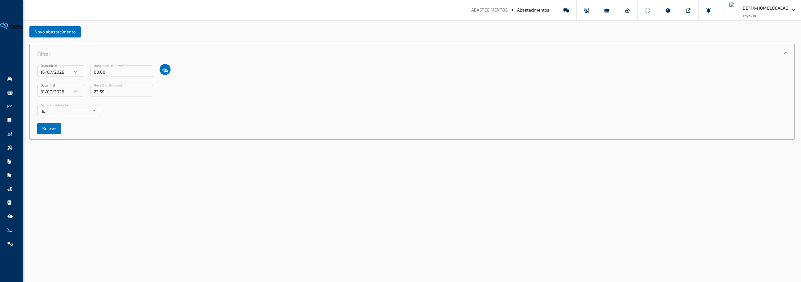

## Abastecimento

### Abastecimentos

**Caminho:** Abastecimento > Abastecimentos

Esta tela permite consultar, registrar e gerenciar os abastecimentos e recargas elétricas realizados pelos veículos da frota. Os registros podem ser agrupados por dia, veículo ou motorista, e exportados em PDF ou Excel para fins de controle e auditoria.

---

#### O que você encontra nesta tela

**Botão Novo Abastecimento**

Localizado no topo da tela. Abre o formulário para registrar manualmente um novo abastecimento ou recarga elétrica.

**Painel de Filtros**

Expansível, localizado abaixo do botão de novo registro. Reúne os campos de período (data e hora inicial e final), o seletor de veículos e a opção de agrupamento dos resultados. O botão **Buscar** aplica os filtros e carrega os registros na tela.

**Botão Exportar**

Aparece somente quando há resultados carregados. Oferece as opções de exportar os dados em **PDF** ou **Excel**.

**Lista de Abastecimentos**

Exibida após a busca. Apresenta os registros organizados conforme o agrupamento selecionado (por dia, por veículo ou por motorista). Cada grupo exibe uma tabela com as colunas: data e hora, veículo, motorista, endereço ou ponto de interesse, hodômetro reportado, tanque completo, tipo de combustível, litros abastecidos, valor por litro e valor total. A tabela possui paginação e permite ordenação por coluna.

---

#### Funcionalidades

**Registrar novo abastecimento ou recarga elétrica**

Abre um formulário para cadastrar manualmente um abastecimento realizado fora do sistema, informando todos os dados da operação.

Como usar:

1. Clique no botão **Novo Abastecimento** no topo da tela.
2. Na janela que abrir, selecione a **Data** e informe o **Horário** do abastecimento.
3. Clique no ícone de carro para selecionar o **Veículo** e no ícone de carteira de habilitação para selecionar o **Motorista**.
4. Preencha os demais campos: hodômetro, ponto de interesse ou endereço, tipo de combustível, quantidade e valor total.
5. Clique em **Salvar** para gravar o registro.

> **Dica:** Ao selecionar o tipo **Recarga Elétrica**, o campo de quantidade muda de "Litros Abastecidos" para "KW Abastecido" e a opção de tanque completo é ocultada automaticamente. O valor por litro (ou por KW) é calculado automaticamente a partir da quantidade e do valor total informados.

**Selecionar veículos para consulta**

Define quais veículos terão seus abastecimentos exibidos nos resultados da busca.

Como usar:

1. No painel de filtros, clique no ícone de carros ao lado dos campos de data inicial.
2. Na janela de seleção, marque os veículos desejados usando as caixas de seleção.
3. Confirme a seleção e clique em **Buscar** para carregar os resultados.

> **Dica:** É obrigatório selecionar pelo menos um veículo antes de buscar. Se nenhum veículo estiver selecionado, uma mensagem de aviso será exibida ao tentar buscar.

**Consultar abastecimentos por período**

Define o intervalo de datas e horários que será consultado, filtrando os registros exibidos na tabela.

Como usar:

1. No painel de filtros, selecione a **Data Inicial** e informe o **Horário Inicial** no formato HH:mm.
2. Selecione a **Data Final** e informe o **Horário Final** no formato HH:mm.
3. Confirme os veículos selecionados e clique em **Buscar**.

> **Dica:** O período padrão ao abrir a tela é dos últimos 15 dias até hoje. Ajuste as datas antes de buscar para períodos específicos de análise.

**Agrupar resultados**

Organiza os registros na tabela em grupos conforme o critério selecionado, facilitando a leitura e análise dos dados.

Como usar:

1. No painel de filtros, localize o campo **Agrupamento de Dados**.
2. Selecione uma das opções disponíveis:
   - **Não Agrupar** — todos os registros são exibidos em uma única lista sem divisão.
   - **Veículo** — os registros são separados por veículo, com um cabeçalho identificando cada um.
   - **Dia** — os registros são separados por data de abastecimento.
   - **Motorista** — os registros são separados por nome do motorista.
3. Clique em **Buscar** para aplicar o agrupamento.

> **Dica:** É possível alterar o agrupamento sem refazer a busca: basta mudar a opção no campo após os resultados já estarem carregados. A reorganização ocorre imediatamente.

**Visualizar observações de um abastecimento**

Exibe a anotação registrada no momento do cadastro do abastecimento.

Como usar:

1. Na tabela de resultados, localize o registro desejado.
2. Clique no ícone de informação (quadrado com "i") na coluna de ações da linha.
3. Uma janela será aberta exibindo o texto da observação registrada.
4. Feche a janela quando terminar.

> **Dica:** Se o abastecimento não tiver observação registrada, a janela será aberta com o campo em branco.

**Gerenciar arquivos de um abastecimento**

Permite visualizar, adicionar ou remover arquivos (como notas fiscais ou comprovantes) vinculados a um registro de abastecimento.

Como usar:

1. Na tabela de resultados, localize o registro desejado.
2. Clique no ícone de importar arquivo na coluna de ações da linha.
3. Na janela que abrir, consulte os arquivos já anexados ou faça o envio de novos documentos.
4. Feche a janela quando terminar.

> **Dica:** Use este recurso para manter comprovantes fiscais e notas de abastecimento vinculados diretamente ao registro, facilitando auditorias e prestações de contas.

**Excluir um abastecimento**

Remove permanentemente um registro de abastecimento da lista.

Como usar:

1. Na tabela de resultados, localize o registro que deseja remover.
2. Clique no ícone de lixeira na coluna de ações da linha.
3. Confirme a exclusão na janela de confirmação exibida.
4. A lista será atualizada automaticamente após a exclusão.

> **Dica:** A exclusão é permanente. Verifique se o registro está correto antes de confirmar, pois não há opção de desfazer a ação.

**Exportar abastecimentos**

Gera um arquivo com todos os registros visíveis na tabela, preservando os agrupamentos e os dados de cada abastecimento.

Como usar:

1. Realize uma busca para carregar os registros na tela.
2. Clique no botão **Exportar** (aparece acima da lista de resultados).
3. No menu que abrir, selecione o formato desejado:
   - **PDF** — gera um documento para impressão ou compartilhamento.
   - **Excel** — gera uma planilha com todos os dados para análise.
4. O arquivo será baixado automaticamente.

> **Dica:** O arquivo exportado contém as mesmas colunas da tabela: data e hora, veículo, motorista, hodômetro reportado, tanque completo, tipo de combustível, litros abastecidos, valor por litro, valor total e endereço ou ponto de interesse. O agrupamento também é refletido no arquivo.

**Cadastrar novo ponto de interesse a partir do formulário**

Permite criar um novo ponto de interesse (como um posto de combustível) sem sair da janela de registro de abastecimento.

Como usar:

1. Na janela de novo abastecimento, localize o campo **Ponto de Interesse**.
2. Clique no botão de adição (ícone de "+") ao lado do campo.
3. Preencha os dados do novo ponto de interesse na janela que abrir.
4. Salve o ponto. Ele estará disponível imediatamente no campo de seleção da janela de abastecimento.

> **Dica:** Esta funcionalidade evita que seja necessário acessar outro módulo para cadastrar um posto antes de registrar o abastecimento. O ponto criado fica disponível para uso em qualquer outro registro futuramente.

---

#### Campos e Filtros

| Campo / Filtro | O que faz |
|---|---|
| **Data Inicial** | Define a data de início do período de consulta |
| **Horário Inicial** | Define o horário de início do período, no formato HH:mm |
| **Seleção de Veículos** | Abre a janela para escolher quais veículos serão incluídos na busca |
| **Data Final** | Define a data de encerramento do período de consulta |
| **Horário Final** | Define o horário de encerramento do período, no formato HH:mm |
| **Agrupamento de Dados** | Define como os registros serão organizados: sem agrupamento, por veículo, por dia ou por motorista |
| **Data e Hora (registro)** | Data e horário em que o abastecimento foi realizado |
| **Veículo (registro)** | Veículo que recebeu o abastecimento |
| **Motorista (registro)** | Motorista responsável pelo abastecimento |
| **Hodômetro** | Leitura do odômetro do veículo no momento do abastecimento, informada manualmente |
| **Ponto de Interesse** | Local de referência onde o abastecimento foi realizado, selecionado a partir dos pontos cadastrados |
| **Endereço** | Endereço do local de abastecimento, quando não há ponto de interesse correspondente |
| **Tipo de Combustível** | Tipo do combustível ou recarga: Gasolina Comum, Gasolina Aditivada, Gasolina Premium, Etanol, Etanol Aditivado, Diesel S500, Diesel S10, Diesel Aditivado, Diesel Premium, GNV, ARLA 32 ou Recarga Elétrica |
| **Litros Abastecidos / KW Abastecido** | Quantidade de combustível abastecida (litros) ou energia carregada (kWh), conforme o tipo selecionado |
| **Valor Total (R$)** | Valor total pago pelo abastecimento; o valor por litro ou por KW é calculado automaticamente |
| **Tanque Completo** | Indica se o tanque foi completamente cheio no abastecimento (não disponível para recargas elétricas) |
| **Observações** | Anotações livres sobre o abastecimento registradas no momento do cadastro |

[↑ Voltar ao Índice](index.md#índice)
