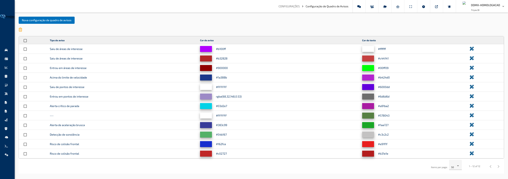
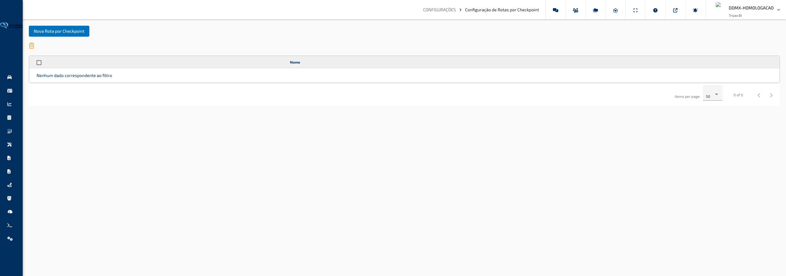
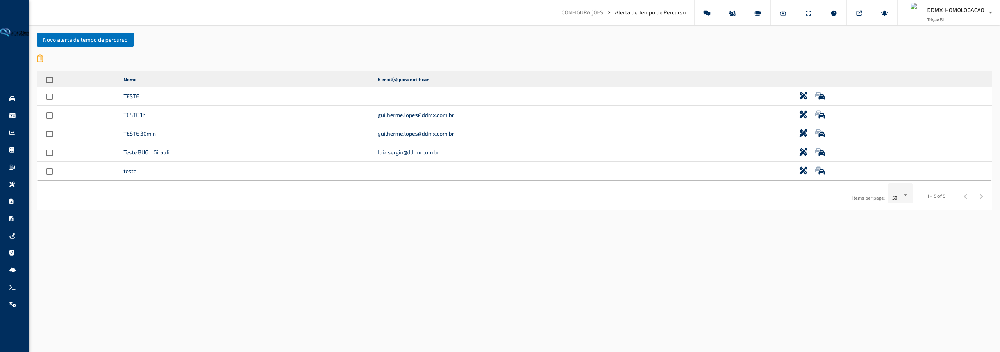
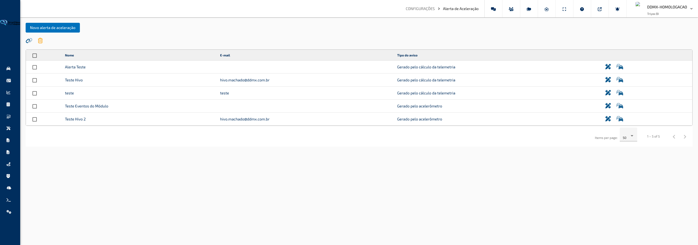
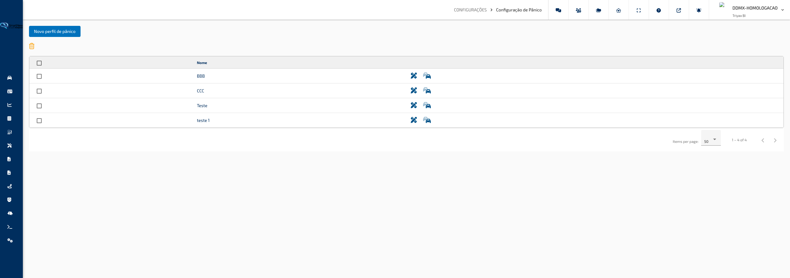

## Configurações

### Configuração de Quadro de Avisos

**Caminho:** Configurações > Configuração de Quadro de Avisos

Esta tela permite definir quais tipos de aviso podem aparecer no Quadro de Avisos e escolher as cores usadas para representar cada um deles. As configurações feitas aqui afetam diretamente como os avisos são exibidos nas telas de Quadro de Avisos e Quadro de Avisos Telemetria.

---

#### O que você encontra nesta tela

**Barra de Ações**

Na parte superior da tela ficam os botões para criar uma nova configuração e para apagar as configurações selecionadas na tabela.

**Tabela de Configurações**

Lista todas as configurações de aviso já cadastradas, mostrando o tipo de aviso e as cores definidas para o fundo e para o texto. Cada linha tem uma caixa de seleção e um ícone para edição.

**Janela de Cadastro e Edição**

Ao criar ou editar uma configuração, abre-se uma janela onde você escolhe o tipo de aviso e define as cores que serão usadas para exibi-lo.

---

#### Funcionalidades

**Criar uma nova configuração de aviso**

Cadastra uma nova combinação de tipo de aviso e cores, que passa a valer para todos os avisos desse tipo exibidos no Quadro de Avisos.

Como usar:

1. Clique no botão **Novo**, na parte superior da tela.
2. Na janela que se abre, selecione o **Tipo de Aviso** desejado. As opções aparecem organizadas por categoria e você pode digitar parte do nome para encontrar mais rápido.
3. Defina a **Cor do Aviso**, clicando sobre o quadrado colorido e escolhendo a cor na paleta que aparece.
4. Defina também a **Cor do Texto**, da mesma forma.
5. Clique em **Salvar** para concluir o cadastro.

> **Dica:** Escolha cores com bom contraste entre o fundo e o texto — isso facilita a leitura dos avisos na hora da consulta.

**Editar uma configuração existente**

Permite alterar o tipo de aviso ou as cores de uma configuração já cadastrada.

Como usar:

1. Localize a configuração desejada na tabela.
2. Clique no ícone de lápis, na coluna de ações da linha correspondente.
3. Altere o **Tipo de Aviso** ou as cores conforme necessário.
4. Clique em **Salvar** para confirmar as alterações.

> **Dica:** Você pode fechar a janela sem salvar clicando em **Cancelar** ou no ícone de fechar, no canto superior da janela.

**Excluir configurações**

Remove uma ou mais configurações de aviso cadastradas. Depois de excluída, a configuração deixa de determinar a cor de exibição do respectivo tipo de aviso.

Como usar:

1. Marque a caixa de seleção das linhas que deseja remover. É possível marcar todas de uma vez pela caixa de seleção no topo da tabela.
2. Clique no ícone de lixeira, acima da tabela.
3. Confirme a operação na mensagem que aparece.

> **Dica:** Se nenhuma linha estiver selecionada ao clicar na lixeira, o sistema avisa que a operação não pode ser realizada.

**Ordenar e navegar pela lista**

Ajuda a localizar configurações específicas quando há muitos registros cadastrados.

Como usar:

1. Clique no título de uma coluna (**Tipo de Aviso**, **Cor do Aviso** ou **Cor do Texto**) para ordenar a tabela por ela.
2. Clique novamente no mesmo título para inverter a ordem.
3. Use os controles de paginação, na parte inferior da tabela, para navegar entre as páginas e escolher quantos registros exibir por vez.

---

#### Campos e Filtros

| Campo / Filtro | O que faz |
|---|---|
| Tipo de Aviso | Define para qual tipo de aviso a configuração de cor será aplicada. As opções são organizadas por categoria e podem ser filtradas por busca. |
| Cor do Aviso | Cor de fundo usada para exibir avisos desse tipo no Quadro de Avisos. |
| Cor do Texto | Cor da fonte usada para exibir o texto dos avisos desse tipo, garantindo contraste com a cor de fundo. |

[↑ Voltar ao Índice](index.md#índice)

---

### Configuração de Rotas por Checkpoint

**Caminho:** Configurações > Configuração de Rotas por Checkpoint

Esta tela permite cadastrar trajetos de referência, chamados de rotas por checkpoint, que servem para acompanhar se os veículos estão passando pelos pontos esperados. Cada rota é desenhada em um mapa e pode ser vinculada a áreas específicas da frota.

---

#### O que você encontra nesta tela

**Barra de Ações**

Na parte superior da tela ficam os botões para criar uma nova rota e para apagar as rotas selecionadas na tabela.

**Tabela de Rotas**

Lista todas as rotas por checkpoint já cadastradas, mostrando o nome de cada uma. Cada linha tem uma caixa de seleção e um ícone para edição.

**Janela de Cadastro e Edição**

Ao criar ou editar uma rota, abre-se uma janela dividida em duas abas: **Configurações**, onde você define o nome da rota e as áreas vinculadas a ela, e **Mapa**, onde o trajeto é desenhado.

**Aba Configurações**

Contém o campo de nome da rota e uma tabela com as áreas de contenção cadastradas no sistema, permitindo selecionar quais delas fazem parte dessa rota.

**Aba Mapa**

Mostra o mapa onde o trajeto é desenhado ponto a ponto, além de uma opção para exibir ou ocultar as demais rotas já cadastradas sobre o mapa, como referência visual.

---

#### Funcionalidades

**Criar uma nova rota por checkpoint**

Cadastra um novo trajeto de referência, informando nome, pontos no mapa e, se necessário, as áreas relacionadas.

Como usar:

1. Clique no botão **Nova**, na parte superior da tela.
2. Na aba **Configurações**, informe o **Nome** da rota.
3. Marque, na tabela de áreas, quais áreas de contenção devem ser vinculadas à rota, se for o caso.
4. Vá para a aba **Mapa** e desenhe o trajeto clicando duas vezes sobre os pontos desejados, na ordem em que devem ser percorridos.
5. Clique em **Salvar** para concluir o cadastro.

> **Dica:** Não é possível salvar uma rota sem nenhum ponto marcado no mapa — o sistema avisa que a rota está sem coordenadas.

**Desenhar e ajustar o trajeto no mapa**

Permite montar o caminho da rota diretamente sobre o mapa, com marcação clara de início e fim.

Como usar:

1. Na aba **Mapa**, clique duas vezes em um ponto do mapa para adicionar um novo marcador ao final do trajeto.
2. Arraste qualquer marcador para ajustar sua posição exata.
3. Clique com o botão direito sobre um marcador para **remover o ponto** ou para **adicionar um marcador na sequência** logo depois dele.
4. Marque ou desmarque a opção **Exibir Rotas Checkpoint** para mostrar ou esconder, no mapa, as demais rotas já cadastradas.

> **Dica:** O primeiro ponto do trajeto aparece com uma bandeira verde e o último com uma bandeira quadriculada, facilitando identificar o início e o fim da rota.

**Importar trajeto a partir de uma planilha**

Preenche o trajeto automaticamente a partir de uma planilha com as coordenadas dos pontos, sem precisar marcá-los manualmente no mapa.

Como usar:

1. Na janela de cadastro, clique no botão **Importar Excel**.
2. Baixe um dos modelos de planilha disponíveis, se ainda não tiver um arquivo pronto.
3. Selecione o arquivo preenchido, no formato **XLS** ou **XLSX**, contendo a latitude e a longitude de cada ponto.
4. Após o carregamento, o trajeto aparece automaticamente desenhado na aba **Mapa**.

> **Dica:** Use o modelo de planilha disponibilizado na própria janela de importação para evitar erros de formatação.

**Importar trajeto a partir de um arquivo KML**

Preenche o trajeto a partir de um arquivo de mapa no formato KML, útil quando o percurso já foi desenhado em outra ferramenta de mapas.

Como usar:

1. Na janela de cadastro, clique no botão **Importar KML**.
2. Selecione o arquivo no formato **KML**.
3. Após o carregamento, o trajeto aparece automaticamente desenhado na aba **Mapa**.

> **Dica:** Confira o trajeto na aba **Mapa** depois de importar, pois pontos muito próximos entre si podem deixar a rota mais difícil de visualizar.

**Importar trajeto a partir de uma rota já percorrida**

Aproveita o caminho que um veículo já percorreu de fato para criar a rota de referência, em vez de desenhar o trajeto do zero.

Como usar:

1. Na janela de cadastro, clique no botão **Importar Rotas Percorridas**.
2. Selecione o veículo e o percurso desejado na tela que se abre.
3. Após a seleção, o trajeto correspondente aparece automaticamente desenhado na aba **Mapa**.

> **Dica:** Essa opção é útil para transformar em referência oficial um caminho que já se mostrou correto na prática.

**Vincular áreas de contenção à rota**

Associa áreas cadastradas no sistema a uma rota por checkpoint, permitindo relacionar o trajeto a regiões específicas da operação.

Como usar:

1. Na aba **Configurações**, localize a tabela de áreas disponíveis.
2. Marque a caixa de seleção das áreas que devem ser vinculadas à rota.
3. Use os títulos das colunas **Grupo**, **Categoria** ou **Nome** para ordenar a tabela e localizar áreas mais rapidamente.
4. Clique em **Salvar** para confirmar a vinculação.

> **Dica:** Vincular áreas à rota ajuda a organizar e filtrar rotas relacionadas a uma mesma região ou operação.

**Excluir rotas**

Remove uma ou mais rotas por checkpoint cadastradas.

Como usar:

1. Marque a caixa de seleção das linhas que deseja remover. É possível marcar todas de uma vez pela caixa de seleção no topo da tabela.
2. Clique no ícone de lixeira, acima da tabela.
3. Confirme a operação na mensagem que aparece.

> **Dica:** Se nenhuma linha estiver selecionada ao clicar na lixeira, o sistema avisa que a operação não pode ser realizada.

---

#### Campos e Filtros

| Campo / Filtro | O que faz |
|---|---|
| Nome | Identifica a rota por checkpoint na lista e nas demais telas que a utilizam. |
| Áreas de contenção | Lista de áreas cadastradas que podem ser vinculadas à rota, organizadas por grupo e categoria. |
| Exibir Rotas Checkpoint | Mostra ou esconde, no mapa, as demais rotas já cadastradas, como referência visual ao desenhar uma nova. |

[↑ Voltar ao Índice](index.md#índice)

---

### Alerta de Tempo de Percurso

**Caminho:** Configurações > Alerta de Tempo de Percurso

Esta tela permite configurar avisos que são disparados quando um veículo demora mais do que o esperado para concluir um percurso. Cada configuração define os tempos de referência, os veículos monitorados e quem deve ser avisado por e-mail.

---

#### O que você encontra nesta tela

**Barra de Ações**

Na parte superior da tela ficam os botões para criar um novo alerta e para apagar os alertas selecionados na tabela.

**Tabela de Alertas**

Lista todos os alertas de tempo de percurso já cadastrados, mostrando o nome do alerta e o e-mail que recebe as notificações. Cada linha tem uma caixa de seleção e ícones para edição e para gerenciar os veículos vinculados.

**Janela de Cadastro e Edição**

Ao criar ou editar um alerta, abre-se uma janela dividida em abas: **Configurações**, com os campos de tempo e o e-mail de notificação, e **Veículos** (disponível somente na criação), onde são escolhidos os veículos monitorados por esse alerta.

---

#### Funcionalidades

**Criar um novo alerta de tempo de percurso**

Cadastra um alerta que passa a monitorar os percursos dos veículos selecionados, avisando por e-mail quando o tempo definido for ultrapassado.

Como usar:

1. Clique no botão **Novo Alerta de Tempo de Percurso**, na parte superior da tela.
2. Na aba **Configurações**, informe o **Nome** do alerta.
3. Preencha o **Tempo Máximo de Percurso**, o **Tempo Mínimo de Parada entre Percursos** e o valor de **Analisar Rotas com Percurso Maior que**.
4. Informe o **E-mail** que deve receber os avisos.
5. Vá para a aba **Veículos** e selecione, na árvore de veículos, quais devem ser monitorados por esse alerta.
6. Clique em **Salvar** para concluir o cadastro.

> **Dica:** É obrigatório selecionar ao menos um veículo na criação do alerta — sem isso, o sistema não permite salvar.

**Editar um alerta existente**

Permite alterar o nome, os tempos de referência ou o e-mail de notificação de um alerta já cadastrado.

Como usar:

1. Localize o alerta desejado na tabela.
2. Clique no ícone de lápis, na coluna de ações da linha correspondente.
3. Altere os campos necessários na aba **Configurações**.
4. Clique em **Salvar** para confirmar as alterações.

> **Dica:** Ao editar um alerta já existente, a aba **Veículos** não aparece nessa janela — use o ícone de carros na tabela para gerenciar os veículos vinculados.

**Gerenciar veículos vinculados ao alerta**

Permite adicionar ou remover veículos monitorados por um alerta já cadastrado, sem precisar recriar a configuração.

Como usar:

1. Localize o alerta desejado na tabela.
2. Clique no ícone de carros, na coluna de ações da linha correspondente.
3. Marque ou desmarque os veículos desejados na janela que se abre.

> **Dica:** Use essa opção sempre que a frota monitorada mudar, sem precisar alterar os demais dados do alerta.

**Excluir alertas**

Remove um ou mais alertas de tempo de percurso cadastrados, encerrando o monitoramento correspondente.

Como usar:

1. Marque a caixa de seleção das linhas que deseja remover. É possível marcar todas de uma vez pela caixa de seleção no topo da tabela.
2. Clique no ícone de lixeira, acima da tabela.
3. Confirme a operação na mensagem que aparece.

> **Dica:** Se nenhuma linha estiver selecionada ao clicar na lixeira, o sistema avisa que a operação não pode ser realizada.

**Ordenar e navegar pela lista**

Ajuda a localizar alertas específicos quando há muitos registros cadastrados.

Como usar:

1. Clique no título de uma coluna (**Nome** ou **E-mail**) para ordenar a tabela por ela.
2. Clique novamente no mesmo título para inverter a ordem.
3. Use os controles de paginação, na parte inferior da tabela, para navegar entre as páginas e escolher quantos registros exibir por vez.

---

#### Campos e Filtros

| Campo / Filtro | O que faz |
|---|---|
| Nome | Identifica o alerta na lista e nas notificações geradas. |
| Tempo Máximo de Percurso | Tempo, em minutos, que um percurso pode durar antes de gerar o alerta. |
| Tempo Mínimo de Parada entre Percursos | Tempo mínimo, em minutos, que o veículo precisa ficar parado para que o sistema considere que um percurso terminou e outro começou. |
| Analisar Rotas com Percurso Maior que | Duração mínima, em minutos, que um percurso precisa ter para ser considerado na análise do alerta, evitando avaliar deslocamentos muito curtos. |
| E-mail | Endereço que recebe as notificações sempre que o tempo configurado for ultrapassado. |
| Veículos | Lista de veículos monitorados por esse alerta, selecionados na árvore de veículos ao criar a configuração. |

[↑ Voltar ao Índice](index.md#índice)

---

### Alerta de Aceleração

**Caminho:** Configurações > Alerta de Aceleração

Esta tela permite configurar avisos disparados quando um veículo realiza manobras bruscas, como acelerações, freadas ou curvas fora dos limites definidos. Cada configuração define os valores de referência, os veículos monitorados e quem deve ser avisado por e-mail.

---

#### O que você encontra nesta tela

**Barra de Ações**

Na parte superior da tela ficam os botões para criar um novo alerta, vincular todos os veículos aos alertas selecionados e apagar os alertas selecionados na tabela.

**Tabela de Alertas**

Lista todos os alertas de aceleração já cadastrados, mostrando o nome do alerta, o e-mail de notificação e o tipo de alerta (se é calculado a partir da telemetria do veículo ou se vem de um módulo acelerômetro instalado). Cada linha tem uma caixa de seleção e ícones para edição e para gerenciar os veículos vinculados.

**Janela de Cadastro e Edição**

Ao criar ou editar um alerta, abre-se uma janela dividida em abas: **Configurações**, com o nome, o e-mail e os valores de referência da manobra, e **Veículos** (disponível somente na criação), onde são escolhidos os veículos monitorados por esse alerta.

---

#### Funcionalidades

**Criar um novo alerta de aceleração**

Cadastra um alerta que passa a monitorar as manobras dos veículos selecionados, avisando por e-mail quando os valores definidos forem ultrapassados.

Como usar:

1. Clique no botão **Novo Alerta de Aceleração**, na parte superior da tela.
2. Na aba **Configurações**, informe o **Nome** do alerta e o **E-mail** que deve receber os avisos.
3. Escolha o **Tipo de Alerta**: calculado por telemetria ou gerado por módulo acelerômetro.
4. Preencha os valores de referência correspondentes ao tipo escolhido, conforme descrito nas funcionalidades abaixo.
5. Vá para a aba **Veículos** e selecione, na árvore de veículos, quais devem ser monitorados por esse alerta.
6. Clique em **Salvar** para concluir o cadastro.

> **Dica:** É obrigatório selecionar ao menos um veículo na criação do alerta — sem isso, o sistema não permite salvar.

**Configurar alerta calculado por telemetria**

Define os limites de aceleração e frenagem calculados a partir dos dados de velocidade do veículo, sem depender de um equipamento adicional.

Como usar:

1. Na aba **Configurações**, selecione o tipo **Calculado por Telemetria**.
2. Informe o valor de **Aceleração**, correspondente ao limite de arrancada considerado brusco.
3. Informe o valor de **Desaceleração**, correspondente ao limite de frenagem considerado brusco.
4. Clique em **Salvar** para confirmar a configuração.

> **Dica:** Os dois valores, aceleração e desaceleração, precisam ser preenchidos com números maiores que zero para o alerta ser salvo.

**Configurar alerta gerado por módulo acelerômetro**

Define os limites de manobras bruscas identificadas por um módulo acelerômetro instalado no veículo, permitindo avaliar frenagem, curvas e trepidação vertical separadamente.

Como usar:

1. Na aba **Configurações**, selecione o tipo **Módulo**.
2. Marque a caixa ao lado de **Frenagem** e informe o valor limite, se quiser monitorar freadas bruscas.
3. Marque a caixa ao lado de **Lateral** e informe o valor limite, se quiser monitorar curvas bruscas.
4. Marque a caixa ao lado de **Vertical** e informe o valor limite, se quiser monitorar impactos verticais, como buracos ou lombadas.
5. Clique em **Salvar** para confirmar a configuração.

> **Dica:** É possível marcar apenas os tipos de manobra que interessam monitorar — desmarcar uma opção zera o valor limite correspondente.

**Aplicar filtro de telemetria**

Ativa um ajuste adicional na análise dos dados de telemetria antes de considerar uma manobra como brusca, reduzindo avisos gerados por oscilações pontuais.

Como usar:

1. Na aba **Configurações**, marque a caixa **Aplicar Filtro de Telemetria**.
2. Preencha normalmente os demais campos do alerta.
3. Clique em **Salvar** para confirmar.

> **Dica:** Use essa opção se notar avisos disparados por variações rápidas e isoladas nos dados do veículo, e não por manobras reais.

**Editar um alerta existente**

Permite alterar o nome, o e-mail de notificação ou os valores de referência de um alerta já cadastrado.

Como usar:

1. Localize o alerta desejado na tabela.
2. Clique no ícone de lápis, na coluna de ações da linha correspondente.
3. Altere os campos necessários na aba **Configurações**.
4. Clique em **Salvar** para confirmar as alterações.

> **Dica:** Ao editar um alerta já existente, a aba **Veículos** não aparece nessa janela — use o ícone de carros na tabela para gerenciar os veículos vinculados.

**Gerenciar veículos vinculados ao alerta**

Permite adicionar ou remover veículos monitorados por um alerta já cadastrado, sem precisar recriar a configuração.

Como usar:

1. Localize o alerta desejado na tabela.
2. Clique no ícone de carros, na coluna de ações da linha correspondente.
3. Marque ou desmarque os veículos desejados na janela que se abre.

> **Dica:** Use essa opção sempre que a frota monitorada mudar, sem precisar alterar os demais dados do alerta.

**Vincular todos os veículos a um alerta**

Associa de uma só vez todos os veículos da frota a um ou mais alertas de aceleração, sem precisar selecioná-los manualmente na árvore de veículos.

Como usar:

1. Marque a caixa de seleção do alerta, ou dos alertas, que devem receber todos os veículos.
2. Clique no ícone de vínculo, acima da tabela.
3. Confirme a operação na mensagem que aparece.

> **Dica:** Use essa opção quando o alerta deve valer para toda a frota, evitando marcar veículo por veículo.

**Excluir alertas**

Remove um ou mais alertas de aceleração cadastrados, encerrando o monitoramento correspondente.

Como usar:

1. Marque a caixa de seleção das linhas que deseja remover. É possível marcar todas de uma vez pela caixa de seleção no topo da tabela.
2. Clique no ícone de lixeira, acima da tabela.
3. Confirme a operação na mensagem que aparece.

> **Dica:** Se nenhuma linha estiver selecionada ao clicar na lixeira, o sistema avisa que a operação não pode ser realizada.

**Ordenar e navegar pela lista**

Ajuda a localizar alertas específicos quando há muitos registros cadastrados.

Como usar:

1. Clique no título de uma coluna (**Nome**, **E-mail** ou **Tipo de Aviso**) para ordenar a tabela por ela.
2. Clique novamente no mesmo título para inverter a ordem.
3. Use os controles de paginação, na parte inferior da tabela, para navegar entre as páginas e escolher quantos registros exibir por vez.

---

#### Campos e Filtros

| Campo / Filtro | O que faz |
|---|---|
| Nome | Identifica o alerta na lista e nas notificações geradas. |
| E-mail | Endereço que recebe as notificações sempre que uma manobra brusca for identificada. |
| Tipo de Alerta | Define se o alerta é calculado a partir da telemetria do veículo ou gerado por um módulo acelerômetro instalado. |
| Aceleração | Valor limite de arrancada considerado brusco, usado quando o tipo de alerta é calculado por telemetria. |
| Desaceleração | Valor limite de frenagem considerado brusco, usado quando o tipo de alerta é calculado por telemetria. |
| Frenagem | Valor limite de frenagem brusca identificada pelo módulo acelerômetro. |
| Lateral | Valor limite de curva brusca identificada pelo módulo acelerômetro. |
| Vertical | Valor limite de impacto vertical, como buracos ou lombadas, identificado pelo módulo acelerômetro. |
| Aplicar Filtro de Telemetria | Reduz avisos causados por oscilações pontuais nos dados, aplicando um ajuste antes de considerar a manobra como brusca. |
| Veículos | Lista de veículos monitorados por esse alerta, selecionados na árvore de veículos ao criar a configuração. |

[↑ Voltar ao Índice](index.md#índice)

---

### Configuração de Pânico

**Caminho:** Configurações > Configuração de Pânico

Esta tela permite configurar quem deve ser avisado quando um veículo aciona o pânico, definindo os contatos que recebem o alerta e os contatos que recebem as posições do veículo enquanto o pânico estiver ativo.

---

#### O que você encontra nesta tela

**Barra de Ações**

Na parte superior da tela ficam os botões para criar uma nova configuração e para apagar as configurações selecionadas na tabela.

**Tabela de Configurações**

Lista todas as configurações de pânico já cadastradas, mostrando o nome de cada uma. Cada linha tem uma caixa de seleção e ícones para edição e para gerenciar os veículos vinculados.

**Janela de Cadastro e Edição**

Ao criar ou editar uma configuração, abre-se uma janela dividida em abas: **Configurações**, com o nome, os contatos de aviso e a opção de visualização no mapa, e **Veículos** (disponível somente na criação), onde são escolhidos os veículos vinculados a essa configuração.

---

#### Funcionalidades

**Criar uma nova configuração de pânico**

Cadastra uma configuração que define quem é avisado quando algum dos veículos vinculados acionar o pânico.

Como usar:

1. Clique no botão **Novo Pânico**, na parte superior da tela.
2. Na aba **Configurações**, informe o **Nome** da configuração.
3. Adicione os contatos de e-mail e SMS que devem receber o alerta e as posições do veículo, conforme descrito nas funcionalidades abaixo.
4. Marque a opção de visualização no Mapa Online, se desejar.
5. Vá para a aba **Veículos** e selecione, na árvore de veículos, quais devem ser vinculados a essa configuração.
6. Clique em **Salvar** para concluir o cadastro.

> **Dica:** É obrigatório selecionar ao menos um veículo na criação da configuração — sem isso, o sistema não permite salvar.

**Definir contatos de aviso do pânico**

Define quem recebe o alerta assim que o pânico é acionado por um dos veículos vinculados.

Como usar:

1. No campo **E-mail de Aviso**, digite um endereço de e-mail e pressione Enter para adicioná-lo à lista. Repita para adicionar mais de um contato.
2. No campo **SMS de Aviso**, digite um número de telefone e pressione Enter para adicioná-lo à lista, da mesma forma.
3. Clique em **Salvar** para confirmar os contatos informados.

> **Dica:** É possível cadastrar mais de um e-mail e mais de um número de SMS na mesma configuração, avisando várias pessoas ao mesmo tempo.

**Definir contatos para envio de posições**

Define quem recebe as posições do veículo enquanto o pânico estiver ativo, permitindo acompanhar o deslocamento durante a ocorrência.

Como usar:

1. No campo **E-mail de Envio de Posições**, digite um endereço de e-mail e pressione Enter para adicioná-lo à lista.
2. No campo **SMS de Envio de Posições**, digite um número de telefone e pressione Enter para adicioná-lo à lista.
3. Clique em **Salvar** para confirmar os contatos informados.

> **Dica:** Esses contatos podem ser diferentes dos contatos de aviso inicial, permitindo, por exemplo, que a equipe de monitoramento acompanhe as posições enquanto outra pessoa apenas recebe o alerta.

**Habilitar visualização no Mapa Online**

Permite acompanhar, na tela de Mapa Online, os veículos que estiverem com o pânico ativo no momento.

Como usar:

1. Na aba **Configurações**, marque a caixa **Habilitar Visualização no Mapa Online**.
2. Preencha normalmente os demais campos da configuração.
3. Clique em **Salvar** para confirmar.

> **Dica:** Mantenha essa opção marcada se a equipe de monitoramento precisa localizar rapidamente um veículo em pânico direto pelo Mapa Online.

**Editar uma configuração existente**

Permite alterar o nome, os contatos de aviso ou a opção de visualização no mapa de uma configuração já cadastrada.

Como usar:

1. Localize a configuração desejada na tabela.
2. Clique no ícone de lápis, na coluna de ações da linha correspondente.
3. Altere os campos necessários na aba **Configurações**.
4. Clique em **Salvar** para confirmar as alterações.

> **Dica:** Ao editar uma configuração já existente, a aba **Veículos** não aparece nessa janela — use o ícone de carros na tabela para gerenciar os veículos vinculados.

**Gerenciar veículos vinculados**

Permite adicionar ou remover veículos vinculados a uma configuração de pânico já cadastrada, sem precisar recriá-la.

Como usar:

1. Localize a configuração desejada na tabela.
2. Clique no ícone de carros, na coluna de ações da linha correspondente.
3. Marque ou desmarque os veículos desejados na janela que se abre.

> **Dica:** Use essa opção sempre que a frota vinculada mudar, sem precisar alterar os demais dados da configuração.

**Excluir configurações**

Remove uma ou mais configurações de pânico cadastradas.

Como usar:

1. Marque a caixa de seleção das linhas que deseja remover. É possível marcar todas de uma vez pela caixa de seleção no topo da tabela.
2. Clique no ícone de lixeira, acima da tabela.
3. Confirme a operação na mensagem que aparece.

> **Dica:** Se nenhuma linha estiver selecionada ao clicar na lixeira, o sistema avisa que a operação não pode ser realizada.

**Ordenar e navegar pela lista**

Ajuda a localizar configurações específicas quando há muitos registros cadastrados.

Como usar:

1. Clique no título da coluna **Nome** para ordenar a tabela por ela.
2. Clique novamente no mesmo título para inverter a ordem.
3. Use os controles de paginação, na parte inferior da tabela, para navegar entre as páginas e escolher quantos registros exibir por vez.

---

#### Campos e Filtros

| Campo / Filtro | O que faz |
|---|---|
| Nome | Identifica a configuração de pânico na lista. |
| E-mail de Aviso | Lista de endereços de e-mail que recebem o alerta assim que o pânico é acionado. |
| SMS de Aviso | Lista de números de telefone que recebem o alerta por mensagem de texto assim que o pânico é acionado. |
| E-mail de Envio de Posições | Lista de endereços de e-mail que recebem as posições do veículo enquanto o pânico estiver ativo. |
| SMS de Envio de Posições | Lista de números de telefone que recebem as posições do veículo por mensagem de texto enquanto o pânico estiver ativo. |
| Habilitar Visualização no Mapa Online | Permite localizar, na tela de Mapa Online, os veículos que estiverem com o pânico ativo. |
| Veículos | Lista de veículos vinculados a essa configuração, selecionados na árvore de veículos ao criar a configuração. |

[↑ Voltar ao Índice](index.md#índice)

---
