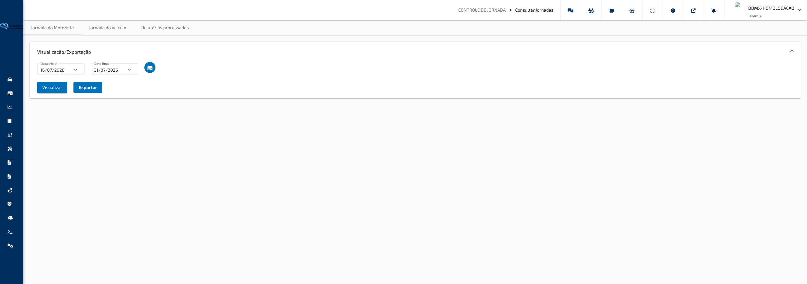
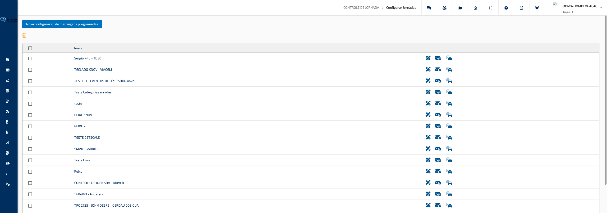

## Controle de Jornada

### Consultar Jornadas

**Caminho:** Controle de Jornada > Consultar Jornadas

Esta tela permite consultar e analisar o histórico de jornadas de trabalho dos motoristas e dos veículos da frota em um período determinado. Ela reúne as mensagens de controle de jornada registradas pelo equipamento de cada veículo, exibindo-as organizadas por motorista ou por veículo, com um gráfico de alocação de tempo para cada dia consultado.

---

#### O que você encontra nesta tela

**Aba Controle Jornada Motorista**

Aba principal ao abrir a tela. Permite filtrar as jornadas por motorista: selecione um período e os motoristas desejados, clique em **Visualizar** e os resultados serão exibidos abaixo dos filtros, agrupados pelo nome de cada motorista. Cada grupo apresenta abas com os dias que possuem registros, e dentro de cada aba é possível consultar as mensagens do dia e o gráfico de alocação de tempo.

**Aba Controle Jornada Veículo**

Funciona da mesma forma que a aba de motoristas, mas com foco nos veículos. Selecione o período e os veículos desejados, clique em **Visualizar** e os resultados serão agrupados por veículo, com abas por data e os mesmos painéis de mensagens e gráfico.

**Aba Relatórios Processados**

Lista os relatórios de controle de jornada gerados anteriormente (por motorista e por veículo). Permite acompanhar o andamento do processamento e baixar os arquivos quando estiverem prontos.

**Painel de Filtros (dentro de cada aba)**

Expansível, localizado no topo de cada aba. Contém os campos de período, o botão de seleção de motoristas ou veículos e as ações de **Visualizar** e **Exportar**.

**Cartões de Resultado**

Exibidos abaixo do painel de filtros após a consulta. Cada cartão representa um motorista (ou veículo) e contém abas com as datas em que há registros. Dentro de cada aba de data há dois painéis principais: a tabela de mensagens e o gráfico de alocação de tempo.

**Tabela de Mensagens (dentro do cartão de cada data)**

Expansível, exibe a lista de mensagens de controle de jornada registradas no dia. As colunas variam conforme a aba ativa: na aba de motorista, a coluna exibe a placa do veículo; na aba de veículo, a coluna exibe o nome do motorista. As demais colunas são: mensagem registrada, endereço do evento e data e hora da mensagem. Cada linha com localização disponível possui um botão para abrir a posição no mapa.

**Gráfico de Alocação de Tempo**

Exibido logo abaixo da tabela de mensagens. Mostra uma linha do tempo com os diferentes status de jornada ao longo do dia: períodos de atividade, pausa, tempo ocioso e outros estados detectados pelo sistema de integração do veículo. O eixo horizontal representa as horas do dia.

---

#### Funcionalidades

**Consultar jornadas por motorista**

Busca e exibe o histórico de mensagens de jornada dos motoristas selecionados no período informado.

Como usar:

1. Na aba **Controle Jornada Motorista**, certifique-se de que o painel de filtros está expandido.
2. Informe a **Data Inicial** e a **Data Final** do período desejado nos campos de data.
3. Clique no ícone de carteira de identidade ao lado das datas para abrir a janela de seleção de motoristas.
4. Localize os motoristas desejados e confirme a seleção.
5. Clique em **Visualizar** para carregar os resultados.

> **Dica:** O período padrão ao abrir a tela é dos últimos 15 dias até hoje. Ajuste conforme a necessidade antes de consultar. É obrigatório selecionar pelo menos um motorista — caso contrário, uma mensagem de aviso será exibida e a consulta não será realizada.

**Consultar jornadas por veículo**

Busca e exibe o histórico de mensagens de jornada dos veículos selecionados no período informado.

Como usar:

1. Clique na aba **Controle Jornada Veículo**.
2. Informe a **Data Inicial** e a **Data Final** nos campos de data.
3. Clique no ícone de veículos ao lado das datas para abrir a janela de seleção de veículos.
4. Marque os veículos desejados e confirme a seleção.
5. Clique em **Visualizar** para carregar os resultados.

> **Dica:** Na visualização por veículo, o gráfico de alocação de tempo exibe as faixas de cada motorista que operou o veículo naquele dia, diferenciadas por cor, facilitando a identificação de quem conduziu em cada período.

**Navegar pelos resultados por data**

Cada motorista ou veículo consultado aparece como um cartão com abas, onde cada aba corresponde a uma data com registros.

Como usar:

1. Após clicar em **Visualizar**, localize o cartão do motorista ou veículo desejado na lista de resultados.
2. O nome do motorista ou veículo é exibido como título do cartão.
3. Clique nas abas na parte superior do cartão para alternar entre as datas disponíveis.
4. A tabela de mensagens e o gráfico de alocação de tempo serão atualizados conforme a data selecionada.

> **Dica:** Apenas as datas que possuem mensagens de jornada registradas aparecem como abas. Datas sem registros não são exibidas.

**Visualizar posição de uma mensagem no mapa**

Abre um mapa com a localização exata onde a mensagem de jornada foi registrada.

Como usar:

1. Na tabela de mensagens, localize a linha do evento desejado.
2. Clique no ícone de localização no mapa (ícone de marcador de mapa) na coluna **Ver no Mapa** da linha correspondente.
3. Um mapa será aberto em uma janela com um marcador indicando o ponto onde o evento foi registrado.

> **Dica:** O botão de mapa só aparece para mensagens que possuem coordenadas de localização registradas. Mensagens sem posição geográfica não exibem o ícone.

**Visualizar mensagens processadas**

Abre uma janela com a lista detalhada das mensagens de jornada processadas pelo sistema para o dia consultado, exibindo veículo, motorista, mensagem e data e hora.

Como usar:

1. Dentro de um cartão de resultado, localize o botão de envelope (ícone de mensagem) abaixo da tabela de mensagens. Ele só aparece quando existem mensagens processadas disponíveis.
2. Clique no ícone para abrir a janela de mensagens processadas.
3. A tabela exibida mostra todas as mensagens processadas com paginação, permitindo navegar entre páginas quando há muitos registros.

> **Dica:** As mensagens processadas representam os registros de jornada interpretados pelo sistema de integração do veículo. Elas complementam os registros brutos exibidos na tabela principal.

**Exportar relatório de jornada por motorista**

Gera um arquivo com os dados de jornada dos motoristas selecionados no período informado.

Como usar:

1. Selecione o período e os motoristas desejados na aba **Controle Jornada Motorista**.
2. Certifique-se de que já houve uma consulta com **Visualizar** (o botão **Exportar** só fica disponível após a primeira consulta bem-sucedida).
3. Clique no botão **Exportar** e selecione o formato desejado no menu:
   - **PDF** — gera um documento formatado para impressão e compartilhamento.
   - **Excel** — gera uma planilha para análise detalhada dos dados.
4. O relatório será enviado para processamento e ficará disponível na aba **Relatórios Processados**.

> **Dica:** Após solicitar a exportação, você será redirecionado automaticamente para a aba **Relatórios Processados**, onde poderá acompanhar o andamento e baixar o arquivo quando estiver pronto.

**Exportar relatório de jornada por veículo**

Gera um arquivo com os dados de jornada dos veículos selecionados no período informado.

Como usar:

1. Clique na aba **Controle Jornada Veículo**, selecione o período e os veículos desejados.
2. Clique em **Visualizar** para carregar os resultados.
3. Clique no botão **Exportar** e selecione o formato desejado: **PDF** ou **Excel**.
4. O relatório será gerado e ficará disponível na aba **Relatórios Processados**.

> **Dica:** O relatório por veículo é útil para auditar o uso de cada veículo ao longo do período, identificando padrões de operação e lacunas na jornada.

**Consultar relatórios processados anteriormente**

A aba Relatórios Processados lista todos os relatórios de controle de jornada já gerados, separados por tipo (motoristas e veículos).

Como usar:

1. Clique na aba **Relatórios Processados** na parte superior da tela.
2. A lista de relatórios disponíveis será exibida com informações de tipo, data de geração e status de processamento.
3. Quando o relatório estiver pronto, clique no botão de download para salvar o arquivo.

> **Dica:** Relatórios em processamento podem levar alguns minutos para ficar disponíveis. Atualize a lista periodicamente se o arquivo ainda não aparecer disponível para download.

---

#### Campos e Filtros

| Campo / Filtro              | O que faz                                                                                                   |
| --------------------------- | ----------------------------------------------------------------------------------------------------------- |
| **Data Inicial**            | Define a data de início do período de consulta de jornadas                                                  |
| **Data Final**              | Define a data de encerramento do período de consulta de jornadas                                            |
| **Selecionar Motoristas**   | Abre a janela para escolher quais motoristas terão as jornadas consultadas (disponível na aba de motorista) |
| **Selecionar Veículos**     | Abre a janela para escolher quais veículos terão as jornadas consultadas (disponível na aba de veículo)     |
| **Visualizar**              | Inicia a consulta com os filtros configurados e exibe os resultados na tela                                 |
| **Exportar**                | Gera um relatório em PDF ou Excel com os dados da consulta atual; disponível após a primeira visualização   |
| **Abas de data (cartão)**   | Permite navegar entre os dias com registros de jornada de cada motorista ou veículo                         |
| **Tabela de Mensagens**     | Lista os registros de jornada do dia selecionado, com coluna de localização no mapa para cada evento        |
| **Mensagens Processadas**   | Abre janela com registros processados detalhados; disponível quando há dados processados para o dia         |

[↑ Voltar ao Índice](index.md#índice)

---

### Configurar Jornadas

**Caminho:** Controle de Jornada > Configurar Jornadas

Esta tela permite cadastrar e gerenciar as configurações de mensagens de jornada que serão enviadas aos equipamentos instalados nos veículos. Cada configuração define os textos que aparecerão no dispositivo do motorista para cada evento de jornada — como início de jornada, refeição, manutenção, entre outros — de acordo com o tipo de equipamento utilizado.

---

#### O que você encontra nesta tela

**Barra de Ações**

Localizada no topo da tela. Contém o botão **Nova Configuração de Mensagens Programadas** para criar uma nova configuração, e o ícone de lixeira para apagar as configurações selecionadas na tabela.

**Tabela de Configurações**

Lista todas as configurações de mensagens de jornada cadastradas. Cada linha exibe o nome da configuração e três botões de ação individuais: editar os dados, consultar o status de envio para os veículos e gerenciar os veículos vinculados. A tabela possui paginação e permite selecionar múltiplas linhas com caixas de seleção.

---

#### Funcionalidades

**Criar nova configuração de mensagens de jornada**

Abre a janela de criação para definir o nome, o tipo de equipamento, o modelo de jornada e os textos de cada evento. Na criação, também é possível vincular veículos de imediato.

Como usar:

1. Clique no botão **Nova Configuração de Mensagens Programadas** no topo da tela.
2. Na janela aberta, preencha o campo **Nome** com uma identificação para a configuração.
3. No campo **Tipo**, selecione o tipo de equipamento instalado nos veículos:
   - **TD50 / TD60** — equipamento com teclado físico padrão
   - **KNOV** — equipamento com interface KNOV
   - **GetScale** — equipamento com interface GetScale
   - **Smartphone / Tablet** — dispositivo móvel com aplicativo
4. No campo **Modelo**, selecione o modelo de jornada compatível com o tipo escolhido.
5. A tabela de mensagens será preenchida automaticamente com os eventos disponíveis para o tipo e modelo selecionados. Para cada evento, edite o texto do campo **Mensagem** conforme necessário.
6. Acesse a aba **Veículos** e selecione os veículos que receberão esta configuração.
7. Clique em **Salvar** para concluir a criação.

> **Dica:** Para equipamentos do tipo **Smartphone / Tablet**, é possível adicionar ou remover eventos da tabela usando os botões de adição (ícone de mais) e exclusão (ícone de lixeira) em cada linha. Para os demais tipos, os eventos são fixos e não podem ser removidos.

**Editar uma configuração existente**

Permite alterar o nome, o tipo de equipamento, o modelo e os textos dos eventos de uma configuração já cadastrada.

Como usar:

1. Na tabela de configurações, localize a configuração desejada.
2. Clique no ícone de lápis (**Editar**) na coluna de ações da linha correspondente.
3. A janela de edição será aberta com os dados atuais da configuração.
4. Faça as alterações necessárias nos campos **Nome**, **Tipo**, **Modelo** e nos textos da tabela de mensagens.
5. Clique em **Salvar** para aplicar as alterações.

> **Dica:** Na edição, a aba **Veículos** não está disponível. Para gerenciar os veículos vinculados a uma configuração existente, use o botão de veículos na tabela principal (ícone de carros).

**Consultar o status de envio para os veículos**

Verifica se a configuração foi enviada e recebida com sucesso por cada veículo vinculado.

Como usar:

1. Na tabela de configurações, localize a configuração desejada.
2. Clique no ícone de envelope com check (**Status de Envio**) na coluna de ações da linha correspondente.
3. A janela de status será aberta com uma tabela listando cada veículo vinculado, sua placa e a situação atual do envio.
4. Consulte a coluna **Situação** para verificar o resultado de cada veículo.

> **Dica:** As situações possíveis são: **Não Enviado** (aguardando transmissão), **Enviado** (transmitido, aguardando confirmação do equipamento), **Confirmado** (recebido com sucesso pelo equipamento), **Tentativas Excedidas** (falhou após múltiplas tentativas), **Expirado** (prazo de envio ultrapassado), **Cancelado** e **Inválido**. Veículos com situação diferente de **Confirmado** podem necessitar de nova transmissão.

**Gerenciar veículos vinculados a uma configuração**

Adiciona ou remove os veículos que receberão esta configuração de mensagens.

Como usar:

1. Na tabela de configurações, localize a configuração desejada.
2. Clique no ícone de frota (**Veículos**) na coluna de ações da linha correspondente.
3. A janela de seleção de veículos será aberta com os vínculos atuais.
4. Marque ou desmarque os veículos conforme necessário.
5. Salve para aplicar as alterações.

> **Dica:** Uma mesma configuração pode ser vinculada a múltiplos veículos do mesmo tipo de equipamento. Após salvar o vínculo, a configuração será automaticamente transmitida para os veículos na próxima oportunidade de conexão.

**Apagar configurações**

Remove permanentemente uma ou mais configurações da lista.

Como usar:

1. Marque a caixa de seleção à esquerda das configurações que deseja apagar. Para selecionar todas, clique na caixa de seleção no cabeçalho da tabela.
2. Clique no ícone de lixeira na barra de ações no topo da tabela.
3. Confirme a exclusão na janela de confirmação exibida.

> **Dica:** A exclusão é permanente. Certifique-se de que a configuração não está mais em uso antes de apagar, pois os veículos vinculados deixarão de recebê-la.

---

#### Campos e Filtros

| Campo / Filtro   | O que faz                                                                                                                                               |
| ---------------- | ------------------------------------------------------------------------------------------------------------------------------------------------------- |
| **Nome**         | Identifica a configuração na lista; use um nome descritivo que indique o tipo de equipamento ou frota                                                   |
| **Tipo**         | Define o modelo de equipamento instalado nos veículos: TD50/TD60, KNOV, GetScale ou Smartphone/Tablet                                                   |
| **Modelo**       | Define o modo de operação dentro do tipo escolhido; as opções variam conforme o tipo selecionado                                                        |
| **Mensagem**     | Texto que será exibido no equipamento do motorista para cada evento de jornada; editável para todos os tipos                                            |
| **Código**       | Identificação interna do evento de jornada; fixo para TD50, KNOV e GetScale, selecionável para Smartphone/Tablet                                        |
| **Situação**     | Status atual do envio da configuração para o veículo: Não Enviado, Enviado, Confirmado, Tentativas Excedidas, Expirado, Cancelado ou Inválido           |

[↑ Voltar ao Índice](index.md#índice)

---

