## Gestão de Campo

### Mapa Online

**Caminho:** Gestão de Campo > Mapa Online

Esta tela permite acompanhar em tempo real a localização e a situação de todos os veículos da frota em um mapa interativo. É a principal ferramenta de monitoramento diário da operação, reunindo informações de posição, telemetria e status de cada veículo em um único lugar.

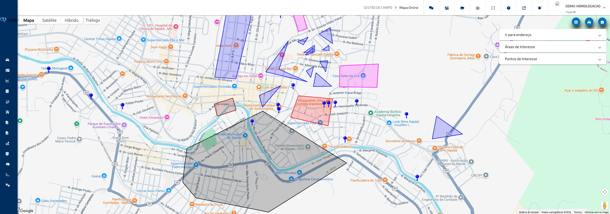

---

#### O que você encontra nesta tela

**Mapa**

Área central que ocupa toda a tela. Exibe os veículos como ícones coloridos sobre o mapa, indicando o status de cada um. O mapa pode ser ampliado, reduzido e arrastado livremente. Ao clicar em um ícone de veículo, um painel de informações detalhadas é exibido diretamente no mapa.

**Painel Lateral de Veículos**

Acessado pelo botão **Veículos** na barra de ações. Desliza a partir da direita da tela e exibe a lista de veículos organizada em grupos. Permite selecionar quais veículos serão exibidos no mapa por meio de caixas de seleção.

**Grid de Monitoramento**

Tabela que pode ser aberta na parte inferior da tela ou em uma janela separada. Exibe os veículos selecionados no painel lateral em formato de lista, com colunas configuráveis.

**Barra de Ações (sobreposição do mapa)**

Localizada no canto superior esquerdo do mapa, contém três botões de acesso rápido:

- **Grid de Monitoramento** — abre ou fecha a tabela de veículos
- **Veículos** — abre o painel lateral para seleção de veículos
- **Legendas** — exibe um quadro explicando o significado das cores e ícones dos veículos

**Painel de Sobreposição (opcionais, conforme configuração)**

Abaixo da barra de ações, podem aparecer painéis expansíveis conforme as permissões configuradas para o usuário:

- **Ir para Endereço** — campo para digitar um endereço e centralizar o mapa nele
- **Áreas de Contenção** — lista as áreas geográficas cadastradas, com opção de exibir ou ocultar cada uma no mapa
- **Pontos de Interesse** — lista os pontos de referência cadastrados, com opção de exibir ou ocultar cada um no mapa
- **Rota Selecionada** — lista as rotas que foram carregadas no mapa para acompanhamento

---

#### Funcionalidades

**Visualizar posição e informações de um veículo**

Abre um painel com todos os dados disponíveis do veículo: localização, velocidade, telemetria, status do motor, identificação do motorista e muito mais.

Como usar:

1. Localize o ícone do veículo desejado no mapa.
2. Clique sobre o ícone para abrir o painel de informações.
3. As informações exibidas variam conforme a configuração da conta: endereço, data da última comunicação, placa, modelo, odômetro, horímetro, velocidade, RPM, nível de bateria, status de bloqueio, dados de telemetria embarcada e CAN, entre outros.

> **Dica:** O painel também pode mostrar informações como manutenções pendentes, último checklist realizado, tempo parado, tempo fora da base e dados de sensores personalizados — dependendo do tipo de equipamento instalado no veículo.

**Selecionar veículos para monitorar**

Permite escolher quais veículos aparecem no mapa e na tabela de monitoramento.

Como usar:

1. Clique no botão **Veículos** na barra de ações (ícone de carro).
2. O painel lateral abrirá à direita com a árvore de grupos e veículos.
3. Marque as caixas de seleção dos veículos ou grupos que deseja monitorar.
4. O mapa será atualizado automaticamente para exibir apenas os veículos selecionados.

> **Dica:** Selecione um grupo inteiro marcando a caixa do grupo para incluir todos os veículos daquele conjunto de uma só vez.

**Consultar legenda de situações dos veículos**

Exibe um quadro explicando o significado de cada cor e ícone utilizado no mapa.

Como usar:

1. Clique no botão **Legendas** na barra de ações (ícone de informação).
2. Um painel será aberto com a lista de situações possíveis.
3. Consulte a situação desejada e feche o painel quando terminar.

> **Dica:** Utilize as legendas para interpretar rapidamente o status de veículos ao monitorar a frota, especialmente em situações de alerta.

As situações disponíveis são:

| Cor / Ícone                  | Significado                           |
| ---------------------------- | ------------------------------------- |
| Círculo vermelho             | Veículo parado                        |
| Círculo verde                | Veículo em movimento                  |
| Círculo cinza claro          | Sem conexão há mais de 2 horas        |
| Círculo preto                | Sem conexão há mais de 12 horas       |
| Círculo amarelo              | Veículo ocioso                        |
| Raio vermelho                | Bateria desconectada                  |
| Cadeado amarelo              | Veículo bloqueado                     |
| Chave inglesa cinza          | Veículo em manutenção                 |
| Velocímetro vermelho         | Veículo acima do limite de velocidade |
| Triângulo de alerta vermelho | Alarme ativo                          |

**Abrir Grid de Monitoramento**

Exibe em formato de tabela os dados dos veículos selecionados, permitindo uma visão comparativa.

Como usar:

1. Clique no botão **Grid de Monitoramento** na barra de ações (ícone de tabela).
2. A tabela aparecerá na parte inferior da tela com as informações dos veículos selecionados.
3. Para expandir a tabela em uma janela separada, clique no botão de expandir (ícone de seta) no cabeçalho da tabela.

> **Dica:** A janela separada do grid permite consultar a tabela enquanto navega livremente pelo mapa, sem dividir a tela.

**Ir para um endereço no mapa**

Centraliza o mapa em qualquer endereço digitado, facilitando a localização de áreas específicas.

Como usar:

1. No painel de sobreposição à esquerda, clique no expansível **Ir para Endereço** (disponível conforme permissão).
2. Digite o endereço desejado no campo de texto.
3. Clique no botão de mover (ícone de setas) para centralizar o mapa no endereço informado.

> **Dica:** Use este recurso para verificar rapidamente se há veículos próximos a um local de interesse, como um cliente ou ponto de entrega.

**Exibir ou ocultar áreas de contenção e pontos de interesse**

Controla a visibilidade das áreas geográficas e pontos de referência cadastrados sobre o mapa.

Como usar:

1. No painel de sobreposição à esquerda, localize os expansíveis **Áreas de Contenção** ou **Pontos de Interesse** (disponíveis conforme permissão).
2. Clique no expansível desejado para ver a lista de itens cadastrados.
3. Marque ou desmarque cada item para exibir ou ocultar no mapa.

> **Dica:** Exibir as áreas de contenção junto com os veículos facilita verificar se algum veículo saiu de uma região autorizada de operação.

**Visualizar rota selecionada**

Exibe no mapa uma rota previamente carregada, mostrando seu traçado e permitindo atualização ou remoção.

Como usar:

1. No painel de sobreposição à esquerda, clique no expansível **Rota Selecionada** (aparece quando uma rota estiver ativa).
2. Clique no nome da rota para centralizar o mapa nela.
3. Use o botão **Atualizar** para recarregar os dados da rota.
4. Use o botão **Remover** para retirar a rota do mapa.

> **Dica:** Cada rota exibida possui uma cor identificadora, facilitando acompanhar múltiplas rotas simultaneamente.

**Enviar comando para o veículo**

Permite enviar instruções remotas para o módulo instalado no veículo, como comandos operacionais específicos.

Como usar:

1. Clique sobre o ícone do veículo no mapa para abrir o painel de informações.
2. No rodapé do painel, clique no botão **Enviar Comando** (ícone de terminal).
3. Selecione ou preencha o comando desejado na janela que será aberta.
4. Confirme o envio.

> **Dica:** Este botão só está disponível para usuários com permissão de envio de comandos. Se o botão estiver desabilitado, consulte o administrador do sistema.

**Acessar streaming de câmera do veículo**

Abre a transmissão ao vivo das câmeras instaladas no veículo.

Como usar:

1. Clique sobre o ícone do veículo no mapa.
2. No rodapé do painel de informações, clique no botão **Streaming** (ícone de câmera).
3. A transmissão ao vivo será aberta em uma nova janela.

> **Dica:** O acesso ao streaming requer permissão específica. Verifique com o administrador caso o botão esteja desabilitado.

**Consultar motoristas vinculados ao veículo**

Exibe a lista de motoristas associados ao veículo, com nome, matrícula, tipo de identificação e jornada atual.

Como usar:

1. Clique sobre o ícone do veículo no mapa.
2. No rodapé do painel de informações, clique no botão **Motoristas Vinculados** (ícone de grupo de pessoas).
3. Uma tabela será exibida com todos os motoristas vinculados ao veículo.
4. Para editar as informações de um motorista, clique no ícone de edição na linha correspondente.
5. Para remover um motorista do vínculo, clique no ícone de exclusão na linha correspondente.

> **Dica:** A jornada exibida indica se o motorista está em atividade, em pausa ou encerrou o turno.

**Visualizar última rota percorrida**

Traça no mapa o caminho que o veículo percorreu mais recentemente.

Como usar:

1. Clique sobre o ícone do veículo no mapa.
2. No rodapé do painel de informações, clique no botão **Última Rota** (ícone de rota com relógio).
3. O trajeto mais recente será desenhado sobre o mapa.

> **Dica:** Após carregar a última rota, o botão será desabilitado para evitar recarregamentos acidentais. Para carregar novamente, feche e reabra o painel do veículo.

**Acessar rotas percorridas, mapa de calor e relatórios**

Atalhos para outros módulos do sistema, abrindo diretamente com o veículo selecionado.

Como usar:

1. Clique sobre o ícone do veículo no mapa.
2. No rodapé do painel, utilize os botões correspondentes:
   - **Rotas Percorridas** — abre o histórico detalhado de trajetos do veículo
   - **Mapa de Calor** — abre a visualização de densidade de deslocamentos
   - **Relatórios** — abre o menu para gerar relatórios do veículo ou listar os relatórios já gerados

> **Dica:** Os botões só ficam ativos se o usuário tiver permissão para acessar os módulos correspondentes.

**Reportar manutenção corretiva**

Registra uma ocorrência de manutenção corretiva diretamente a partir do mapa, sem precisar navegar até outro módulo.

Como usar:

1. Clique sobre o ícone do veículo no mapa.
2. No rodapé do painel, clique no botão **Manutenção Corretiva** (ícone de ferramentas).
3. Preencha as informações da ocorrência na janela aberta.
4. Confirme o registro.

> **Dica:** Use este atalho quando identificar um veículo com problema durante o monitoramento em tempo real, registrando a ocorrência imediatamente.

**Enviar mensagem para o veículo**

Abre o canal de comunicação por mensagens com o operador ou motorista do veículo.

Como usar:

1. Clique sobre o ícone do veículo no mapa.
2. No rodapé do painel, clique no botão **Mensagem** (ícone de balão de conversa).
3. Digite a mensagem desejada na janela de chat que será aberta.
4. Envie a mensagem.

> **Dica:** As mensagens enviadas ficam registradas no histórico de comunicação do veículo.

**Acionar alerta de status de alarme**

Altera o status de alarme ativo no veículo diretamente pelo mapa.

Como usar:

1. Clique sobre o ícone do veículo no mapa.
2. No rodapé à esquerda do painel, clique no botão de **Status de Alarme** (ícone de triângulo de alerta — pisca em vermelho quando há alarme ativo).
3. Confirme a ação para alterar o status do alarme.

> **Dica:** O ícone piscante indica que o veículo possui um alarme ativo no momento. Clique para investigar e tratar a ocorrência.

**Bloquear ou desbloquear veículo**

Envia um comando de bloqueio ou desbloqueio do módulo instalado no veículo remotamente.

Como usar:

1. Clique sobre o ícone do veículo no mapa.
2. No rodapé do painel, clique no botão de menu adicional (três pontos verticais).
3. Selecione **Bloquear Veículo** ou **Desbloquear Veículo**, conforme o status atual.
4. Aguarde a confirmação da operação.

> **Dica:** Após o bloqueio, o ícone do veículo no mapa será atualizado para refletir o status de bloqueado (cadeado amarelo).

**Desligar pânico**

Cancela um acionamento de pânico ativo no veículo.

Como usar:

1. Clique sobre o ícone do veículo no mapa.
2. No rodapé do painel, clique no botão de menu adicional (três pontos verticais).
3. Selecione **Desligar Pânico**.
4. Confirme a operação.

> **Dica:** A opção de desligar pânico só aparece quando o veículo possui pânico ativo. Verifique o campo de pânico no painel de informações do veículo.

**Definir contra-senha**

Registra uma contra-senha para o veículo, usada em procedimentos de segurança específicos da operação.

Como usar:

1. Clique sobre o ícone do veículo no mapa.
2. No rodapé do painel, clique no botão de menu adicional (três pontos verticais).
3. Selecione **Solicitar Contra-Senha**.
4. Informe a senha desejada no campo apresentado.
5. Confirme para salvar.

> **Dica:** A data da última contra-senha definida e o valor atual são exibidos no painel de informações do veículo, quando configurados para exibição.

---

#### Campos e Filtros

| Campo / Filtro                           | O que faz                                                                              |
| ---------------------------------------- | -------------------------------------------------------------------------------------- |
| **Seleção de veículos (painel lateral)** | Define quais veículos são exibidos no mapa e na tabela de monitoramento                |
| **Ir para Endereço**                     | Centraliza o mapa em um endereço digitado manualmente                                  |
| **Áreas de Contenção**                   | Ativa ou desativa a exibição de cada área geográfica cadastrada sobre o mapa           |
| **Pontos de Interesse**                  | Ativa ou desativa a exibição de cada ponto de referência cadastrado sobre o mapa       |
| **Rota Selecionada**                     | Lista as rotas ativas no mapa, com opção de centralizar, atualizar ou remover cada uma |

[↑ Voltar ao Índice](index.md#índice)

---

### Rotas Percorridas

**Caminho:** Gestão de Campo > Rotas Percorridas

Esta tela permite consultar e visualizar no mapa os percursos realizados por um veículo em um dia específico. É utilizada para analisar o histórico de deslocamentos, verificar distâncias percorridas, tempos de parada e dados de telemetria ao longo de cada rota.

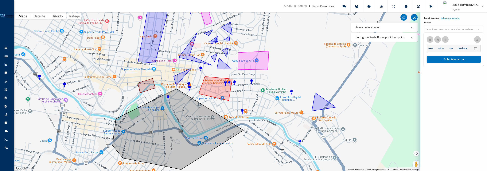

---

#### O que você encontra nesta tela

**Mapa**

Área principal que ocupa a maior parte da tela. Exibe as rotas selecionadas desenhadas como linhas coloridas sobre o mapa. O mapa pode ser ampliado, reduzido e arrastado livremente. Ao passar o cursor sobre um ponto do gráfico de telemetria, a posição correspondente é marcada no mapa.

**Painel Lateral de Rotas**

Localizado à direita. Contém o seletor de veículo, o calendário de datas e a tabela com todas as rotas do dia selecionado. É o ponto de partida para qualquer consulta: escolha o veículo, selecione a data e marque as rotas que deseja visualizar.

**Painel de Camadas do Mapa**

Localizado sobre o mapa, à direita. Permite ativar ou desativar a exibição de **Áreas de Interesse** e **Rotas Checkpoint** cadastradas, sobrepondo-as ao mapa para referência visual.

**Painel de Telemetria**

Painel retrátil que aparece na parte inferior da tela. Exibe um gráfico com os dados de telemetria (velocidade, bateria e outros sensores) ao longo do tempo das rotas selecionadas. Pode ser aberto pelo botão **Exibir Telemetria** no painel lateral.

**Painel de Ajuste de Rota (Map Matching)**

Painel flutuante ativado por um botão na tela. Permite processar as rotas selecionadas para encaixá-las na malha viária real, corrigindo imprecisões do GPS.

---

#### Funcionalidades

**Selecionar um veículo**

Escolhe o veículo cujas rotas serão consultadas. O nome e a placa do veículo selecionado ficam visíveis no topo do painel lateral.

Como usar:

1. No painel lateral, clique no botão com o nome do veículo (ou em **Selecionar veículo**, caso nenhum esteja selecionado).
2. Na janela de busca que se abre, localize o veículo pelo nome, placa ou grupo.
3. Clique no veículo desejado e confirme a seleção. O calendário será atualizado automaticamente para destacar os dias com registros daquele veículo.

> **Dica:** O calendário destaca os dias que possuem rotas registradas para o veículo selecionado. Use esse recurso para localizar rapidamente períodos com atividade.

---

**Consultar rotas de um dia**

Carrega a lista de rotas realizadas pelo veículo em uma data específica.

Como usar:

1. Com o veículo já selecionado, clique no campo de data no painel lateral.
2. No calendário, navegue até o mês desejado e clique em uma data destacada.
3. A tabela abaixo do calendário será preenchida com todas as rotas do dia, exibindo horário de início, horário de fim e distância percorrida.

> **Dica:** Datas sem destaque no calendário não possuem registros de rota para o veículo selecionado.

---

**Visualizar rotas no mapa**

Desenha as rotas selecionadas como linhas coloridas sobre o mapa, permitindo acompanhar visualmente o percurso realizado.

Como usar:

1. Na tabela de rotas, marque a caixa de seleção ao lado de uma ou mais rotas.
2. As rotas marcadas serão desenhadas automaticamente no mapa.
3. Para selecionar todas as rotas de uma vez, marque a caixa na linha de cabeçalho da tabela.

> **Dica:** Ao selecionar uma única rota, o painel lateral exibe um resumo de estatísticas com distância, velocidade média, velocidade máxima, tempo em movimento e tempo parado com motor ligado.

---

**Deselecionar todas as rotas**

Remove todas as seleções de uma só vez, limpando o mapa e o resumo de estatísticas.

Como usar:

1. No topo da tabela de rotas, clique no botão de vassoura (**Deselecionar todos**).
2. Todas as marcações serão removidas e as linhas do mapa serão apagadas.
3. Para refazer a seleção, marque as rotas desejadas individualmente ou use a caixa de seleção geral.

> **Dica:** Use este recurso para começar uma nova análise sem precisar desmarcar cada rota manualmente.

---

**Exibir telemetria**

Abre o painel de telemetria na parte inferior da tela, exibindo um gráfico com os dados registrados pelo veículo ao longo das rotas selecionadas.

Como usar:

1. Selecione pelo menos uma rota na tabela.
2. Clique no botão **Exibir Telemetria** na parte inferior do painel lateral.
3. O painel de gráfico será exibido na parte inferior da tela.
4. Para ocultar os rótulos do eixo vertical, ative o botão **Ocultar eixo Y** no canto superior do painel.
5. Para fechar o painel, clique no ícone de fechar (X) no canto superior direito do gráfico.

> **Dica:** Passe o cursor sobre qualquer ponto do gráfico para ver os valores exatos naquele momento e localizar a posição correspondente no mapa.

---

**Exportar rotas selecionadas (planilha)**

Gera um arquivo Excel com os dados detalhados de telemetria das rotas marcadas na tabela.

Como usar:

1. Selecione uma ou mais rotas na tabela marcando as caixas de seleção.
2. Clique no botão de exportação de planilha (ícone de arquivo Excel) na barra de ações acima da tabela.
3. O arquivo será baixado automaticamente com o nome e a data da geração.

> **Dica:** O arquivo exportado contém os registros de telemetria detalhados de cada rota selecionada, úteis para relatórios e auditorias.

---

**Exportar rotas selecionadas (KML)**

Gera um arquivo KML com o traçado geográfico das rotas marcadas, compatível com ferramentas como Google Earth e Google Maps.

Como usar:

1. Selecione uma ou mais rotas na tabela marcando as caixas de seleção.
2. Clique no botão de exportação KML (ícone de mapa) na barra de ações acima da tabela.
3. O arquivo KML será baixado automaticamente.

> **Dica:** O KML é ideal para compartilhar ou arquivar percursos visualmente, ou para sobrepor rotas em outras ferramentas de mapeamento.

---

**Exportar todos os pontos do dia**

Gera um arquivo com todos os registros de posição do veículo no dia selecionado, independentemente de quais rotas estão marcadas.

Como usar:

1. Selecione um veículo e uma data no painel lateral.
2. Clique no botão de exportação completa (ícone de múltiplos arquivos) na barra de ações acima da tabela.
3. O arquivo será baixado automaticamente com o identificador do veículo e a data.

> **Dica:** Use este recurso quando precisar de todos os dados brutos de posição do dia, sem filtrar por rota específica.

---

**Ajuste de rota na malha viária (Map Matching)**

Processa as rotas selecionadas para encaixá-las nas vias reais, corrigindo desvios causados por imprecisão do GPS. O resultado é exibido no mapa como uma nova linha sobreposta à rota original. Enquanto o ajuste é exibido, a rota original fica oculta para facilitar a comparação com as vias.

Como usar:

1. Selecione uma ou mais rotas na tabela.
2. Clique no botão de ajuste de rota (ícone de seta de progresso) no canto da tela para abrir o painel de configuração.
3. Escolha o **raio de busca** em metros (5, 10, 20, 30, 40 ou 50 m) — raios maiores encaixam pontos mais distantes da via.
4. Selecione o **Modo básico** para um resultado mais rápido com traçado aproximado, ou **Modo completo** para um encaixe mais preciso na malha viária.
5. Clique em **Processar** para iniciar o ajuste.
6. Para desfazer o ajuste e voltar ao traçado original, clique em **Limpar**.

> **Dica:** No **Modo básico**, trechos sem correspondência na malha viária mantêm o ponto original, evitando que partes do percurso desapareçam. No **Modo completo**, ao passar o cursor sobre o gráfico de telemetria, o marcador no mapa acompanha a rota ajustada (colada à via), e não mais o traçado bruto do GPS.

> **Dica:** O painel mostra o número de rotas selecionadas e a distância total antes de processar. Recomenda-se usar a visualização de satélite no mapa ao trabalhar com o ajuste de rota para comparar o traçado com as vias reais. Ao reprocessar a mesma rota com os mesmos parâmetros durante a sessão, o resultado é reaproveitado, tornando a resposta mais rápida.

---

#### Campos e Filtros

| Campo / Filtro                   | O que faz                                                                            |
| -------------------------------- | ------------------------------------------------------------------------------------ |
| **Veículo**                      | Define o veículo cujas rotas serão consultadas                                       |
| **Data**                         | Seleciona o dia a ser consultado; datas com rotas ficam destacadas no calendário     |
| **Tabela de rotas**              | Lista todas as rotas do dia, com horário de início, horário de fim e distância       |
| **Selecionar todos**             | Marca ou desmarca todas as rotas da tabela de uma vez                                |
| **Raio de busca (Map Matching)** | Define a tolerância em metros para encaixar pontos na malha viária                   |
| **Modo básico / Modo completo**  | Controla a precisão do ajuste de rota: básico é mais rápido; completo é mais preciso |
| **Áreas de Interesse**           | Ativa ou desativa a exibição de áreas geográficas cadastradas sobre o mapa           |
| **Rotas Checkpoint**             | Ativa ou desativa a exibição de rotas de referência cadastradas sobre o mapa         |

[↑ Voltar ao Índice](index.md#índice)

---

### Flashback

**Caminho:** Gestão de Campo > Flashback

Esta tela permite identificar quais veículos da frota estiveram em uma determinada região geográfica durante um período informado. É utilizada para investigar passagens ou paradas próximas a um endereço específico, facilitando auditorias, verificações operacionais e apurações de ocorrências.

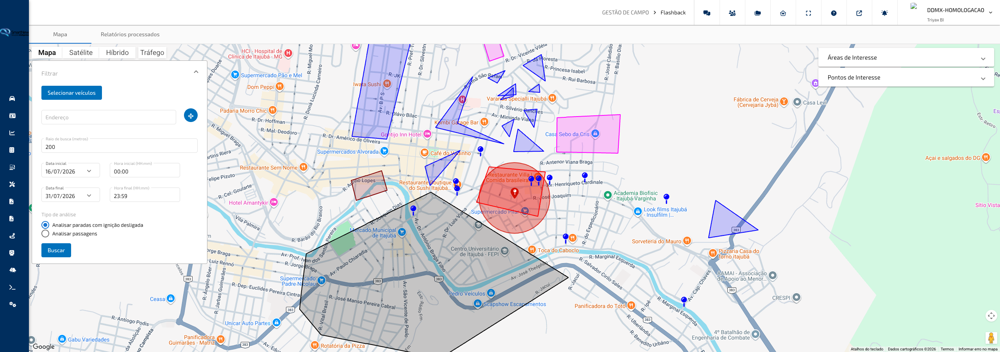

---

#### O que você encontra nesta tela

**Aba Mapa**

Tela principal ao abrir o Flashback. Contém o mapa interativo e o painel de filtros lateral. É aqui que a busca é configurada e executada. O mapa exibe um marcador no ponto de interesse definido e, conforme configuração, pode sobrepor áreas de contenção e pontos de interesse cadastrados.

**Painel de Filtros**

Localizado sobre o mapa, no lado direito. Expansível e contraível. Concentra todos os campos necessários para realizar a busca: seleção de veículos, endereço de referência, raio, período e tipo de análise.

**Painel de Camadas do Mapa**

Localizado sobre o mapa, no lado esquerdo. Permite ativar ou desativar a exibição de **Áreas de Contenção** e **Pontos de Interesse** cadastrados, sobrepondo-os ao mapa como referência visual durante a análise.

**Janela de Resultados**

Aberta automaticamente após a busca. Exibe uma tabela com os veículos encontrados na região e período informados, com dados de entrada, saída ou tempo parado, conforme o tipo de análise escolhido. Permite exportar os dados e gerar um relatório para consulta posterior.

**Aba Relatórios Processados**

Lista os relatórios de Flashback gerados anteriormente. Permite acompanhar o status de processamento e baixar os arquivos quando estiverem prontos.

---

#### Funcionalidades

**Definir o ponto de referência no mapa**

Posiciona um marcador no mapa a partir de um endereço digitado, definindo o centro da área de busca.

Como usar:

1. No painel de filtros, localize o campo **Endereço**.
2. Digite o endereço desejado (rua, número, cidade).
3. Clique no botão de mover (ícone de setas ao lado do campo) para posicionar o marcador no mapa.
4. O mapa será centralizado no endereço informado e o marcador indicará o ponto central da busca.

> **Dica:** Após posicionar o marcador, é possível ajustá-lo arrastando-o diretamente no mapa para refinar a localização.

> Se o endereço estiver vazio, não for encontrado ou ocorrer um erro na consulta, uma mensagem explicativa será exibida abaixo do campo.

**Selecionar os veículos para a busca**

Define quais veículos serão considerados na análise. Apenas os veículos selecionados serão verificados.

Como usar:

1. No painel de filtros, clique no botão **Selecionar Veículos**.
2. Na janela que se abre, localize os veículos pelo nome, placa ou grupo.
3. Marque as caixas de seleção dos veículos desejados.
4. Clique em confirmar para salvar a seleção.

> **Dica:** É possível selecionar veículos de grupos diferentes na mesma busca. Combine grupos e veículos individuais conforme a necessidade da investigação.

**Definir o raio de busca**

Determina o tamanho da área circular em torno do ponto de referência dentro da qual os veículos serão verificados.

Como usar:

1. No painel de filtros, localize o campo **Raio de Busca**.
2. Digite o valor em metros desejado (o valor padrão é 200 metros).
3. O círculo exibido no mapa ao redor do marcador será atualizado automaticamente conforme o valor informado.

> **Dica:** Raios menores tornam a busca mais precisa; raios maiores abrangem uma área maior e podem retornar mais resultados. Ajuste conforme o tamanho da região de interesse.

**Definir o período da busca**

Informa o intervalo de datas e horários que será analisado.

Como usar:

1. No painel de filtros, clique no campo **Data Inicial** e selecione a data de início no calendário.
2. No campo **Hora Inicial**, informe o horário de início no formato HH:mm.
3. Clique no campo **Data Final** e selecione a data de encerramento.
4. No campo **Hora Final**, informe o horário de encerramento no formato HH:mm.

> **Dica:** O período máximo permitido por busca é de 1 mês. Caso o intervalo informado ultrapasse esse limite, o botão **Buscar** será desabilitado e uma mensagem de aviso será exibida.

**Escolher o tipo de análise**

Define o que será procurado dentro da região: veículos que fizeram paradas com motor desligado ou veículos que simplesmente passaram pelo local.

Como usar:

1. No painel de filtros, localize a seção **Tipo de Análise**.
2. Selecione uma das opções:
   - **Analisar paradas com ignição desligada** — retorna veículos que permaneceram parados com o motor desligado dentro da área, com a data da parada e o tempo que ficaram parados.
   - **Analisar passagens** — retorna todos os veículos que passaram pela área no período, com os horários de entrada e saída.
3. O tipo escolhido influencia as colunas exibidas na tabela de resultados.

> **Dica:** Use "Analisar passagens" para verificar se um veículo transitou por uma determinada região. Use "Analisar paradas com ignição desligada" para identificar veículos que fizeram uma pausa prolongada em um local.

**Executar a busca**

Inicia a pesquisa com os filtros configurados e exibe os resultados encontrados.

Como usar:

1. Preencha todos os filtros: veículos selecionados, endereço com marcador posicionado, raio, período e tipo de análise.
2. Clique no botão **Buscar**.
3. Aguarde o processamento. A janela de resultados será aberta automaticamente ao concluir.
4. Caso nenhum veículo seja encontrado, uma mensagem informará que a busca não retornou resultados.

> **Dica:** O botão **Buscar** permanece desabilitado enquanto o período ultrapassar 1 mês ou enquanto nenhum veículo estiver selecionado.

**Consultar os resultados da busca**

A janela de resultados exibe uma tabela com os veículos encontrados na região durante o período informado.

Como usar:

1. Após a busca, a janela de resultados será aberta automaticamente.
2. Consulte a tabela com as informações dos veículos encontrados. As colunas variam conforme o tipo de análise:
   - **Paradas com ignição desligada:** identificação do veículo, placa, data da parada e tempo parado.
   - **Passagens:** identificação do veículo, placa, data de entrada e data de saída.
3. Utilize os controles de paginação na parte inferior para navegar entre páginas quando houver muitos resultados.
4. Clique no cabeçalho de qualquer coluna para ordenar os resultados por aquele critério.

> **Dica:** Os resultados são paginados em grupos de 50 registros. Para visualizar mais ou menos itens por página, use o seletor na barra de paginação.

**Exportar os resultados**

Gera um arquivo com os dados da tabela de resultados para análise externa ou arquivo.

Como usar:

1. Na janela de resultados, clique no botão **Exportar**.
2. Selecione o formato desejado no menu:
   - **PDF** — gera um arquivo de documento para impressão e compartilhamento.
   - **Excel** — gera uma planilha para análise detalhada dos dados.
3. O arquivo será gerado e enviado para a aba **Relatórios Processados**, onde poderá ser baixado quando o processamento estiver concluído.

> **Dica:** Após solicitar a exportação, a janela de resultados será fechada e você será redirecionado automaticamente para a aba **Relatórios Processados** para acompanhar o download.

**Consultar relatórios gerados anteriormente**

A aba Relatórios Processados lista todos os relatórios de Flashback já gerados, permitindo baixar os arquivos prontos.

Como usar:

1. Clique na aba **Relatórios Processados** na parte superior da tela.
2. A lista de relatórios gerados será exibida, com informações de data e status de processamento.
3. Quando o relatório estiver pronto, clique no botão de download para salvar o arquivo.

> **Dica:** Relatórios em processamento podem levar alguns minutos para ficar disponíveis. Atualize a lista periodicamente se o arquivo ainda não aparecer disponível para download.

---

#### Campos e Filtros

| Campo / Filtro          | O que faz                                                                                         |
| ----------------------- | ------------------------------------------------------------------------------------------------- |
| **Selecionar Veículos** | Define quais veículos serão verificados na busca                                                  |
| **Endereço**            | Ponto de referência no mapa; ao confirmar, posiciona o marcador central da área de busca          |
| **Raio de Busca**       | Define o tamanho em metros da área circular em torno do ponto de referência                       |
| **Data Inicial**        | Data de início do período analisado                                                               |
| **Hora Inicial**        | Horário de início do período, no formato HH:mm                                                    |
| **Data Final**          | Data de encerramento do período analisado                                                         |
| **Hora Final**          | Horário de encerramento do período, no formato HH:mm                                              |
| **Tipo de Análise**     | Define se a busca considera apenas paradas com ignição desligada ou todas as passagens pelo local |
| **Áreas de Contenção**  | Ativa ou desativa a exibição de áreas geográficas cadastradas sobre o mapa                        |
| **Pontos de Interesse** | Ativa ou desativa a exibição de pontos de referência cadastrados sobre o mapa                     |

[↑ Voltar ao Índice](index.md#índice)

---

### Mapa de Calor

**Caminho:** Gestão de Campo > Mapa de Calor

Esta tela gera uma visualização em mapa que destaca, por meio de cores, as regiões onde um ou mais veículos da frota circularam com maior frequência em um determinado período. É uma ferramenta de análise histórica que ajuda a identificar rotas repetidas, pontos de concentração de paradas e comportamentos de deslocamento da operação.

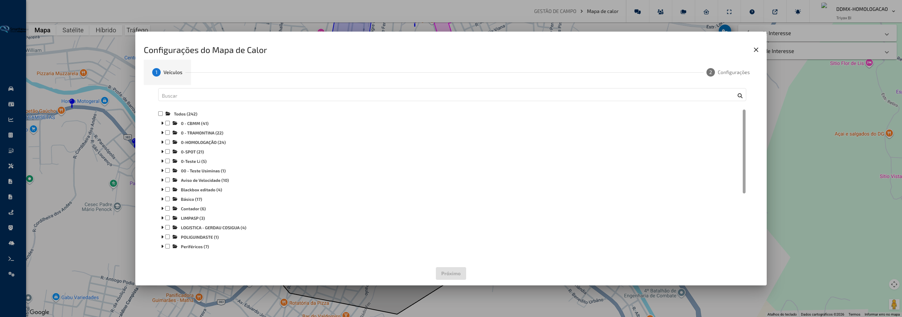

---

#### O que você encontra nesta tela

**Mapa**

Área principal que ocupa toda a tela. Após a análise ser executada, exibe uma camada de calor sobre o mapa: as regiões mais frequentadas pelos veículos aparecem em cores mais intensas (tons quentes), enquanto regiões menos visitadas aparecem em cores mais frias. O mapa pode ser ampliado, reduzido e arrastado livremente.

**Botão de Configurações**

Ícone de engrenagens localizado no canto superior da tela. Abre a janela de configuração onde é possível selecionar veículos e definir os filtros da análise.

**Painel de Áreas de Interesse**

Exibido no canto superior da tela quando há áreas cadastradas disponíveis. Permite ativar ou desativar a exibição de áreas geográficas delimitadas sobre o mapa durante a visualização.

**Painel de Pontos de Interesse**

Exibido junto ao painel de áreas quando há pontos cadastrados disponíveis. Permite ativar ou desativar a exibição de pontos de referência sobre o mapa.

---

#### Funcionalidades

**Configurar e executar uma análise**

Define os veículos e o período a serem analisados, aplica filtros de eventos e gera o mapa de calor com os dados históricos de posição.

Como usar:

1. Clique no botão de configurações (ícone de engrenagem) no canto superior da tela. A janela de configuração será aberta automaticamente na primeira vez que a tela for acessada.
2. Na aba **Veículos**, selecione um ou mais veículos da lista usando as caixas de seleção. Você pode marcar múltiplos veículos ao mesmo tempo.
3. Clique em **Próximo** para avançar para a aba de configurações de filtro.
4. Defina o período da análise informando a **Data Inicial**, a **Hora Inicial**, a **Data Final** e a **Hora Final**.
5. Marque as opções de comportamento desejadas e selecione os tipos de evento que devem ser considerados.
6. Clique em **Analisar** para gerar o mapa de calor.

> **Dica:** O botão **Analisar** só aparece na segunda aba (configurações de filtro). Se ele não estiver visível, verifique se você avançou para a segunda etapa e se as datas estão corretamente preenchidas.

---

**Filtrar por faixa de horário**

Restringe a análise para considerar apenas os registros que ocorreram dentro de um intervalo de horas específico, independentemente da data. Útil para analisar o comportamento da frota em turnos de trabalho.

Como usar:

1. Na janela de configuração, avance para a aba de configurações clicando em **Próximo**.
2. Marque a opção **Considerar apenas faixa de horário**.
3. Defina a hora inicial e a hora final nos campos correspondentes ao lado das datas.
4. Clique em **Analisar** para gerar o resultado considerando apenas esse intervalo de horas.

> **Dica:** Use esta opção quando quiser comparar o comportamento da frota em um determinado turno ao longo de vários dias, sem misturar registros de outros horários.

---

**Utilizar todos os pontos de rastreamento**

Inclui na análise todos os registros de posição coletados pelo veículo, sem restrição por tipo de evento. Gera um mapa de calor mais completo e detalhado.

Como usar:

1. Na aba de configurações, marque a opção **Utilizar todos os pontos**.
2. Certifique-se de que apenas **um veículo** esteja selecionado — esta opção não está disponível para análises com múltiplos veículos.
3. Clique em **Analisar**.

> **Dica:** Para análises de frota com vários veículos, deixe esta opção desmarcada e use os filtros de tipo de evento para selecionar quais registros devem compor o mapa.

---

**Incluir paradas na análise**

Considera os registros de parada do veículo ao compor o mapa de calor, destacando os locais onde os veículos ficaram estacionados ou parados por algum tempo.

Como usar:

1. Na aba de configurações, marque a opção **Utilizar paradas**.
2. Defina o período desejado nos campos de data e hora.
3. Clique em **Analisar**.

> **Dica:** Combine esta opção com filtros de tipo de evento para identificar, por exemplo, onde os veículos ficaram parados durante alarmes ou alertas de tempo crítico.

---

**Filtrar por tipo de evento**

Permite concentrar a análise em registros associados a eventos específicos, como entradas e saídas de áreas, alertas de velocidade, alarmes ou ocorrências de segurança. O resultado no mapa destacará apenas as regiões onde esses eventos ocorreram.

Como usar:

1. Na aba de configurações, localize as três categorias de filtro de eventos: **Controle de Área/Ponto**, **Avisos de Segurança** e **Gestão de Frota**.
2. Em cada categoria, selecione um ou mais tipos de evento que deseja incluir na análise.
3. Clique em **Analisar** para gerar o mapa considerando apenas os eventos selecionados.

> **Dica:** Se nenhum tipo de evento for selecionado nas categorias de filtro, a análise utilizará todos os registros disponíveis no período (desde que as demais opções também não restrinjam).

---

**Excluir áreas específicas da análise**

Remove da análise os registros de posição que ocorreram dentro de áreas geográficas cadastradas, como pátios, garagens ou bases operacionais. Isso evita que regiões com alta concentração por motivos estruturais (como estacionamentos) distorçam o resultado do mapa.

Como usar:

1. Na aba de configurações, localize o painel **Áreas de Exclusão** (clique no título para expandir se necessário).
2. Na tabela exibida, marque as áreas que devem ser excluídas da análise. Use a caixa de seleção no cabeçalho da tabela para marcar todas de uma vez.
3. Clique em **Analisar** para gerar o mapa sem considerar os registros dentro dessas áreas.

> **Dica:** Exclua a base principal da operação para que o mapa de calor destaque os locais de circulação em campo, sem a concentração natural gerada pelo retorno diário dos veículos.

---

#### Campos e Filtros

| Campo / Filtro                         | O que faz                                                                                                                  |
| -------------------------------------- | -------------------------------------------------------------------------------------------------------------------------- |
| **Veículos**                           | Seleciona um ou mais veículos cujos dados históricos serão analisados                                                      |
| **Data Inicial**                       | Define o início do período de análise                                                                                      |
| **Hora Inicial**                       | Define o horário de início dentro do dia selecionado                                                                       |
| **Data Final**                         | Define o fim do período de análise                                                                                         |
| **Hora Final**                         | Define o horário de encerramento dentro do dia selecionado                                                                 |
| **Considerar apenas faixa de horário** | Restringe a análise para considerar somente registros dentro do intervalo de horas definido, em todos os dias do período   |
| **Utilizar todos os pontos**           | Inclui todos os registros de posição do veículo, sem filtro por tipo de evento (disponível apenas para um veículo por vez) |
| **Utilizar paradas**                   | Inclui registros de parada do veículo na composição do mapa de calor                                                       |
| **Controle de Área/Ponto**             | Filtra por eventos de entrada e saída de áreas e pontos de referência, e alertas de permanência                            |
| **Avisos de Segurança**                | Filtra por eventos de excesso de velocidade, aceleração/frenagem brusca, tombamento e outros alertas de condução           |
| **Gestão de Frota**                    | Filtra por eventos de bateria, alarme, pânico, manutenção preventiva e checklist                                           |
| **Áreas de Exclusão**                  | Seleciona áreas geográficas cujos registros de posição serão ignorados na análise                                          |
| **Áreas de Interesse**                 | Ativa ou desativa a exibição de áreas geográficas delimitadas sobre o mapa                                                 |
| **Pontos de Interesse**                | Ativa ou desativa a exibição de pontos de referência cadastrados sobre o mapa                                              |

[↑ Voltar ao Índice](index.md#índice)

---

### Quadro de Avisos

**Caminho:** Gestão de Campo > Quadro de Avisos

Esta tela centraliza todos os eventos e alertas gerados pelos veículos da frota em um período de tempo. Permite consultar ocorrências como excesso de velocidade, entradas e saídas de áreas, alarmes, alertas de manutenção e eventos de fadiga do motorista, facilitando o acompanhamento e a tomada de ação da equipe de monitoramento.

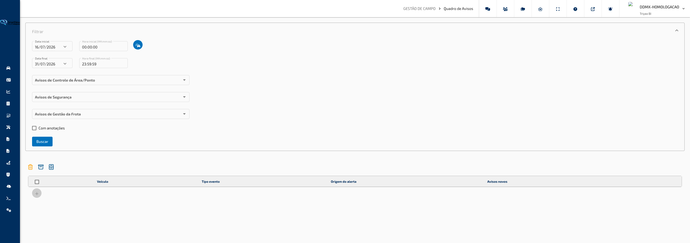

---

#### O que você encontra nesta tela

**Painel de Filtros**

Localizado no topo da tela. Permite configurar os critérios de busca antes de carregar os avisos. Contém os campos de período, seleção de veículos e categorias de eventos. O painel pode ser recolhido para ampliar a área da tabela.

**Tabela de Avisos**

Exibida abaixo do painel de filtros após a busca ser realizada. Lista todos os eventos encontrados para os veículos e período selecionados. Cada linha representa um aviso e exibe o nome do veículo, o tipo de evento, a **Origem do Alerta**, a descrição do aviso e botões de ação. As linhas são coloridas de acordo com o tipo de aviso, conforme as cores configuradas em **Configuração do Quadro de Avisos**. A tabela permanece visível mesmo quando nenhum aviso é encontrado, exibindo a mensagem "Nenhum registro encontrado" em vez de desaparecer da tela.

**Barra de Ações da Tabela**

Localizada acima da tabela de avisos. Contém ações que se aplicam aos itens selecionados na tabela: apagar avisos selecionados, arquivar avisos selecionados e visualizar a lista de avisos arquivados.

---

#### Funcionalidades

**Buscar avisos por período e veículo**

Consulta os eventos registrados para um conjunto de veículos dentro de um intervalo de datas e horários.

Como usar:

1. No painel de filtros, informe a **Data Inicial** e o **Hora Inicial** no formato HH:mm:ss.
2. Informe a **Data Final** e o **Hora Final** no formato HH:mm:ss.
3. Clique no ícone de veículos (ícone de carros) ao lado do campo de data inicial para abrir a janela de seleção de veículos.
4. Selecione os veículos desejados e confirme a seleção.
5. Escolha as categorias de avisos desejadas nos filtros disponíveis.
6. Clique em **Buscar** para carregar os resultados.

> **Dica:** A busca carrega no máximo 100 avisos por vez. Se houver mais resultados, use o botão **+** no rodapé da tabela para carregar mais 100 avisos adicionais.

**Filtrar por categoria de evento**

Refina a busca para exibir apenas os tipos de evento que interessam, evitando excesso de informação na tabela.

Como usar:

1. No painel de filtros, localize as seções de categorias: **Controle de Área e Ponto**, **Avisos de Segurança** e **Gestão de Frota**.
2. Em cada seção, selecione as opções desejadas. É possível selecionar múltiplas opções em cada categoria ou marcar a opção **Todos** para incluir tudo.
3. Após configurar as categorias, clique em **Buscar** para aplicar.

> **Dica:** Selecionar todas as categorias e usar o filtro de veículos específicos é útil quando se deseja analisar o histórico completo de um veículo.

**Filtrar somente avisos com anotações**

Exibe apenas os avisos que já possuem alguma anotação registrada pela equipe.

Como usar:

1. No painel de filtros, marque a opção **Somente com anotações**.
2. Clique em **Buscar** (ou, se a tabela já estiver carregada, a seleção é aplicada imediatamente ao resultado existente).
3. A tabela será atualizada exibindo apenas os avisos que possuem anotações.

> **Dica:** Use este filtro para acompanhar avisos que já estão em tratamento, verificando se as anotações foram atualizadas.

**Visualizar detalhes e notificação de um aviso**

Abre um painel com informações completas sobre o aviso, incluindo tipo de evento, data, endereço, placa, categoria do veículo, grupo, velocidade no momento e motorista identificado. Se o aviso estiver associado a uma câmera embarcada, o vídeo do evento é exibido neste mesmo painel.

Como usar:

1. Localize o aviso desejado na tabela.
2. Clique no ícone de **sino** (notificar) na coluna de ações do aviso. Se houver vídeo disponível, o ícone exibido será de **câmera de vídeo**.
3. O painel de detalhes será aberto com as informações do aviso.
4. Se desejar confirmar a verificação do evento, clique em **Verificar** no rodapé do painel.
5. Para exportar as informações do aviso como notificação, clique em **Exportar Notificação**.

> **Dica:** O botão **Verificar** registra que o aviso foi analisado pela equipe. Use-o para manter o controle do que já foi revisado.

**Visualizar imagem quando não há vídeo disponível**

Alguns avisos vindos de câmeras (Hikvision ou Jimi) não possuem um vídeo gravado do momento do evento, apenas uma imagem capturada. Nesses casos, a tela mostra a imagem no lugar do vídeo, com aviso de que não há vídeo disponível para aquele evento.

Como usar:

1. Abra os detalhes de um aviso que tenha câmera associada, clicando no ícone de **câmera de vídeo** ou **sino** na coluna de ações.
2. Se o evento não tiver vídeo gravado, a imagem capturada no momento do aviso é exibida no lugar do player de vídeo, junto com a mensagem informando que não há vídeo disponível.
3. Clique no botão de **download** sobre a imagem para salvá-la no computador.

> **Dica:** Esse comportamento também vale para eventos com dispositivo de vídeo externo (Hikvision/Jimi) que antes só apareciam corretamente para alguns tipos de aviso — agora qualquer aviso vinculado a esses dispositivos é reconhecido como tendo mídia disponível.

**Registrar anotações em um aviso**

Permite adicionar observações textuais a um aviso específico, criando um histórico de tratativa para aquela ocorrência.

Como usar:

1. Localize o aviso desejado na tabela.
2. Clique no ícone de **calendário com usuário** (anotações) na coluna de ações. Um número exibido sobre o ícone indica quantas anotações o aviso já possui.
3. Na janela de anotações, visualize o histórico de comentários anteriores.
4. No campo de texto na parte inferior, digite a nova anotação.
5. Clique em **Adicionar** para salvar.

> **Dica:** As anotações são visíveis para toda a equipe e ficam registradas com data e hora. Use-as para documentar as ações tomadas em resposta ao aviso.

**Detalhar aviso em janela separada**

Abre uma janela independente do navegador com os detalhes completos do aviso, permitindo consultar a ocorrência sem perder a visualização da tabela principal.

Como usar:

1. Localize o aviso desejado na tabela.
2. Clique no ícone de **informação** (quadrado com "i") na coluna de ações.
3. Uma nova janela será aberta com os detalhes do aviso.

> **Dica:** Útil para monitorar dois avisos simultaneamente ou para deixar o detalhe aberto enquanto continua navegando na tabela.

**Arquivar avisos**

Move avisos da lista principal para um arquivo histórico, organizando o quadro sem apagar os registros.

Como usar:

1. Marque a caixa de seleção à esquerda dos avisos que deseja arquivar. Para selecionar todos, clique na caixa de seleção no cabeçalho da tabela.
2. Clique no ícone de **arquivo** (caixa com seta) na barra de ações acima da tabela.
3. Confirme a operação na janela de confirmação.

> **Dica:** Os avisos arquivados não são excluídos. Acesse-os a qualquer momento clicando no ícone de **armário de arquivos** na barra de ações.

**Visualizar avisos arquivados**

Consulta os avisos que foram movidos para o arquivo histórico.

Como usar:

1. Clique no ícone de **armário de arquivos** na barra de ações acima da tabela.
2. Uma janela em tela cheia será aberta com a lista de avisos arquivados, respeitando os mesmos filtros aplicados na busca principal.
3. Se desejar, utilize o filtro por **usuário** na lista de arquivados para localizar os avisos tratados por um operador específico.
4. Na lista de arquivados é possível visualizar anotações, ver vídeos (quando disponíveis), consultar ações realizadas, detalhar o aviso e apagar registros.

> **Dica:** Use a lista de arquivados para auditar ocorrências passadas ou verificar o histórico de tratativas realizadas pela equipe.

**Apagar avisos**

Remove permanentemente um ou mais avisos da lista.

Como usar:

1. Para apagar um único aviso, clique no ícone de **lixeira** na coluna de ações da linha desejada.
2. Para apagar múltiplos avisos, marque as caixas de seleção e clique no ícone de **lixeira** na barra de ações.
3. Confirme a exclusão na janela de confirmação.

> **Dica:** A exclusão é permanente. Caso queira manter o registro para consulta futura, use a opção **Arquivar** em vez de apagar.

**Atualização automática**

A tabela de avisos é atualizada automaticamente a cada 60 segundos enquanto permanece aberta, garantindo que novos eventos sejam exibidos sem necessidade de nova busca manual.

Como usar:

1. Realize a busca normalmente, configurando os filtros desejados.
2. Após o carregamento, a tabela se atualiza sozinha a cada minuto.
3. Caso queira forçar uma atualização imediata, clique novamente em **Buscar**.

> **Dica:** Mantenha a tela aberta durante o turno de monitoramento para acompanhar os alertas em tempo real sem precisar recarregar a página.

---

#### Campos e Filtros

| Campo / Filtro               | O que faz                                                                                                                                                                                                 |
| ---------------------------- | --------------------------------------------------------------------------------------------------------------------------------------------------------------------------------------------------------- |
| **Data Inicial**             | Define a data de início do período de consulta                                                                                                                                                            |
| **Hora Inicial**             | Define o horário de início dentro da data inicial (formato HH:mm:ss)                                                                                                                                      |
| **Seleção de Veículos**      | Abre a janela para escolher quais veículos serão incluídos na busca                                                                                                                                       |
| **Data Final**               | Define a data de encerramento do período de consulta                                                                                                                                                      |
| **Hora Final**               | Define o horário de encerramento dentro da data final (formato HH:mm:ss)                                                                                                                                  |
| **Controle de Área e Ponto** | Filtra eventos de entrada/saída de áreas, pontos de referência, tempo de permanência e tempo fora da base                                                                                                 |
| **Avisos de Segurança**      | Filtra eventos como excesso de velocidade (normal e sob chuva), velocidade em área, tempo de percurso excedido, parada insuficiente, aceleração brusca, frenagem brusca, aceleração vertical e tombamento |
| **Gestão de Frota**          | Filtra eventos de bateria, alarme disparado, pânico ativado/desativado, lembrete de manutenção preventiva e itens não conformes de checklist                                                              |
| **Somente com anotações**    | Exibe apenas avisos que possuem pelo menos uma anotação registrada                                                                                                                                        |
| **Origem do Alerta**         | Coluna da tabela que indica se o aviso partiu de um Módulo, do Videomonitoramento ou do Sistema. A tabela pode ser ordenada por essa coluna clicando no cabeçalho                                        |

[↑ Voltar ao Índice](index.md#índice)

---

### Quadro de Avisos Telemetria

**Caminho:** Gestão de Campo > Quadro de Avisos Telemetria

Esta tela exibe os alertas gerados pelo sistema a partir de dados de telemetria embarcada dos veículos, como comportamento do motor, fadiga do motorista e eventos detectados por sensores ADAS. É voltada para o monitoramento de eventos de natureza técnica e de segurança ativa, complementando o Quadro de Avisos convencional com informações mais detalhadas sobre o desempenho veicular.

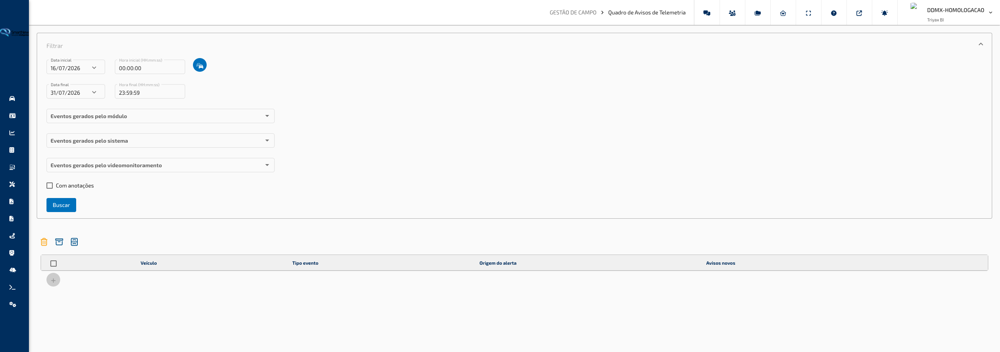

---

#### O que você encontra nesta tela

**Painel de Filtros**

Localizado na parte superior da tela. Permite definir o período de consulta, selecionar os veículos desejados e escolher quais categorias de eventos de telemetria devem ser incluídos na busca. O painel pode ser recolhido clicando no cabeçalho **Filtro**.

**Tabela de Avisos**

Exibida abaixo do painel de filtros após a realização de uma busca. Lista todos os alertas encontrados para os veículos e período selecionados. Cada linha representa um evento e exibe o nome do veículo, a referência associada e a descrição do aviso. As linhas podem ser coloridas conforme a categoria do evento, de acordo com a configuração da conta. A tabela atualiza automaticamente a cada minuto enquanto permanece aberta.

**Barra de Ações**

Aparece no topo da tabela. Contém botões para excluir ou arquivar os avisos selecionados em lote, e para visualizar os avisos já arquivados.

---

#### Funcionalidades

**Buscar eventos de telemetria**

Consulta os alertas de telemetria registrados para os veículos e período informados nos filtros.

Como usar:

1. No painel **Filtro**, selecione a **Data Inicial** e informe o **Horário Inicial** desejado.
2. Selecione a **Data Final** e informe o **Horário Final** desejado.
3. Clique no ícone de veículo (ícone de carros) para abrir a janela de seleção de veículos, marque os veículos que devem ser incluídos na consulta e confirme.
4. Selecione as categorias de eventos desejadas nos filtros de **Eventos Gerados pelo Módulo**, **Eventos Gerados pelo Sistema** e/ou **ADAS e Fadiga**.
5. Clique em **Buscar** para carregar os resultados na tabela.

> **Dica:** O período padrão ao abrir a tela é dos últimos 15 dias até hoje. Ajuste conforme a necessidade antes de buscar.

**Filtrar por tipo de evento de telemetria**

Permite selecionar quais categorias de eventos de telemetria devem aparecer nos resultados, separados em três grupos distintos.

Como usar:

1. No painel **Filtro**, localize os seletores de categoria de evento.
2. No campo **Eventos Gerados pelo Módulo**, selecione um ou mais eventos como aceleração brusca, frenagem brusca, giro alto do motor, falha de pressão de óleo, temperatura alta, velocidade em ponto neutro, entre outros.
3. No campo **Eventos Gerados pelo Sistema**, selecione eventos calculados pelo sistema como excesso de velocidade, ignição sem motor ligado, parada crítica, manutenção e jornada do motorista.
4. No campo **ADAS e Fadiga**, selecione eventos de sensores de segurança ativa como sonolência, desvio de faixa, uso de celular, colisão frontal, botão de SOS e outros.
5. Clique em **Buscar** para aplicar os filtros.

> **Dica:** Deixar todos os campos de evento sem seleção inclui todos os tipos de evento na busca. Selecione categorias específicas quando quiser focar em um tipo de alerta.

**Visualizar detalhes de um aviso**

Abre uma janela com informações completas sobre o evento, incluindo localização no mapa, dados do veículo e, quando disponível, vídeo registrado pelo equipamento embarcado.

Como usar:

1. Na tabela de resultados, localize o aviso desejado.
2. Clique no ícone de informação (quadrado com "i") na coluna de ações da linha correspondente.
3. Uma janela será aberta exibindo o mapa com a posição do evento, tipo de aviso, data e hora, endereço, nome e placa do veículo, categoria, grupo, velocidade e identificação do motorista.
4. Se o evento possuir vídeo gravado, ele será exibido automaticamente na janela.
5. Clique em **Fechar** para encerrar a visualização.

> **Dica:** Use o botão **Exportar Notificação** dentro da janela de detalhes para gerar um comprovante do evento. O botão **Verificar** marca o aviso como verificado.

**Adicionar anotação a um aviso**

Registra observações textuais vinculadas a um evento específico, permitindo documentar providências tomadas ou informações relevantes.

Como usar:

1. Na tabela de resultados, localize o aviso desejado.
2. Clique no ícone de calendário com pessoa na coluna de ações da linha correspondente.
3. Uma janela será aberta exibindo o histórico de anotações já registradas para aquele aviso.
4. Digite a nova anotação no campo de texto na parte inferior da janela.
5. Clique em **Adicionar** para salvar a anotação.

> **Dica:** O número exibido sobre o ícone de anotação indica quantas anotações já foram registradas para aquele aviso. Use o filtro **Somente com anotações** para localizar rapidamente avisos que já receberam tratativa.

**Filtrar apenas avisos com anotações**

Restringe a exibição da tabela para mostrar somente os eventos que possuem pelo menos uma anotação registrada.

Como usar:

1. Realize uma busca normalmente para carregar os resultados na tabela.
2. Marque a opção **Somente com anotações** no painel de filtros.
3. A tabela será atualizada imediatamente para exibir apenas os avisos com anotações.
4. Desmarque a opção para voltar a exibir todos os avisos.

> **Dica:** Esta opção é útil para revisar avisos que já estão em tratamento ou para verificar se algum evento pendente já foi anotado por outro operador.

**Arquivar avisos**

Move um ou mais avisos para o arquivo, retirando-os da lista principal sem excluí-los permanentemente.

Como usar:

1. Na tabela de resultados, marque a caixa de seleção na linha dos avisos que deseja arquivar.
2. Para selecionar todos de uma vez, marque a caixa no cabeçalho da tabela.
3. Clique no ícone de arquivo (caixa com seta) na barra de ações no topo da tabela.
4. Confirme a operação na janela de confirmação exibida.

> **Dica:** Avisos arquivados não são excluídos. Para consultá-los posteriormente, clique no ícone de armário de arquivos na barra de ações para abrir a lista de avisos arquivados.

**Visualizar avisos arquivados**

Acessa a lista de avisos que foram movidos para o arquivo, permitindo consultar histórico e ações registradas.

Como usar:

1. Realize uma busca para carregar os resultados na tela principal.
2. Clique no ícone de armário de arquivos na barra de ações no topo da tabela.
3. Uma nova janela será aberta com a lista de avisos arquivados correspondentes ao mesmo período e veículos da busca atual.
4. Utilize as ações disponíveis para visualizar detalhes, anotações, ações realizadas ou excluir os avisos arquivados.

> **Dica:** Na lista de arquivados, é possível verificar as ações registradas em cada evento clicando no ícone de dupla marcação. Isso facilita o acompanhamento do tratamento dado a cada alerta.

**Excluir avisos**

Remove definitivamente um ou mais avisos da lista.

Como usar:

1. Na tabela de resultados, marque a caixa de seleção na linha dos avisos que deseja excluir.
2. Para excluir um aviso individual sem selecioná-lo, clique diretamente no ícone de lixeira na coluna de ações daquela linha.
3. Para excluir todos os marcados de uma vez, clique no ícone de lixeira na barra de ações no topo da tabela.
4. Confirme a exclusão na janela de confirmação exibida.

> **Dica:** A exclusão é permanente e não pode ser desfeita. Utilize o arquivamento quando quiser preservar o histórico do evento.

**Carregar mais avisos**

Amplia a quantidade de resultados exibidos na tabela quando há mais eventos do que o limite inicial carregado.

Como usar:

1. Após realizar uma busca, observe se o botão com símbolo "+" aparece abaixo da tabela.
2. Se o botão estiver ativo, significa que existem mais avisos além dos exibidos.
3. Clique no botão "+" para carregar os próximos 100 resultados.
4. Repita o processo até visualizar todos os eventos do período ou até o botão ficar desativado.

> **Dica:** A busca inicial carrega no máximo 100 avisos por vez. Se o período consultado for longo ou o número de veículos for grande, utilize datas mais curtas para resultados mais ágeis.

---

#### Campos e Filtros

| Campo / Filtro                   | O que faz                                                                                                                                                                                                                                                                                                                                     |
| -------------------------------- | --------------------------------------------------------------------------------------------------------------------------------------------------------------------------------------------------------------------------------------------------------------------------------------------------------------------------------------------- |
| **Data Inicial**                 | Define a data de início do período de consulta                                                                                                                                                                                                                                                                                                |
| **Horário Inicial**              | Define o horário de início dentro da data inicial (formato HH:mm:ss)                                                                                                                                                                                                                                                                          |
| **Seleção de Veículos**          | Abre a janela para escolher quais veículos serão incluídos na busca                                                                                                                                                                                                                                                                           |
| **Data Final**                   | Define a data de encerramento do período de consulta                                                                                                                                                                                                                                                                                          |
| **Horário Final**                | Define o horário de encerramento dentro da data final (formato HH:mm:ss)                                                                                                                                                                                                                                                                      |
| **Eventos Gerados pelo Módulo**  | Filtra eventos registrados diretamente pelo equipamento embarcado: aceleração brusca, frenagem brusca, aceleração vertical, aceleração lateral, falha de alternador, arrancada em segunda marcha, excesso de marcha lenta, temperatura alta do motor, falha de pressão de óleo, embreagem pressionada, giro alto e velocidade em ponto neutro |
| **Eventos Gerados pelo Sistema** | Filtra eventos calculados pela plataforma: excesso de velocidade (normal e sob chuva), parada crítica, aceleração e desaceleração brusca calculadas, ignição sem motor, controle de periféricos, entrada e saída de manutenção e intrajornada do motorista                                                                                    |
| **ADAS e Fadiga**                | Filtra eventos de sensores de segurança ativa: sonolência, não olhar para frente, desvio de atenção, uso de celular, cigarro, alerta de colisão, código numérico, cinto de segurança, colisão frontal, colisão com pedestres, desvio de faixas, risco de colisão frontal e botão SOS                                                          |
| **Somente com anotações**        | Exibe apenas avisos que possuem pelo menos uma anotação registrada                                                                                                                                                                                                                                                                            |

[↑ Voltar ao Índice](index.md#índice)

---

### Alerta de Parada

**Caminho:** Gestão de Campo > Alerta de Parada

Esta tela permite configurar regras automáticas de notificação quando um veículo permanece parado por tempo superior ao permitido. Cada alerta define limiares de tempo para três níveis de situação — normal, alerta e crítico — e pode ser associado a veículos e áreas específicas, com agendamento de horários de vigência.

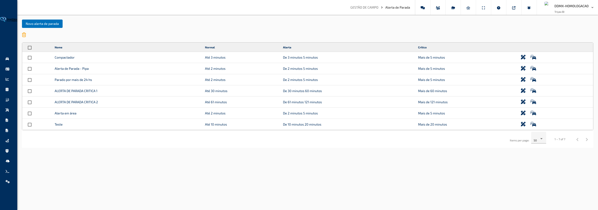

---

#### O que você encontra nesta tela

**Barra de Ações**

Localizada no topo da tela. Contém o botão **Novo Alerta de Parada** para criar uma nova configuração, e o ícone de lixeira para apagar os alertas marcados na tabela.

**Tabela de Alertas**

Lista todos os alertas de parada cadastrados. Cada linha exibe o nome do alerta e os intervalos de tempo configurados para cada nível de situação: normal, alerta e crítico. As colunas são ordenáveis. Ao final de cada linha há botões de ação individuais para editar o alerta ou gerenciar os veículos vinculados.

---

#### Funcionalidades

**Criar novo alerta de parada**

Abre o formulário para cadastrar uma nova regra de alerta, definindo os limites de tempo, notificações, tipo de situação monitorada, agendamento e veículos que serão monitorados.

Como usar:

1. Clique no botão **Novo Alerta de Parada** no topo da tela.
2. A janela de configuração será aberta na aba **Configurações**.
3. Preencha os dados do alerta conforme as seções a seguir e, ao concluir, clique em **Salvar**.

> **Dica:** Na criação, a aba **Veículos** estará disponível para já vincular os veículos ao alerta. Na edição posterior, o vínculo de veículos é gerenciado pelo botão de carro na tabela principal.

**Configurar os dados do alerta (aba Configurações)**

Define o nome, os tempos-limite de cada nível, o e-mail para notificação, o tipo de parada monitorada e o comportamento fora de áreas de interesse.

Como usar:

1. No campo **Nome**, informe um nome para identificar o alerta.
2. No campo **E-mail de Notificação**, informe o endereço de e-mail que receberá os avisos gerados.
3. No campo **Tempo de Reenvio**, informe em minutos o intervalo mínimo entre notificações repetidas do mesmo evento.
4. No campo **Normal — até**, informe em minutos o tempo máximo que o veículo pode ficar parado sem gerar alerta.
5. No campo **Alerta — de X até**, informe o tempo de encerramento da faixa de alerta em minutos. O início desta faixa é definido automaticamente pelo valor do campo anterior.
6. O nível **Crítico** é calculado automaticamente: qualquer parada superior ao valor do campo anterior será considerada crítica. O valor é exibido como informativo na tela.
7. No campo **Tipo de Alerta**, selecione qual condição de ignição deve ser monitorada:
   - **Ignição ligada e desligada** — monitora paradas independente do estado do motor.
   - **Ignição ligada** — monitora apenas quando o veículo está com o motor ligado e parado (veículo ocioso).
   - **Ignição desligada** — monitora apenas quando o veículo está parado com o motor desligado.
8. No campo **Parado com Ignição Ligada**, informe em minutos o tempo de tolerância para veículos ociosos (motor ligado sem movimento) antes de gerar alerta.
9. Marque a opção **Gerar alerta fora das áreas de interesse** caso queira que o alerta seja gerado mesmo quando o veículo estiver fora das áreas vinculadas. Deixe desmarcado para monitorar apenas dentro das áreas configuradas.

> **Dica:** Os três níveis (normal, alerta e crítico) formam uma sequência contínua: normal vai de zero até o primeiro limite, alerta vai do primeiro ao segundo limite, e crítico começa a partir do segundo limite sem fim definido.

**Configurar agendamento de vigência (agendador)**

Define os períodos de dias e horários em que o alerta estará ativo. Fora do agendamento, o alerta não gera notificações.

Como usar:

1. Na aba **Configurações**, role até a seção de agendamento abaixo do formulário principal.
2. Clique no botão **Adicionar Agendador** para incluir um novo período de vigência.
3. Na linha adicionada, configure:
   - **Ativar em**: selecione o **Dia da semana** e a **Hora** de início da vigência.
   - **Desativar em**: selecione o **Dia da semana** e a **Hora** de encerramento da vigência.
4. Para remover um período, clique no ícone de lixeira ao final da linha.
5. Repita o processo para adicionar quantos períodos forem necessários.

> **Dica:** É possível criar múltiplos períodos de agendamento para cobrir diferentes turnos de trabalho ao longo da semana. Um alerta sem agendamentos cadastrados estará ativo o tempo todo.

**Associar áreas de interesse ao alerta (aba Áreas de Interesse)**

Define em quais regiões geográficas o alerta deve ser monitorado.

Como usar:

1. Na janela de configuração, clique na aba **Áreas de Interesse**.
2. A lista de áreas cadastradas no sistema será exibida.
3. Selecione as áreas que devem ser monitoradas por este alerta.
4. Clique em **Salvar** para confirmar.

> **Dica:** Quando nenhuma área estiver selecionada, o comportamento do alerta depende da opção **Gerar alerta fora das áreas de interesse** na aba **Configurações**. Para monitorar a frota inteira sem restrição geográfica, deixe as áreas em branco e marque essa opção.

**Vincular veículos ao alerta (aba Veículos — disponível apenas na criação)**

Associa os veículos que serão monitorados pela regra de alerta criada.

Como usar:

1. Na janela de criação do alerta, clique na aba **Veículos**.
2. A árvore de grupos e veículos será exibida com caixas de seleção.
3. Marque os veículos ou grupos desejados.
4. Clique em **Salvar** para finalizar o cadastro com os veículos vinculados.

> **Dica:** Na edição de um alerta existente, a aba **Veículos** não aparece no formulário. Para alterar os veículos vinculados após a criação, use o botão de carro (ícone de frota) na linha do alerta na tabela principal.

**Editar um alerta de parada existente**

Abre o formulário de configuração com os dados atuais do alerta para alteração.

Como usar:

1. Na tabela, localize o alerta que deseja alterar.
2. Clique no ícone de lápis (editar) na coluna de ações da linha correspondente.
3. A janela de configuração será aberta com os dados preenchidos.
4. Faça as alterações desejadas nas abas **Configurações** e **Áreas de Interesse**.
5. Clique em **Salvar** para aplicar as alterações.

> **Dica:** Durante a edição, o agendador e as áreas de interesse também podem ser modificados. As alterações valem imediatamente após salvar.

**Gerenciar veículos vinculados a um alerta**

Adiciona ou remove veículos vinculados a um alerta já cadastrado.

Como usar:

1. Na tabela, localize o alerta desejado.
2. Clique no ícone de carro (veículos) na coluna de ações da linha correspondente.
3. A janela de seleção de veículos será aberta com a configuração atual.
4. Marque ou desmarque veículos e grupos conforme necessário.
5. Feche a janela para salvar as alterações.

> **Dica:** Use este botão para transferir veículos entre alertas diferentes sem precisar recriar as configurações — basta remover o veículo de um alerta e adicioná-lo em outro.

**Apagar alertas selecionados**

Remove permanentemente um ou mais alertas de parada da lista.

Como usar:

1. Na tabela, marque a caixa de seleção à esquerda dos alertas que deseja remover. Para selecionar todos, marque a caixa no cabeçalho da tabela.
2. Clique no ícone de lixeira na barra de ações no topo da tela.
3. Confirme a exclusão na janela de confirmação.

> **Dica:** A exclusão remove as regras e os vínculos com veículos. Os veículos não são afetados, mas deixarão de ser monitorados pelo alerta excluído.

---

#### Campos e Filtros

| Campo / Filtro                               | O que faz                                                                                                           |
| -------------------------------------------- | ------------------------------------------------------------------------------------------------------------------- |
| **Nome**                                     | Identifica o alerta na tabela e nas notificações enviadas                                                           |
| **E-mail de Notificação**                    | Endereço que recebe os avisos gerados pelo alerta                                                                   |
| **Tempo de Reenvio**                         | Intervalo mínimo em minutos entre notificações repetidas do mesmo evento                                            |
| **Normal — até**                             | Tempo máximo em minutos que o veículo pode ficar parado sem gerar aviso                                             |
| **Alerta — de X até**                        | Limite superior em minutos da faixa de alerta; o início é o valor do campo anterior                                 |
| **Crítico — mais de**                        | Calculado automaticamente como qualquer parada acima do limite da faixa de alerta (exibido apenas como informativo) |
| **Tipo de Alerta**                           | Define se o monitoramento considera ignição ligada, desligada ou ambas                                              |
| **Parado com Ignição Ligada**                | Tempo em minutos de tolerância para veículo ocioso antes de gerar alerta                                            |
| **Gerar alerta fora das áreas de interesse** | Quando marcado, o alerta também é gerado quando o veículo está fora das áreas vinculadas                            |
| **Ativar em (agendador)**                    | Dia da semana e hora de início de um período de vigência do alerta                                                  |
| **Desativar em (agendador)**                 | Dia da semana e hora de encerramento de um período de vigência do alerta                                            |
| **Áreas de Interesse**                       | Regiões geográficas onde o alerta será monitorado                                                                   |

[↑ Voltar ao Índice](index.md#índice)

---

### Áreas de Interesse

**Caminho:** Gestão de Campo > Áreas de Interesse

Esta tela permite cadastrar, configurar e gerenciar as áreas geográficas delimitadas que serão monitoradas pelo sistema. Cada área de interesse pode gerar alertas automáticos quando veículos entram, saem ou permanecem além do tempo permitido dentro dela, além de controlar limites de velocidade específicos por região.

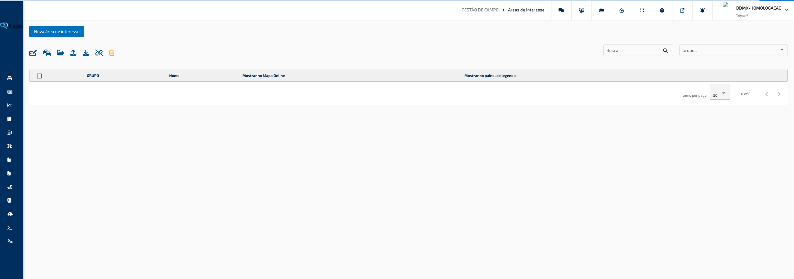

---

#### O que você encontra nesta tela

**Barra de Ações**

Localizada no topo da tela. Contém o botão **Nova Área de Interesse** para criar uma nova área, e uma fila de ícones que executam ações em lote sobre as áreas marcadas na tabela:

- Ícone de lápis com campos — **Configurar Selecionados**: aplica configurações a várias áreas de uma vez
- Ícone de frota — **Vincular Todos os Veículos**: associa todos os veículos da conta às áreas selecionadas
- Ícone de pasta — **Gerenciar Grupos**: abre o gerenciador de grupos de áreas
- Ícone de upload — **Importar KML**: importa áreas a partir de um arquivo de mapa externo
- Ícone de download — **Exportar Informações**: baixa os dados das áreas em planilha
- Ícone de corrente cortada — **Desvincular Veículos**: remove o vínculo de todos os veículos das áreas selecionadas
- Ícone de lixeira — **Apagar Selecionados**: remove permanentemente as áreas marcadas

**Filtros de Busca**

Localizados à direita da barra de ações. Campo de texto para busca por nome e seletor de **Grupos** para filtrar as áreas exibidas na tabela por um ou mais grupos.

**Tabela de Áreas**

Lista todas as áreas cadastradas. Cada linha exibe:

- Indicador de status (ativo ou inativo)
- Caixa de seleção para ações em lote
- **Grupo** ao qual a área pertence
- Toggle **Mostrar no Mapa Online** — controla se a área aparece sobreposta ao mapa em tempo real
- Toggle **Mostrar no Painel de Legenda** — controla se a área aparece no painel de legendas do mapa
- **Nome** da área
- Botão de **Editar** (ícone de lápis e régua)
- Botão de **Veículos** (ícone de frota) — gerencia os veículos vinculados àquela área individualmente

---

#### Funcionalidades

**Criar uma nova área de interesse**

Abre o formulário de cadastro completo com mapa interativo para desenhar os limites da área e definir todas as configurações de alertas.

Como usar:

1. Clique no botão **Nova Área de Interesse** no topo da tela.
2. A janela de criação será aberta com três abas: **Configurações**, **Mapa** e **Veículos**.
3. Preencha os dados na aba **Configurações**, desenhe a área na aba **Mapa** e, opcionalmente, vincule veículos na aba **Veículos**.
4. Clique em **Salvar** para confirmar o cadastro.

> **Dica:** O sistema valida automaticamente o formato da área desenhada. Caso a área tenha muitos pontos, o sistema aplica um algoritmo de simplificação automática para reduzir a quantidade de coordenadas sem perder a forma geral.

---

**Configurar os dados da área (aba Configurações)**

Define o nome, categoria, grupo, opções de exibição e todas as regras de alerta vinculadas à área.

Como usar:

1. No campo **Nome**, informe um nome que identifique a área.
2. No campo **Categoria**, selecione o tipo da área: Padrão, Base, Oficina, Estacionamento, Pedágio, Concessionária, Montadora, Produtiva ou Improdutiva. A categoria **Base** ativa campos adicionais de monitoramento de afastamento.
3. No campo **Grupo**, selecione o grupo ao qual a área pertence.
4. Marque **Mostrar no Mapa Online** para que a área apareça sobre o mapa em tempo real.
5. Marque **Mostrar no Painel de Legenda** para exibir a área no painel de legendas do mapa.
6. No campo **Limite de Velocidade**, informe em km/h a velocidade máxima permitida dentro da área (deixe em zero para não monitorar velocidade).
7. No campo **Tempo Mínimo Acima do Limite**, selecione por quanto tempo o veículo precisa exceder o limite para gerar um alerta de velocidade.
8. Marque **Aviso ao Ultrapassar Velocidade** e informe um e-mail para receber notificações de excesso de velocidade dentro da área.
9. Marque **Aviso ao Entrar na Área** e informe um e-mail para receber notificações quando um veículo entrar na área.
10. Marque **Aviso ao Sair da Área** e informe um e-mail para receber notificações quando um veículo sair da área.
11. Marque **Avisos de Tempo de Permanência** para gerar alertas quando um veículo permanecer além do tempo definido. Informe o e-mail de notificação, o **Tempo Máximo de Permanência** em minutos e o **Tempo de Reenvio do Alerta** em minutos.
12. Se a categoria for **Base**, preencha o **Tempo Máximo Fora da Base** em minutos e o e-mail para avisos de ausência prolongada.

> **Dica:** O campo **Ativar Jornada de Trabalho** permite configurar horários de vigência dos alertas. Ao ativá-lo, os avisos serão gerados apenas dentro do intervalo definido. Fora do horário, o comportamento pode ser configurado para não gerar avisos ou apenas destacá-los sem notificar.

---

**Desenhar a área no mapa (aba Mapa)**

Define o contorno geográfico da área por meio de desenho interativo sobre o mapa.

Como usar:

1. Na janela de criação ou edição, clique na aba **Mapa**.
2. Para centralizar o mapa em um local específico, expanda o painel **Endereço**, digite o endereço desejado e clique no botão de mover (ícone de setas).
3. Use as ferramentas do mapa para desenhar o polígono que define os limites da área. Clique nos pontos do mapa para criar os vértices e feche o polígono ao clicar no ponto inicial.
4. Para ajustar a cor de exibição da área, expanda o painel **Selecione a Cor da Área** e clique na cor desejada na paleta.
5. Para visualizar onde os veículos circulam naquela região, clique em **Mapa de Calor** dentro do painel de cor.
6. Para configurar um raio de entrada — uma zona periférica de atenção ao redor da área —, expanda o painel **Configurações**, marque **Criar Raio de Entrada**, informe o raio em metros e o limite de velocidade em km/h aplicável à zona de entrada.
7. Clique em **Salvar** após definir o contorno.

> **Dica:** O mapa também exibe outras áreas de interesse e pontos de interesse cadastrados como referência visual. Isso facilita verificar sobreposições ou adjacências ao desenhar uma nova área.

---

**Vincular veículos à área (aba Veículos — disponível na criação)**

Associa os veículos que serão monitorados pela área recém-criada.

Como usar:

1. Na janela de criação, clique na aba **Veículos**.
2. A árvore de grupos e veículos será exibida com caixas de seleção.
3. Marque os veículos ou grupos que devem ser monitorados por esta área.
4. Clique em **Salvar** para finalizar o cadastro com os veículos vinculados.

> **Dica:** Na edição de uma área existente, a aba **Veículos** não aparece no formulário. Para alterar os veículos vinculados após a criação, use o botão de frota (ícone de carros) na linha da área na tabela principal.

---

**Editar uma área existente**

Abre o formulário com os dados atuais da área para alteração das configurações ou do contorno no mapa.

Como usar:

1. Na tabela, localize a área desejada.
2. Clique no ícone de lápis e régua (editar) na coluna de ações da linha correspondente.
3. A janela de edição será aberta com as abas **Configurações** e **Mapa** preenchidas com os dados atuais.
4. Faça as alterações necessárias.
5. Clique em **Salvar** para confirmar.

> **Dica:** Ao editar o contorno de uma área que já monitora veículos, os alertas passam a considerar o novo contorno imediatamente após salvar.

---

**Ativar ou desativar exibição no mapa diretamente da tabela**

Controla a visibilidade de cada área no Mapa Online e no painel de legendas sem precisar abrir o formulário de edição.

Como usar:

1. Na tabela, localize a área desejada.
2. Clique no toggle da coluna **Mostrar no Mapa Online** para ativar ou desativar a exibição da área no mapa em tempo real.
3. Clique no toggle da coluna **Mostrar no Painel de Legenda** para controlar a exibição da área no painel de legendas do mapa.
4. A alteração é salva automaticamente ao clicar no toggle.

> **Dica:** Desativar a exibição no mapa não remove os alertas da área — ela continua monitorando e gerando notificações normalmente. A opção controla apenas a visibilidade visual no mapa.

---

**Gerenciar veículos vinculados a uma área individualmente**

Permite adicionar ou remover veículos vinculados a uma área específica sem alterar outras configurações.

Como usar:

1. Na tabela, localize a área desejada.
2. Clique no ícone de frota (carros duplos) na coluna de ações da linha correspondente.
3. A janela de seleção de veículos será aberta com os vínculos atuais.
4. Marque ou desmarque veículos e grupos conforme necessário.
5. Feche a janela para salvar as alterações.

> **Dica:** Use esta opção para ajustar rapidamente quais veículos são monitorados em uma área específica sem precisar abrir o formulário completo de edição.

---

**Vincular todos os veículos às áreas selecionadas**

Associa automaticamente todos os veículos da conta às áreas marcadas na tabela, sem precisar selecioná-los individualmente.

Como usar:

1. Na tabela, marque as caixas de seleção das áreas desejadas.
2. Clique no ícone de frota (vincular veículos) na barra de ações.
3. Confirme a operação na janela de confirmação.

> **Dica:** Use esta função quando quiser que toda a frota seja monitorada por uma ou mais áreas sem precisar selecionar veículo por veículo.

---

**Desvincular todos os veículos das áreas selecionadas**

Remove o vínculo de todos os veículos com as áreas marcadas, interrompendo o monitoramento daquelas áreas para toda a frota.

Como usar:

1. Na tabela, marque as caixas de seleção das áreas das quais deseja desvincular os veículos.
2. Clique no ícone de corrente cortada (desvincular veículos) na barra de ações.
3. Confirme a operação na janela de confirmação.

> **Dica:** Esta ação remove todos os vínculos de uma vez. Se desejar manter algum veículo vinculado, use o botão de veículos individual em cada linha da tabela para ajustar os vínculos com precisão.

---

**Configurar várias áreas simultaneamente**

Permite aplicar alterações de configuração a um conjunto de áreas selecionadas de uma só vez, sem precisar editar cada uma individualmente.

Como usar:

1. Na tabela, marque as caixas de seleção das áreas que deseja configurar.
2. Clique no ícone de lápis com campos (configurar selecionados) na barra de ações.
3. A janela de configuração em lote será aberta.
4. Para cada campo que deseja alterar, marque a caixa de seleção ao lado do campo e defina o novo valor.
5. Apenas os campos marcados serão atualizados nas áreas selecionadas. Campos sem marca permanecem inalterados.
6. Clique em **Salvar** para aplicar as alterações.

> **Dica:** Use a caixa de seleção no topo da janela para marcar ou desmarcar todos os campos de uma vez. Isso é útil quando quiser padronizar todas as configurações de um grupo de áreas ao mesmo tempo.

---

**Importar áreas por arquivo KML**

Cria múltiplas áreas de interesse de uma vez importando um arquivo de mapa no formato KML — formato padrão utilizado por ferramentas como Google Earth e Google Maps.

Como usar:

1. Clique no ícone de upload (importar KML) na barra de ações.
2. Na janela de importação, clique no link de **Download do Modelo (.kml)** para baixar o arquivo de exemplo e ver o formato esperado.
3. Preencha ou ajuste o arquivo KML com as áreas que deseja importar.
4. Clique no botão de seleção de arquivo e escolha o arquivo KML no seu computador.
5. A lista de áreas contidas no arquivo será exibida em uma tabela. Verifique os nomes das áreas — linhas com nome em vermelho indicam problemas que precisam ser corrigidos antes de importar.
6. Edite os nomes diretamente na tabela, se necessário.
7. Clique em **Importar** para concluir.

> **Dica:** O sistema valida automaticamente o número de coordenadas de cada área importada. Áreas que excedam o limite máximo permitido passarão por um algoritmo de simplificação automática para reduzir os pontos sem comprometer o formato da área.

---

**Exportar informações das áreas**

Baixa os dados das áreas filtradas atualmente na tela em formato de planilha para análise ou arquivo.

Como usar:

1. Aplique os filtros desejados na tela (busca por nome ou por grupo) para definir quais áreas serão incluídas na exportação.
2. Clique no ícone de download (exportar) na barra de ações.
3. O arquivo será baixado automaticamente em formato Excel com os dados das áreas visíveis.

> **Dica:** A exportação considera apenas as áreas dos grupos selecionados nos filtros da tela. Limpe os filtros de grupo antes de exportar se quiser incluir todas as áreas cadastradas.

---

**Gerenciar grupos de áreas**

Permite criar, renomear ou remover os grupos utilizados para organizar as áreas de interesse.

Como usar:

1. Clique no ícone de pasta aberta (gerenciar grupos) na barra de ações.
2. A janela de gerenciamento de grupos será aberta com a lista de grupos existentes.
3. Crie novos grupos, renomeie grupos existentes ou remova grupos que não serão mais utilizados.
4. Feche a janela para salvar as alterações.

> **Dica:** Remover um grupo não exclui as áreas pertencentes a ele. As áreas são reorganizadas automaticamente. Planeje a estrutura de grupos com base nas regiões operacionais ou tipos de local da sua frota.

---

**Apagar áreas selecionadas**

Remove permanentemente as áreas marcadas na tabela, incluindo todos os vínculos com veículos e configurações de alerta.

Como usar:

1. Na tabela, marque as caixas de seleção das áreas que deseja remover.
2. Clique no ícone de lixeira (apagar selecionados) na barra de ações.
3. Confirme a exclusão na janela de confirmação.

> **Dica:** A exclusão é permanente. Os veículos vinculados não são afetados, mas deixarão de ser monitorados pelas áreas excluídas. Se desejar manter o histórico de alertas, não apague a área — apenas desmarque os toggles de exibição ou remova os vínculos de veículos.

---

#### Campos e Filtros

| Campo / Filtro                                  | O que faz                                                                                                 |
| ----------------------------------------------- | --------------------------------------------------------------------------------------------------------- |
| **Buscar**                                      | Filtra as áreas exibidas na tabela pelo nome                                                              |
| **Grupos**                                      | Filtra as áreas exibidas na tabela pelos grupos selecionados                                              |
| **Nome**                                        | Identifica a área nas tabelas, no mapa e nas notificações                                                 |
| **Categoria**                                   | Define o tipo da área; a categoria Base ativa campos adicionais de monitoramento de afastamento           |
| **Grupo**                                       | Organiza as áreas em categorias para facilitar filtros e gerenciamento                                    |
| **Mostrar no Mapa Online**                      | Ativa ou desativa a exibição da área sobreposta ao Mapa Online em tempo real                              |
| **Mostrar no Painel de Legenda**                | Ativa ou desativa a exibição da área no painel de legendas do mapa                                        |
| **Limite de Velocidade**                        | Velocidade máxima em km/h permitida dentro da área; zero desativa o monitoramento de velocidade           |
| **Tempo Mínimo Acima do Limite**                | Duração que o veículo precisa exceder o limite de velocidade para gerar um alerta                         |
| **Aviso ao Ultrapassar Velocidade**             | Ativa notificação por e-mail quando a velocidade é excedida dentro da área                                |
| **E-mail de Aviso de Excesso de Velocidade**    | Destinatário das notificações de excesso de velocidade                                                    |
| **Aviso ao Entrar na Área**                     | Ativa notificação por e-mail quando um veículo entra na área                                              |
| **E-mail de Aviso de Entrada**                  | Destinatário das notificações de entrada na área                                                          |
| **Aviso ao Sair da Área**                       | Ativa notificação por e-mail quando um veículo sai da área                                                |
| **E-mail de Aviso de Saída**                    | Destinatário das notificações de saída da área                                                            |
| **Tempo Máximo Fora da Base**                   | Tempo em minutos que o veículo pode ficar fora da base antes de gerar aviso (somente categoria Base)      |
| **E-mail de Aviso de Permanência Fora da Base** | Destinatário das notificações de afastamento prolongado da base                                           |
| **Avisos de Tempo de Permanência**              | Ativa alertas quando o veículo permanece dentro da área além do tempo definido                            |
| **E-mail de Avisos de Tempo de Permanência**    | Destinatário das notificações de permanência excessiva                                                    |
| **Tempo Máximo de Permanência**                 | Tempo em minutos que o veículo pode ficar dentro da área antes de gerar alerta de permanência             |
| **Tempo de Reenvio do Alerta**                  | Intervalo em minutos entre reenvios do mesmo alerta de permanência                                        |
| **Ativar Jornada de Trabalho**                  | Restringe os alertas a um intervalo de horários definido; fora do horário, o comportamento é configurável |
| **Hora Inicial / Hora Final**                   | Definem o intervalo de horário em que os alertas serão gerados quando a jornada de trabalho estiver ativa |
| **Criar Raio de Entrada**                       | Cria uma zona periférica de atenção ao redor da área com limite de velocidade próprio                     |
| **Raio de Entrada (metros)**                    | Tamanho em metros da zona periférica ao redor do contorno da área                                         |
| **Velocidade no Raio de Entrada (km/h)**        | Limite de velocidade aplicável à zona periférica de entrada                                               |

[↑ Voltar ao Índice](index.md#índice)

---

### Pontos de Interesse

**Caminho:** Gestão de Campo > Pontos de Interesse

Esta tela permite cadastrar e gerenciar pontos de referência geográficos identificados por um marcador e um raio circular. Diferente das áreas de interesse, que são delimitadas por polígonos desenhados, cada ponto de interesse é definido por uma localização central e um raio de atuação em metros, gerando alertas quando veículos entram ou saem dessa área circular.

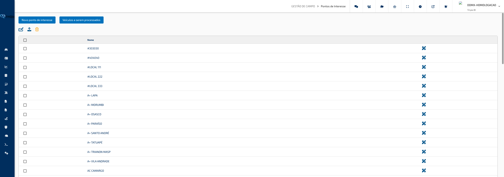

---

#### O que você encontra nesta tela

**Barra de Ações Principal**

Localizada no topo da tela. Contém dois botões:

- **Novo Ponto de Interesse** — abre o formulário para cadastrar um novo ponto
- **Veículos Processados** — abre a janela de gerenciamento dos veículos considerados no processamento de pontos de interesse

**Barra de Ações em Lote**

Localizada abaixo da barra principal. Contém ícones de ação aplicados aos pontos marcados na tabela:

- Ícone de lápis com campos — **Configurar Selecionados**: aplica configurações a vários pontos de uma vez
- Ícone de upload — **Importar KML**: importa pontos a partir de um arquivo de mapa externo
- Ícone de lixeira — **Apagar Selecionados**: remove permanentemente os pontos marcados

**Tabela de Pontos**

Lista todos os pontos de interesse cadastrados. Cada linha exibe:

- Caixa de seleção para ações em lote
- **Nome** do ponto
- Botão de **Editar** (ícone de lápis e régua) para abrir o formulário de edição

---

#### Funcionalidades

**Criar um novo ponto de interesse**

Abre o formulário de cadastro com mapa interativo para posicionar o marcador e definir as configurações de alerta.

Como usar:

1. Clique no botão **Novo Ponto de Interesse** no topo da tela.
2. A janela de criação será aberta com duas abas: **Configurações** e **Mapa**.
3. Preencha os dados na aba **Configurações** e posicione o marcador na aba **Mapa**.
4. Clique em **Salvar** para confirmar o cadastro.

> **Dica:** O ponto só pode ser salvo depois que um marcador for posicionado no mapa. Se o nome estiver preenchido mas nenhum ponto tiver sido marcado no mapa, o sistema exibirá um aviso ao tentar salvar.

---

**Configurar os dados do ponto (aba Configurações)**

Define o nome, endereço de referência, opções de exibição e regras de alerta do ponto.

Como usar:

1. No campo **Nome**, informe um nome que identifique o ponto de interesse. Este campo é obrigatório.
2. No campo **Endereço**, informe opcionalmente o endereço textual do local para referência interna.
3. Marque **Mostrar no Mapa Online** para que o ponto apareça sobre o mapa em tempo real.
4. Marque **Mostrar no Painel de Legenda** para exibir o ponto no painel de legendas do mapa.
5. Marque **Avisar ao Entrar no Ponto** para ativar notificações quando um veículo entrar no raio do ponto.
6. Marque **Avisar ao Sair do Ponto** para ativar notificações quando um veículo sair do raio do ponto.
7. No campo **E-mail de Eventos**, informe o endereço de e-mail que receberá os alertas de entrada e saída.
8. No campo **E-mail de Permanência**, informe o endereço de e-mail que receberá os alertas de tempo excessivo dentro do ponto.
9. No campo **Tempo Máximo de Permanência**, informe em minutos o tempo máximo que um veículo pode permanecer dentro do raio do ponto antes de gerar um alerta de permanência.

> **Dica:** Os campos de e-mail aceitam múltiplos destinatários, dependendo da configuração do servidor. Utilize um endereço de grupo ou lista de distribuição para notificar toda a equipe de monitoramento ao mesmo tempo.

---

**Posicionar o ponto no mapa (aba Mapa)**

Define a localização geográfica do ponto e o tamanho do raio de atuação por meio de um marcador interativo.

Como usar:

1. Na janela de criação ou edição, clique na aba **Mapa**.
2. Para centralizar o mapa em um local específico, digite o endereço desejado no campo **Endereço** à direita do mapa e clique no botão de mover (ícone de setas).
3. Clique diretamente no mapa para posicionar o marcador na localização desejada. Um círculo será desenhado ao redor do marcador indicando o raio de atuação.
4. No campo **Raio de Atuação**, ajuste o valor em metros para definir o tamanho da área de monitoramento ao redor do ponto. O valor padrão é 200 metros.
5. Clique em **Salvar** após posicionar o marcador e definir o raio.

> **Dica:** O mapa exibe outros pontos de interesse e áreas de interesse cadastrados como referência visual. Isso ajuda a verificar sobreposições ou proximidades ao criar um novo ponto, evitando duplicidades em uma mesma região.

---

**Editar um ponto existente**

Abre o formulário com os dados atuais do ponto para alteração das configurações ou da posição no mapa.

Como usar:

1. Na tabela, localize o ponto desejado.
2. Clique no ícone de lápis e régua (editar) na coluna de ações da linha correspondente.
3. A janela de edição será aberta com as abas **Configurações** e **Mapa** preenchidas com os dados atuais.
4. Faça as alterações necessárias.
5. Clique em **Salvar** para confirmar.

> **Dica:** Alterar a posição do marcador ou o raio de um ponto que já monitora veículos aplica os novos valores imediatamente após salvar. Veículos que antes estavam dentro do raio e agora ficaram fora (ou vice-versa) serão reconhecidos na próxima atualização de posição.

---

**Configurar vários pontos simultaneamente**

Permite aplicar as mesmas configurações a um conjunto de pontos de uma só vez, sem precisar editar cada um individualmente.

Como usar:

1. Na tabela, marque as caixas de seleção dos pontos que deseja configurar em lote.
2. Clique no ícone de lápis com campos (configurar selecionados) na barra de ações.
3. A janela de configuração em lote será aberta.
4. Para cada campo que deseja alterar, marque a caixa de seleção ao lado do campo e defina o novo valor.
5. Apenas os campos marcados serão atualizados nos pontos selecionados. Campos sem marca permanecem inalterados.
6. Clique em **Salvar** para aplicar.

> **Dica:** Esta funcionalidade é útil para padronizar rapidamente as configurações de notificação de um grupo de pontos, como ativar alertas de entrada e saída para todos os pontos de uma determinada região de uma vez.

---

**Importar pontos por arquivo KML**

Cria múltiplos pontos de interesse de uma vez importando um arquivo de mapa no formato KML — formato padrão utilizado por ferramentas como Google Earth e Google Maps.

Como usar:

1. Clique no ícone de upload (importar KML) na barra de ações.
2. Na janela de importação, clique no link de **Download do Modelo (.kml)** para baixar o arquivo de exemplo e ver o formato esperado.
3. Preencha ou ajuste o arquivo KML com os pontos que deseja importar — cada ponto deve ter um marcador de localização e um nome.
4. Clique no botão de seleção de arquivo e escolha o arquivo KML no seu computador.
5. A lista de pontos contidos no arquivo será exibida em uma tabela. Linhas em verde indicam pontos válidos; linhas em vermelho indicam pontos sem nome que precisam ser corrigidos antes de importar.
6. Edite os nomes diretamente na tabela, se necessário.
7. Clique em **Importar** para concluir.

> **Dica:** Diferente das áreas de interesse, os pontos importados via KML não possuem raio configurado no momento da importação. Após importar, edite cada ponto para definir o raio de atuação e as configurações de alerta desejadas.

---

**Gerenciar veículos processados**

Define quais veículos da frota são considerados no processamento e monitoramento dos pontos de interesse, de forma global para todos os pontos.

Como usar:

1. Clique no botão **Veículos Processados** no topo da tela.
2. A janela de seleção de veículos será aberta com a configuração atual.
3. Marque ou desmarque veículos e grupos conforme necessário.
4. Feche a janela para salvar as alterações.

> **Dica:** Esta configuração é global e se aplica a todos os pontos de interesse cadastrados. Veículos não marcados como processados não gerarão alertas de entrada, saída ou permanência em nenhum ponto de interesse.

---

**Apagar pontos selecionados**

Remove permanentemente os pontos marcados na tabela.

Como usar:

1. Na tabela, marque as caixas de seleção dos pontos que deseja remover.
2. Clique no ícone de lixeira (apagar selecionados) na barra de ações.
3. Confirme a exclusão na janela de confirmação.

> **Dica:** A exclusão é permanente. Os veículos não são afetados, mas deixarão de ser monitorados pelos pontos excluídos e nenhum alerta de entrada, saída ou permanência será mais gerado para aquelas localizações.

---

#### Campos e Filtros

| Campo / Filtro                   | O que faz                                                                                                  |
| -------------------------------- | ---------------------------------------------------------------------------------------------------------- |
| **Nome**                         | Identifica o ponto na tabela, no mapa e nas notificações; campo obrigatório                                |
| **Endereço**                     | Texto livre para registrar o endereço do local como referência interna; não afeta o posicionamento no mapa |
| **Mostrar no Mapa Online**       | Ativa ou desativa a exibição do ponto sobreposto ao Mapa Online em tempo real                              |
| **Mostrar no Painel de Legenda** | Ativa ou desativa a exibição do ponto no painel de legendas do mapa                                        |
| **Avisar ao Entrar no Ponto**    | Ativa notificação quando um veículo entra no raio de atuação do ponto                                      |
| **Avisar ao Sair do Ponto**      | Ativa notificação quando um veículo sai do raio de atuação do ponto                                        |
| **E-mail de Eventos**            | Destinatário dos alertas de entrada e saída                                                                |
| **E-mail de Permanência**        | Destinatário dos alertas de permanência excessiva dentro do ponto                                          |
| **Tempo Máximo de Permanência**  | Tempo em minutos que um veículo pode permanecer dentro do raio antes de gerar alerta de permanência        |
| **Raio de Atuação (metros)**     | Define o tamanho do círculo de monitoramento ao redor do marcador; padrão de 200 metros                    |

[↑ Voltar ao Índice](index.md#índice)

---

### Limite de Velocidade

**Caminho:** Gestão de Campo > Limite de Velocidade

Esta tela permite cadastrar e gerenciar perfis de limite de velocidade que serão monitorados pela plataforma. Cada perfil define velocidades máximas permitidas — em condições normais e em condições de chuva — e pode ser aplicado a grupos de veículos específicos, com configurações de notificação por e-mail.

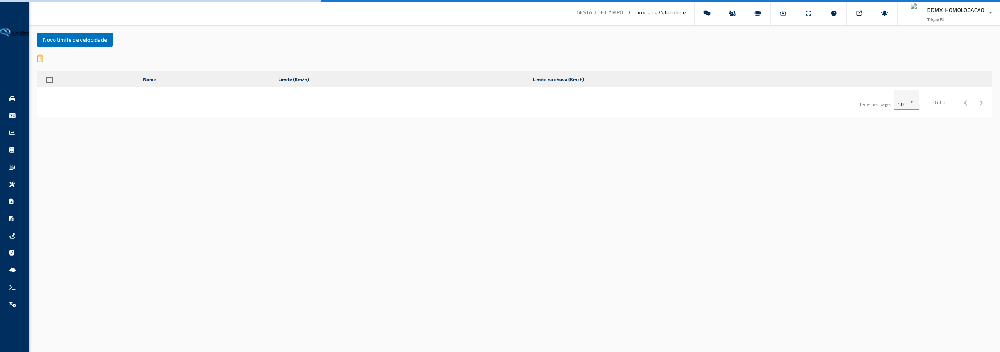

---

#### O que você encontra nesta tela

**Tabela de Limites de Velocidade**

Área principal da tela. Lista todos os perfis de limite de velocidade cadastrados, exibindo o nome do perfil, o limite em km/h para condições normais e o limite em km/h para condições de chuva. Cada linha possui ações para editar o perfil ou gerenciar os veículos vinculados.

**Barra de Ações**

Localizada no topo da tabela. Contém o botão **Novo Limite de Velocidade** para criar um novo perfil, e o ícone de lixeira para excluir os perfis selecionados.

**Caixas de Seleção**

Cada linha da tabela possui uma caixa de seleção. O cabeçalho da coluna contém uma caixa que seleciona ou desmarca todos os registros de uma vez.

---

#### Funcionalidades

**Criar um novo perfil de limite de velocidade**

Permite definir um novo conjunto de regras de velocidade máxima, com limites distintos para tempo seco e tempo chuvoso, além de configurações de notificação e áreas de aplicação.

Como usar:

1. Clique no botão **Novo Limite de Velocidade** na barra de ações.
2. No painel que se abre, preencha os campos da aba **Configurações do Limite de Velocidade**: nome do perfil, limite de velocidade normal, limite de velocidade na chuva, tempo mínimo de infração e demais opções.
3. Caso deseje já associar veículos ao perfil no momento da criação, acesse a aba **Veículos**, selecione os veículos desejados na árvore de seleção e clique em **Salvar**.

> **Dica:** Ao criar um novo perfil, a aba **Veículos** aparece apenas durante o cadastro inicial. Para alterar os veículos vinculados depois, use o ícone de veículos na linha do perfil na tabela principal.

**Editar um perfil existente**

Permite alterar as configurações de um perfil de limite de velocidade já cadastrado, como os valores de velocidade, o e-mail de notificação ou as áreas de interesse vinculadas.

Como usar:

1. Localize o perfil desejado na tabela.
2. Clique no ícone de lápis (editar) na coluna de ações da linha correspondente.
3. Faça as alterações necessárias nos campos disponíveis e clique em **Salvar** para confirmar.

> **Dica:** Ao editar um perfil, a aba **Veículos** não aparece. Para alterar os veículos vinculados ao perfil, use o ícone de veículos diretamente na tabela principal.

**Gerenciar veículos vinculados a um perfil**

Permite adicionar ou remover veículos que estão sujeitos ao monitoramento de um determinado perfil de limite de velocidade.

Como usar:

1. Localize o perfil desejado na tabela.
2. Clique no ícone de veículos (dois carros) na coluna de ações da linha correspondente.
3. No painel que se abre, selecione ou desmarque os veículos desejados na árvore de seleção e confirme a operação.

> **Dica:** A árvore de veículos organiza os equipamentos por grupos e subgrupos. Selecionar um grupo aplica o limite a todos os veículos daquele grupo.

**Excluir perfis de limite de velocidade**

Remove um ou mais perfis de limite de velocidade da plataforma. A exclusão é permanente e solicita confirmação antes de ser concluída.

Como usar:

1. Marque as caixas de seleção dos perfis que deseja excluir. Use a caixa do cabeçalho para selecionar todos de uma vez.
2. Clique no ícone de lixeira na barra de ações.
3. Confirme a operação na janela de confirmação que aparece na tela.

> **Dica:** Verifique quais veículos estão vinculados ao perfil antes de excluí-lo. Após a exclusão, esses veículos deixam de ser monitorados pelo limite em questão.

---

#### Campos e Filtros

| Campo / Filtro                      | O que faz                                                                                                                                                                 |
| ----------------------------------- | ------------------------------------------------------------------------------------------------------------------------------------------------------------------------- |
| **Nome**                            | Identificação do perfil de limite de velocidade                                                                                                                           |
| **Limite (km/h)**                   | Velocidade máxima permitida em condições normais de tempo                                                                                                                 |
| **Limite na Chuva (km/h)**          | Velocidade máxima permitida quando há detecção de chuva                                                                                                                   |
| **Mostrar no Mapa Online**          | Quando ativado, exibe indicação visual do limite na tela do Mapa Online                                                                                                   |
| **Tempo Mínimo de Infração**        | Define por quanto tempo o veículo precisa ultrapassar o limite para que a infração seja registrada (de "sem tempo mínimo" até 5 minutos)                                  |
| **Tolerância para Envio de E-mail** | Percentual acima do limite a partir do qual o sistema dispara uma notificação por e-mail (de "sem tolerância" até 100%)                                                   |
| **Utilizar Eventos do Módulo**      | Quando ativado, utiliza os eventos de velocidade registrados diretamente pelo equipamento instalado no veículo                                                            |
| **Ignorar Envios de Comando**       | Quando ativado, ignora as infrações de velocidade que ocorrem durante o envio de comandos ao veículo                                                                      |
| **E-mail**                          | Endereço de e-mail que receberá as notificações de infração de velocidade                                                                                                 |
| **Áreas de Interesse**              | Restringe o monitoramento do limite a determinadas áreas geográficas cadastradas na plataforma; se nenhuma área for selecionada, o limite é aplicado em todo o território |

[↑ Voltar ao Índice](index.md#índice)

---

### Aviso de Periféricos

**Caminho:** Gestão de Campo > Aviso de Periféricos

Esta tela permite configurar avisos automáticos com base em leituras dos periféricos instalados nos veículos, como entradas analógicas, entradas e saídas digitais, contadores e dados de telemetria embarcada. Cada aviso define uma regra de disparo que, ao ser atingida, pode notificar a equipe por e-mail ou acionar uma integração externa.

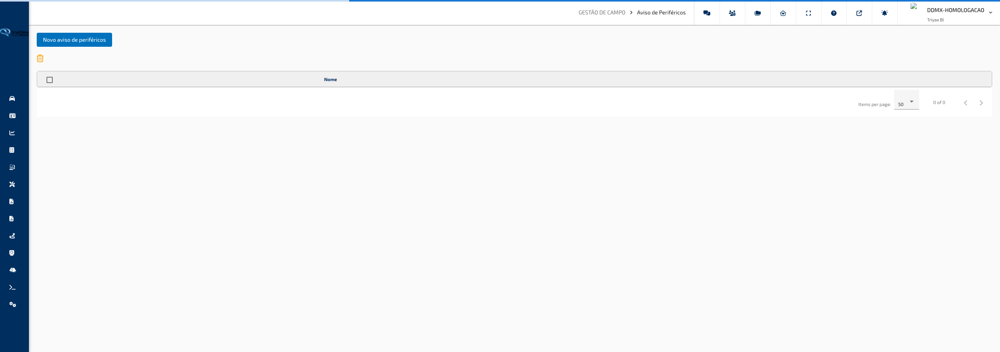

---

#### O que você encontra nesta tela

**Lista de Avisos**

Área principal da tela. Exibe todos os avisos de periféricos cadastrados em forma de tabela, com o nome de cada aviso e opções de ação. A lista pode ser ordenada clicando no cabeçalho da coluna **Nome**.

**Barra de Ações**

Localizada acima da tabela. Contém o botão **Novo Aviso de Periférico** para iniciar o cadastro, e o ícone de lixeira para excluir os itens selecionados na lista.

**Paginação**

Localizada abaixo da tabela. Permite navegar entre páginas da lista e ajustar a quantidade de registros exibidos por página (5, 10, 25 ou 100 itens).

---

#### Funcionalidades

**Criar novo aviso de periférico**

Abre um assistente de criação em etapas para configurar um novo aviso de periférico e vinculá-lo a um ou mais veículos.

Como usar:

1. Clique no botão **Novo Aviso de Periférico** na barra de ações.
2. Na etapa **Veículos**, selecione os veículos que receberão este aviso marcando-os na lista em árvore. Clique em **Próximo** para avançar.
3. Na etapa **Tipo do Aviso**, preencha o nome, a categoria e escolha o tipo de análise e o canal específico. Clique em **Próximo** ao concluir.
4. Na etapa **Regra do Aviso**, defina os gatilhos de disparo (análise de rampa, faixa de valor, variação e duração). Clique em **Próximo** ao concluir.
5. Na etapa **Opcionais**, configure condições adicionais como limites de velocidade, RPM, áreas de exclusão e notificações por e-mail.
6. Clique em **Salvar** para concluir o cadastro.

> **Dica:** Todos os quatro campos da etapa **Regra do Aviso** precisam ser preenchidos para que o botão **Próximo** seja liberado. Caso queira desabilitar um gatilho, defina o valor como zero.

---

**Editar aviso de periférico**

Permite alterar as configurações de tipo, regra e opcionais de um aviso já cadastrado. A vinculação de veículos não pode ser alterada por aqui — use o botão de veículos para isso.

Como usar:

1. Localize o aviso desejado na lista.
2. Clique no ícone de lápis na coluna de ações da linha correspondente.
3. O assistente abrirá diretamente na etapa **Tipo do Aviso**. Faça as alterações necessárias e avance com o botão **Próximo**.
4. Ajuste a **Regra do Aviso** e as configurações **Opcionais** conforme necessário.
5. Clique em **Salvar** para confirmar as alterações.

> **Dica:** Ao editar, o assistente começa pela etapa de tipo — as etapas de veículos não aparecem, pois os veículos vinculados são gerenciados separadamente.

---

**Gerenciar veículos vinculados**

Permite visualizar e alterar quais veículos estão associados a um aviso de periférico já cadastrado.

Como usar:

1. Localize o aviso desejado na lista.
2. Clique no ícone de veículos (ícone de carros) na coluna de ações da linha correspondente.
3. Uma janela será aberta com a lista de veículos disponíveis e os que já estão vinculados ao aviso.
4. Marque ou desmarque os veículos conforme necessário e salve as alterações.

> **Dica:** Um mesmo aviso pode ser aplicado a vários veículos simultaneamente. Veículos adicionados aqui passam a ter o aviso monitorado em tempo real.

---

**Excluir avisos selecionados**

Remove da plataforma um ou mais avisos de periférico cadastrados.

Como usar:

1. Marque a caixa de seleção ao lado do nome dos avisos que deseja excluir. Para selecionar todos de uma vez, use a caixa de seleção no cabeçalho da tabela.
2. Clique no ícone de lixeira na barra de ações.
3. Confirme a operação na janela de confirmação que aparece na tela.

> **Dica:** A exclusão de um aviso remove automaticamente o monitoramento para todos os veículos vinculados a ele. Verifique os vínculos antes de excluir.

---

#### Etapas do cadastro em detalhe

**Etapa: Tipo do Aviso**

Define a identidade do aviso e qual sinal do veículo será monitorado.

| Campo               | O que faz                                                                                                                         |
| ------------------- | --------------------------------------------------------------------------------------------------------------------------------- |
| **Nome**            | Identificação do aviso na lista                                                                                                   |
| **Categoria**       | Agrupamento livre para organizar os avisos por tipo de uso                                                                        |
| **Tipo de Análise** | Define qual sinal do equipamento será lido: Entrada Analógica, Entrada Digital, Saída Digital, Contadores ou Telemetria Embarcada |
| **Canal**           | Canal específico do tipo escolhido (ex: AD 1, INPUT 3, OUTPUT 2, Contador 1, Temperatura do Motor)                                |

---

**Etapa: Regra do Aviso**

Define quando o aviso deve ser disparado com base nos valores lidos do periférico.

| Campo                           | O que faz                                                                                            |
| ------------------------------- | ---------------------------------------------------------------------------------------------------- |
| **Análise de Rampa**            | Define se o sistema analisa a variação em subida, em descida ou não analisa a direção da variação    |
| **Menor ou igual a**            | Valor máximo da leitura para que o aviso seja disparado                                              |
| **Maior ou igual a (faixa)**    | Valor mínimo da leitura para que o aviso seja disparado                                              |
| **Maior ou igual a (variação)** | Variação mínima no valor da leitura necessária para disparar o aviso                                 |
| **Maior ou igual a (duração)**  | Tempo mínimo (em segundos) que o valor deve permanecer na condição configurada para disparar o aviso |

---

**Etapa: Opcionais**

Condições adicionais que refinam quando o aviso deve ou não ser gerado.

| Campo / Filtro                             | O que faz                                                                                                 |
| ------------------------------------------ | --------------------------------------------------------------------------------------------------------- |
| **Considerar dados com ignição desligada** | Quando ativado, o aviso pode ser disparado mesmo que o veículo esteja com a ignição desligada             |
| **Utilizar velocidade mínima**             | Quando ativado, o aviso só é gerado se o veículo estiver acima da velocidade mínima informada             |
| **Velocidade Mínima**                      | Valor de velocidade mínima (km/h) necessário para gerar o aviso                                           |
| **Utilizar velocidade máxima**             | Quando ativado, o aviso só é gerado se o veículo estiver abaixo da velocidade máxima informada            |
| **Velocidade Máxima**                      | Valor de velocidade máxima (km/h) acima do qual o aviso não é gerado                                      |
| **Utilizar RPM mínimo**                    | Quando ativado, o aviso só é gerado se o RPM do motor estiver acima do valor mínimo informado             |
| **RPM Mínimo**                             | Valor de RPM mínimo necessário para gerar o aviso                                                         |
| **Utilizar RPM máximo**                    | Quando ativado, o aviso só é gerado se o RPM do motor estiver abaixo do valor máximo informado            |
| **RPM Máximo**                             | Valor de RPM máximo acima do qual o aviso não é gerado                                                    |
| **Não gerar aviso nas áreas**              | Seleciona áreas de interesse nas quais o aviso não deve ser disparado, mesmo que a condição seja atingida |
| **Gerar alerta no momento do evento**      | Quando ativado, envia um e-mail imediatamente ao detectar o evento                                        |
| **E-mail**                                 | Endereço de e-mail que receberá as notificações de aviso                                                  |
| **Endereço de integração**                 | Endereço externo que receberá uma notificação automática quando o aviso for disparado                     |

[↑ Voltar ao Índice](index.md#índice)

---

### Telemetria

**Caminho:** Gestão de Campo > Telemetria

Esta tela permite analisar, em forma de gráficos, os dados captados pelos sensores de um veículo ao longo de um período. É utilizada para investigar o comportamento do veículo — como variações de velocidade, bateria, temperatura, entradas e saídas digitais — em um intervalo de tempo específico.

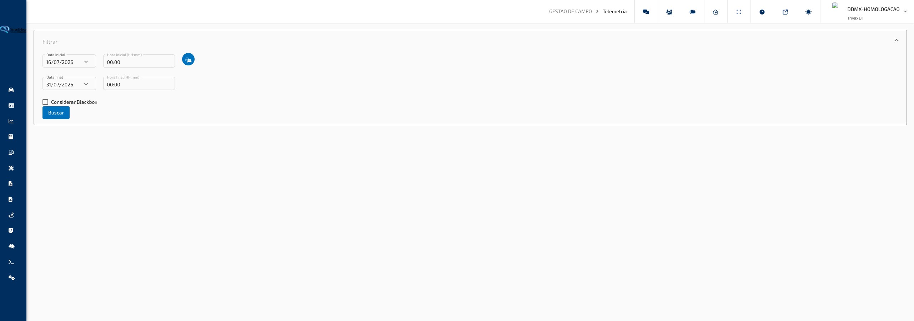

---

#### O que você encontra nesta tela

**Painel de Filtros**

Localizado no topo da tela, inicialmente expandido. Contém os campos de data, hora e seleção de veículo. É o ponto de partida obrigatório: sem selecionar um veículo e definir o período, nenhum gráfico é exibido.

**Análise Separada**

Painel exibido após a busca, inicialmente recolhido. Apresenta cada variável de telemetria em um gráfico individual, um abaixo do outro. Ideal para analisar o comportamento de cada grandeza de forma detalhada, sem interferência visual de outros dados.

**Análise Agregada**

Painel exibido após a busca, inicialmente expandido. Permite sobrepor múltiplas variáveis em um único gráfico, facilitando a comparação entre grandezas no mesmo eixo de tempo. O usuário escolhe quais variáveis deseja visualizar antes de gerar o gráfico.

---

#### Funcionalidades

**Selecionar o veículo para análise**

Define qual veículo terá seus dados de telemetria carregados.

Como usar:

1. No painel de filtros, clique no botão com o ícone de veículos, ao lado dos campos de hora inicial.
2. Na janela de seleção que será aberta, localize o veículo desejado na lista.
3. Clique no veículo para selecioná-lo e feche a janela. O veículo ficará associado à busca.

> **Dica:** Use a busca dentro da janela de seleção para localizar rapidamente um veículo pelo nome ou placa.

**Definir o período de análise**

Determina o intervalo de data e hora cujos dados de telemetria serão carregados.

Como usar:

1. No painel de filtros, informe a **Data Inicial** e a **Hora Inicial** nos campos correspondentes.
2. Informe a **Data Final** e a **Hora Final**.
3. O campo de hora aceita o formato HH:mm (ex: 08:30). Se desejar o dia inteiro, utilize 00:00 em ambos os campos.

> **Dica:** O período padrão ao abrir a tela é dos últimos 15 dias até hoje. Reduza o intervalo para carregar os dados mais rapidamente.

**Incluir dados de Blackbox**

Incorpora na análise os registros gravados internamente pelo dispositivo do veículo quando há falta de comunicação com o servidor.

Como usar:

1. No painel de filtros, marque a opção **Considerar Blackbox**.
2. Preencha os demais filtros normalmente.
3. Clique em **Buscar**. Os dados do período incluirão registros que estavam armazenados localmente no dispositivo.

> **Dica:** Ative esta opção quando notar lacunas nos gráficos em períodos em que o veículo pode ter ficado sem sinal de comunicação.

**Buscar dados de telemetria**

Carrega os dados do veículo selecionado para o período informado e gera os gráficos.

Como usar:

1. Com o veículo selecionado e o período preenchido, clique no botão **Buscar**.
2. Aguarde o carregamento. Quando concluído, os painéis **Análise Separada** e **Análise Agregada** serão exibidos abaixo dos filtros.
3. Expanda o painel desejado para visualizar os gráficos.

> **Dica:** Se nenhum gráfico aparecer após a busca, verifique se o veículo foi selecionado corretamente. Um aviso será exibido caso o veículo não tenha sido informado.

**Visualizar gráficos individuais (Análise Separada)**

Exibe cada variável de telemetria disponível em seu próprio gráfico, permitindo analisar detalhadamente o comportamento de cada dado ao longo do tempo.

Como usar:

1. Após a busca, clique no cabeçalho do painel **Análise Separada** para expandi-lo.
2. Os gráficos serão exibidos automaticamente, um por variável disponível para o veículo.
3. Passe o cursor sobre os gráficos para visualizar os valores exatos em cada momento do período.

> **Dica:** Apenas as variáveis que possuem dados gravados no período selecionado serão exibidas. Variáveis sem dados não aparecem na lista.

**Comparar múltiplas variáveis em um único gráfico (Análise Agregada)**

Permite selecionar até 8 variáveis de telemetria e exibi-las sobrepostas em um único gráfico, facilitando a identificação de correlações entre os dados.

Como usar:

1. Após a busca, no painel **Análise Agregada**, clique no botão **Selecionar Exibição de Telemetria**.
2. Na janela de seleção, navegue pelas abas para encontrar as variáveis desejadas: **Dados do Veículo**, **Entradas Digitais**, **Saídas Digitais**, **Entradas Analógicas** ou **CAN**.
3. Marque as caixas de seleção das variáveis que deseja comparar (máximo de 8 ao mesmo tempo) e confirme a seleção.

> **Dica:** O contador no topo da janela de seleção mostra quantas variáveis já foram marcadas e lista os nomes delas. Ao atingir 8 seleções, as demais ficam desabilitadas automaticamente.

---

#### Campos e Filtros

| Campo / Filtro          | O que faz                                                                                       |
| ----------------------- | ----------------------------------------------------------------------------------------------- |
| **Data Inicial**        | Define a data de início do período de análise                                                   |
| **Hora Inicial**        | Define o horário de início do período, no formato HH:mm                                         |
| **Data Final**          | Define a data de fim do período de análise                                                      |
| **Hora Final**          | Define o horário de fim do período, no formato HH:mm                                            |
| **Considerar Blackbox** | Inclui na análise os dados gravados localmente no dispositivo do veículo quando sem comunicação |
| **Selecionar veículo**  | Botão que abre a janela de seleção do veículo a ser analisado                                   |

[↑ Voltar ao Índice](index.md#índice)

---

### Alarme

**Caminho:** Gestão de Campo > Alarme

Esta tela permite configurar as regras de alarme para cada veículo da frota. Para cada veículo é possível definir o tipo de alarme monitorado, ativar ou desativar o alarme, informar um e-mail para notificações, controlar a exibição no mapa online, configurar o envio automático de bloqueio e agendar os períodos em que o alarme deve estar em funcionamento.

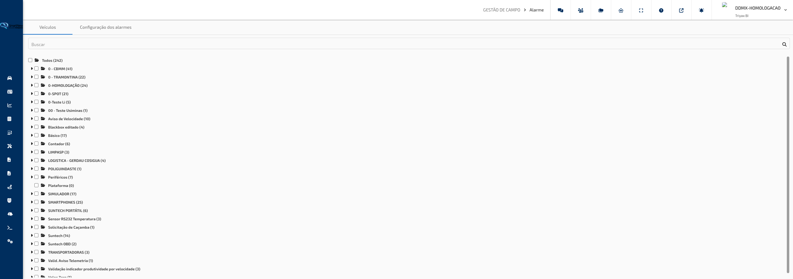

---

#### O que você encontra nesta tela

**Aba Veículos**

Exibida ao abrir a tela. Apresenta a árvore de veículos organizados em grupos, com caixas de seleção. É o ponto de partida: selecione os veículos que deseja configurar antes de avançar para a aba de configuração.

**Aba Configuração de Alarmes**

Exibida após selecionar os veículos. Apresenta uma tabela com uma linha por veículo selecionado, contendo todos os campos de configuração do alarme. No topo da tabela há uma barra com ações que se aplicam a todos os veículos listados.

**Barra de Ações (Configuração de Alarmes)**

Localizada no topo da aba de configuração. Contém três ícones:

- **Salvar Configurações** (ícone de disquete) — salva todas as alterações feitas na tabela
- **Ativar Todos** (ícone de caixa marcada) — marca todos os veículos da tabela como ativos de uma vez
- **Desativar Todos** (ícone de caixa desmarcada) — desmarca todos os veículos da tabela de uma vez

**Janela de Agendamento**

Aberta ao clicar no ícone de calendário em um veículo da tabela. Permite definir períodos de vigência do alarme: em quais dias da semana e horários o alarme deve estar ativo e quando deve ser desativado automaticamente.

---

#### Funcionalidades

**Selecionar os veículos a configurar**

Define quais veículos aparecerão na tabela de configuração de alarmes.

Como usar:

1. Na aba **Veículos**, localize os veículos desejados na árvore de grupos.
2. Marque as caixas de seleção dos veículos ou grupos que deseja configurar.
3. Clique na aba **Configuração de Alarmes** para visualizar a tabela com os veículos selecionados.

> **Dica:** Selecionar um grupo inteiro é a forma mais rápida de carregar todos os veículos de um setor de uma vez.

---

**Definir o tipo de alarme de um veículo**

Escolhe qual tipo de evento o alarme daquele veículo deve monitorar.

Como usar:

1. Na aba **Configuração de Alarmes**, localize a linha do veículo desejado.
2. Na coluna **Tipo**, clique no seletor e escolha uma das opções:
   - **Movimento** — o alarme é disparado quando o veículo entra em movimento.
   - **Sem Movimento** — o alarme é disparado quando o veículo permanece parado.
3. O tipo selecionado determina quais campos adicionais ficam disponíveis na mesma linha (apenas **Movimento** habilita os campos de mapa online e bloqueio).

> **Dica:** Após definir o tipo, clique em **Salvar Configurações** para que a alteração seja aplicada.

---

**Ativar ou desativar o alarme de um veículo**

Controla individualmente se o alarme de cada veículo está em funcionamento.

Como usar:

1. Na tabela, localize a linha do veículo desejado.
2. Marque ou desmarque a caixa de seleção na coluna **Ativo**.
3. Clique em **Salvar Configurações** para confirmar a alteração.

> **Dica:** Para alterar o status de todos os veículos de uma vez, use os botões **Ativar Todos** ou **Desativar Todos** na barra de ações. O botão salva o status em lote diretamente, sem necessidade de clicar em Salvar Configurações.

---

**Configurar e-mail de aviso**

Define o endereço de e-mail que receberá as notificações quando o alarme do veículo for disparado.

Como usar:

1. Na tabela, localize a linha do veículo desejado.
2. No campo da coluna **E-mail de Aviso**, digite o endereço de e-mail desejado.
3. Clique em **Salvar Configurações** para confirmar.

> **Dica:** O campo aceita um único endereço por veículo. Para notificar múltiplas pessoas, utilize um endereço de lista de distribuição ou grupo de e-mail.

---

**Exibir alarme no mapa online**

Controla se o veículo em estado de alarme é destacado com indicação visual no Mapa Online.

Como usar:

1. Na tabela, localize a linha do veículo com tipo **Movimento**.
2. Marque a caixa de seleção na coluna **Mostrar no Mapa Online**.
3. Clique em **Salvar Configurações** para confirmar.

> **Dica:** Esta opção só está disponível quando o tipo do alarme é **Movimento**. Para veículos com tipo **Sem Movimento**, a coluna ficará em branco.

---

**Configurar envio automático de bloqueio**

Define se, ao disparar o alarme de movimento, o sistema deve enviar automaticamente um comando de bloqueio para o veículo.

Como usar:

1. Na tabela, localize a linha do veículo com tipo **Movimento**.
2. Marque a caixa de seleção na coluna **Enviar Bloqueio**.
3. No campo **Tempo Mínimo de Bloqueio**, informe em minutos o intervalo mínimo entre envios consecutivos do comando de bloqueio.
4. Clique em **Salvar Configurações** para confirmar.

> **Dica:** O campo **Tempo Mínimo de Bloqueio** evita que o sistema envie múltiplos comandos de bloqueio em sequência rápida. Defina um valor adequado ao tempo de resposta esperado do módulo instalado no veículo. Estas opções só estão disponíveis para o tipo de alarme **Movimento**.

---

**Agendar períodos de vigência do alarme**

Define em quais dias da semana e horários o alarme de um veículo específico deve estar ativo. Fora dos períodos agendados, o alarme não é disparado.

Como usar:

1. Na tabela, localize a linha do veículo desejado.
2. Clique no ícone de calendário (ícone de dias) na coluna de ações.
3. A janela de agendamento será aberta. Clique em **Adicionar Agendador** para incluir um novo período.
4. Na linha criada, configure:
   - **Ativar em**: selecione o dia da semana e o horário de início do período de vigência.
   - **Desativar em**: selecione o dia da semana e o horário de encerramento do período de vigência.
5. Repita o processo para adicionar quantos períodos forem necessários.
6. Para remover um período, clique no ícone de lixeira ao final da linha.
7. Clique em **Salvar** para confirmar os agendamentos. Clique em **Cancelar** para fechar sem salvar.

> **Dica:** Um veículo sem nenhum agendamento cadastrado terá o alarme ativo o tempo todo, desde que esteja marcado como **Ativo** na tabela principal. Use o agendamento para restringir o alarme ao horário de operação da frota.

---

**Copiar configurações para todos os veículos**

Replica as configurações de alarme de um veículo para todos os demais veículos listados na tabela, sem precisar preencher cada linha individualmente.

Como usar:

1. Configure completamente a linha do veículo que servirá de modelo (tipo, ativo, e-mail, mapa online, bloqueio e agendamentos).
2. Na coluna de ações daquele veículo, clique no ícone de copiar (ícone de folhas sobrepostas).
3. Todas as demais linhas da tabela serão atualizadas automaticamente com as mesmas configurações do veículo modelo.
4. Clique em **Salvar Configurações** para confirmar a alteração em todos os veículos.

> **Dica:** A cópia inclui os agendamentos cadastrados. Verifique se os períodos de vigência definidos no modelo são adequados para todos os veículos antes de copiar.

---

**Salvar as configurações**

Confirma e aplica todas as alterações feitas na tabela de configuração de alarmes.

Como usar:

1. Faça todas as alterações desejadas nos campos da tabela.
2. Clique no ícone de **Salvar Configurações** (ícone de disquete) na barra de ações.
3. Uma mensagem de confirmação será exibida ao concluir com sucesso. Em caso de erro, uma mensagem de falha será apresentada.

> **Dica:** As alterações na tabela não são aplicadas automaticamente. Sempre clique em **Salvar Configurações** ao terminar as edições para que as mudanças sejam efetivadas.

---

#### Campos e Filtros

| Campo / Filtro                         | O que faz                                                                                                                                 |
| -------------------------------------- | ----------------------------------------------------------------------------------------------------------------------------------------- |
| **Seleção de Veículos (aba Veículos)** | Define quais veículos aparecerão na tabela de configuração de alarmes                                                                     |
| **Identificação**                      | Nome de identificação do veículo; exibido apenas para referência, não é editável                                                          |
| **Tipo**                               | Define o comportamento do alarme: **Movimento** (disparado ao entrar em movimento) ou **Sem Movimento** (disparado ao ficar parado)       |
| **Ativo**                              | Ativa ou desativa o alarme do veículo; quando desmarcado, nenhum alarme é gerado mesmo que o evento ocorra                                |
| **E-mail de Aviso**                    | Endereço de e-mail que receberá as notificações quando o alarme for disparado                                                             |
| **Mostrar no Mapa Online**             | Quando marcado, destaca o veículo em alarme no Mapa Online; disponível apenas para o tipo **Movimento**                                   |
| **Enviar Bloqueio**                    | Quando marcado, envia automaticamente um comando de bloqueio ao veículo ao disparar o alarme; disponível apenas para o tipo **Movimento** |
| **Tempo Mínimo de Bloqueio (minutos)** | Intervalo mínimo em minutos entre envios consecutivos do comando de bloqueio automático                                                   |
| **Ativar em — Dia (agendamento)**      | Dia da semana em que o período de vigência do alarme começa                                                                               |
| **Ativar em — Hora (agendamento)**     | Horário de início do período de vigência do alarme                                                                                        |
| **Desativar em — Dia (agendamento)**   | Dia da semana em que o período de vigência do alarme termina                                                                              |
| **Desativar em — Hora (agendamento)**  | Horário de encerramento do período de vigência do alarme                                                                                  |

[↑ Voltar ao Índice](index.md#índice)

---

### Rotas Programadas

**Caminho:** Gestão de Campo > Rotas Programadas

Esta tela permite cadastrar e gerenciar rotas geográficas predefinidas que os veículos devem seguir. Cada rota é delimitada por um polígono desenhado no mapa e pode gerar alertas automáticos de velocidade, entrada, saída e permanência — além de controlar pontos de início e fim do percurso com raios de tolerância configuráveis.

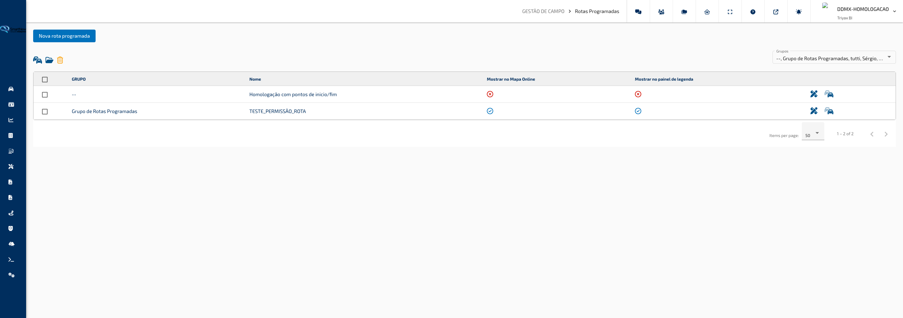

---

#### O que você encontra nesta tela

**Barra de Ações**

Localizada no topo da tela. Contém o botão **Nova Rota Programada** para criar uma nova rota, além de ícones para ações em lote sobre as rotas marcadas na tabela:

- Ícone de veículos — **Vincular Todos os Veículos**: associa todos os veículos da conta às rotas selecionadas
- Ícone de pasta — **Gerenciar Grupos**: abre o gerenciador de grupos de rotas
- Ícone de lixeira — **Apagar Selecionados**: remove permanentemente as rotas marcadas

**Filtro de Grupos**

Localizado à direita dos ícones de ação. Permite filtrar as rotas exibidas na tabela selecionando um ou mais grupos.

**Tabela de Rotas**

Lista todas as rotas programadas cadastradas. Cada linha exibe:

- Indicador de status (ativo ou inativo)
- Caixa de seleção para ações em lote
- **Grupo** ao qual a rota pertence
- **Nome** da rota
- Indicador de **Mostrar no Mapa Online** — se a rota aparece sobreposta ao Mapa Online em tempo real
- Indicador de **Mostrar no Painel de Legenda** — se a rota aparece no painel de legendas do mapa
- Botão de **Editar** (ícone de lápis e régua)
- Botão de **Veículos** (ícone de frota) — gerencia os veículos vinculados à rota

---

#### Funcionalidades

**Criar uma nova rota programada**

Abre o formulário completo para cadastrar uma rota, definindo nome, grupo, configurações de alerta, o traçado da rota no mapa e os veículos que serão monitorados.

Como usar:

1. Clique no botão **Nova Rota Programada** no topo da tela.
2. A janela de criação será aberta com três abas: **Configurações**, **Mapa** e **Veículos**.
3. Preencha os dados na aba **Configurações**, desenhe a rota na aba **Mapa** e vincule os veículos na aba **Veículos**.
4. Clique em **Salvar** para confirmar o cadastro.

> **Dica:** Ao criar uma rota, é obrigatório desenhar o traçado no mapa e selecionar pelo menos um veículo. Tentar salvar sem esses dados exibirá mensagens de aviso antes de concluir.

---

**Configurar os dados da rota (aba Configurações)**

Define o nome, grupo e todas as regras de alerta vinculadas à rota.

Como usar:

1. No campo **Nome**, informe um nome que identifique a rota.
2. No campo **Grupo**, selecione o grupo ao qual a rota pertence.
3. Marque **Mostrar no Mapa Online** para que o traçado apareça sobre o mapa em tempo real.
4. Marque **Mostrar no Painel de Legenda** para exibir a rota no painel de legendas do mapa.
5. No campo **Limite de Velocidade**, informe em km/h a velocidade máxima permitida no percurso (deixe em zero para não monitorar velocidade).
6. No campo **Tempo Mínimo Acima do Limite**, selecione por quanto tempo o veículo precisa exceder o limite para gerar um alerta de velocidade.
7. Marque **Aviso ao Ultrapassar Velocidade** para ativar notificação por e-mail em caso de excesso de velocidade na rota. Informe o e-mail no campo correspondente.
8. Marque **Aviso ao Entrar na Rota** para notificar quando um veículo entrar no traçado. Informe o e-mail desejado.
9. Marque **Aviso ao Sair da Rota** para notificar quando um veículo sair do traçado. Informe o e-mail desejado.
10. Para avisos de permanência excessiva, marque **Avisos de Tempo de Permanência**, informe o e-mail, o **Tempo Máximo de Permanência** em minutos e o **Tempo de Reenvio do Alerta** em minutos.
11. Para controle de afastamento da base, preencha o **Tempo Máximo Fora da Base** em minutos e o e-mail de aviso correspondente.

> **Dica:** O campo **Ativar Jornada de Trabalho** restringe os alertas a um intervalo de horários e dias. Ao ativá-lo, é possível definir a hora de início, a hora de fim e escolher entre não gerar avisos fora do horário ou apenas destacá-los sem enviar notificações.

---

**Desenhar o traçado no mapa (aba Mapa)**

Define o contorno geográfico da rota e configura os pontos de início e fim do percurso.

Como usar:

1. Na janela de criação ou edição, clique na aba **Mapa**.
2. Para centralizar o mapa em um local específico, expanda o painel **Endereço**, digite o endereço desejado e clique no botão de mover (ícone de setas).
3. Use as ferramentas do mapa para desenhar o polígono que delimita a área da rota. Clique nos pontos do mapa para criar os vértices e feche o polígono ao clicar no ponto inicial.
4. Para ajustar a cor de exibição do traçado, expanda o painel **Selecione a Cor da Área** e clique na cor desejada na paleta.
5. Para configurar o ponto de início do percurso, expanda o painel **Configurações**:
   - Em **Ponto de Início**, selecione **Utilizar ponto como início** para marcar diretamente no mapa, ou **Utilizar área como início** para usar uma área de interesse cadastrada como referência de partida.
   - No campo **Raio de Entrada**, informe o raio em metros de tolerância ao redor do ponto de início.
   - Se desejar que a rota seja considerada válida nos dois sentidos (ida e volta), marque **Considerar ida e volta**.
   - No campo **Área de Interesse de Entrada**, selecione a área de interesse que representa o ponto de partida (quando "utilizar área" estiver selecionado).
6. Para configurar o ponto de fim do percurso, na seção **Ponto de Fim**:
   - Selecione **Utilizar ponto como fim** ou **Utilizar área como fim**.
   - Informe o **Raio de Saída** em metros.
   - Selecione a **Área de Interesse de Saída**, se aplicável.
7. Use os painéis **Áreas de Interesse** e **Pontos de Interesse** para ativar ou desativar referências visuais sobre o mapa durante o desenho.

> **Dica:** Ao editar uma rota existente, o mapa centraliza automaticamente no traçado salvo ao passar o cursor sobre o mapa. O traçado atual é carregado para edição, permitindo ajustar os vértices existentes.

---

**Vincular veículos à rota (aba Veículos — disponível apenas na criação)**

Associa os veículos que serão monitorados pela rota recém-criada.

Como usar:

1. Na janela de criação, clique na aba **Veículos**.
2. A árvore de grupos e veículos será exibida com caixas de seleção.
3. Marque os veículos ou grupos que devem ser monitorados por esta rota.
4. Clique em **Salvar** para finalizar o cadastro com os veículos vinculados.

> **Dica:** Na edição de uma rota existente, a aba **Veículos** não aparece no formulário. Para alterar os veículos vinculados após a criação, use o botão de frota (ícone de carros) na linha da rota na tabela principal.

---

**Editar uma rota existente**

Abre o formulário com os dados atuais da rota para alteração das configurações ou do traçado.

Como usar:

1. Na tabela, localize a rota que deseja alterar.
2. Clique no ícone de lápis e régua (editar) na coluna de ações da linha correspondente.
3. A janela de edição será aberta com as abas **Configurações** e **Mapa** preenchidas com os dados atuais.
4. Faça as alterações necessárias.
5. Clique em **Salvar** para confirmar.

> **Dica:** Alterar o traçado de uma rota que já monitora veículos aplica os novos limites imediatamente após salvar. Veículos que estavam dentro do traçado e saírem (ou vice-versa) serão reconhecidos na próxima atualização de posição.

---

**Gerenciar veículos vinculados a uma rota individualmente**

Permite adicionar ou remover veículos vinculados a uma rota específica sem alterar outras configurações.

Como usar:

1. Na tabela, localize a rota desejada.
2. Clique no ícone de frota (carros duplos) na coluna de ações da linha correspondente.
3. A janela de seleção de veículos será aberta com os vínculos atuais.
4. Marque ou desmarque veículos e grupos conforme necessário.
5. Feche a janela para salvar as alterações.

> **Dica:** Use esta opção para ajustar quais veículos são monitorados em uma rota específica sem precisar abrir o formulário completo de edição.

---

**Vincular todos os veículos às rotas selecionadas**

Associa automaticamente todos os veículos da conta às rotas marcadas na tabela, sem precisar selecioná-los individualmente.

Como usar:

1. Na tabela, marque as caixas de seleção das rotas desejadas.
2. Clique no ícone de veículos (vincular veículos) na barra de ações.
3. Confirme a operação na janela de confirmação.

> **Dica:** Use esta função para monitorar toda a frota em uma ou mais rotas de forma rápida, sem precisar selecionar veículo por veículo.

---

**Gerenciar grupos de rotas**

Permite criar, renomear ou remover os grupos utilizados para organizar as rotas programadas.

Como usar:

1. Clique no ícone de pasta aberta (gerenciar grupos) na barra de ações.
2. A janela de gerenciamento de grupos será aberta com a lista de grupos existentes.
3. Crie novos grupos, renomeie grupos existentes ou remova grupos que não serão mais utilizados.
4. Feche a janela para salvar as alterações.

> **Dica:** Organize as rotas em grupos por região de operação, tipo de percurso ou turno de trabalho para facilitar a localização e o gerenciamento da lista.

---

**Apagar rotas selecionadas**

Remove permanentemente as rotas marcadas na tabela, incluindo todos os vínculos com veículos e configurações de alerta.

Como usar:

1. Na tabela, marque as caixas de seleção das rotas que deseja remover.
2. Clique no ícone de lixeira (apagar selecionados) na barra de ações.
3. Confirme a exclusão na janela de confirmação.

> **Dica:** A exclusão é permanente. Os veículos não são afetados, mas deixarão de ser monitorados pelas rotas excluídas. Se quiser desativar temporariamente o monitoramento sem excluir, remova os vínculos de veículos em vez de apagar a rota.

---

#### Campos e Filtros

| Campo / Filtro                      | O que faz                                                                                                 |
| ----------------------------------- | --------------------------------------------------------------------------------------------------------- |
| **Grupos (filtro da tabela)**       | Filtra as rotas exibidas na tabela pelos grupos selecionados                                              |
| **Nome**                            | Identifica a rota na tabela, no mapa e nas notificações                                                   |
| **Grupo**                           | Organiza as rotas em categorias para facilitar filtros e gerenciamento                                    |
| **Mostrar no Mapa Online**          | Ativa ou desativa a exibição do traçado sobreposto ao Mapa Online em tempo real                           |
| **Mostrar no Painel de Legenda**    | Ativa ou desativa a exibição da rota no painel de legendas do mapa                                        |
| **Limite de Velocidade**            | Velocidade máxima em km/h permitida no percurso; zero desativa o monitoramento de velocidade              |
| **Tempo Mínimo Acima do Limite**    | Duração que o veículo precisa exceder o limite de velocidade para gerar alerta                            |
| **Aviso ao Ultrapassar Velocidade** | Ativa notificação por e-mail quando a velocidade é excedida dentro da rota                                |
| **Aviso ao Entrar na Rota**         | Ativa notificação por e-mail quando um veículo entra no traçado da rota                                   |
| **Aviso ao Sair da Rota**           | Ativa notificação por e-mail quando um veículo sai do traçado da rota                                     |
| **Tempo Máximo Fora da Base**       | Tempo em minutos que o veículo pode ficar ausente antes de gerar aviso de afastamento                     |
| **Avisos de Tempo de Permanência**  | Ativa alertas quando o veículo permanece dentro da rota além do tempo definido                            |
| **Tempo Máximo de Permanência**     | Tempo em minutos que o veículo pode ficar dentro da rota antes de gerar alerta                            |
| **Tempo de Reenvio do Alerta**      | Intervalo em minutos entre reenvios do mesmo alerta de permanência                                        |
| **Ativar Jornada de Trabalho**      | Restringe os alertas a um intervalo de horários definido; fora do horário, o comportamento é configurável |
| **Hora Inicial / Hora Final**       | Definem o intervalo de horário em que os alertas serão gerados quando a jornada de trabalho estiver ativa |
| **Ponto de Início (Entrada)**       | Define se o início do percurso é marcado diretamente no mapa ou representado por uma área de interesse    |
| **Raio de Entrada**                 | Raio em metros de tolerância ao redor do ponto de início do percurso; padrão de 200 metros                |
| **Considerar ida e volta**          | Quando marcado, a rota é monitorada nos dois sentidos de percurso                                         |
| **Área de Interesse de Entrada**    | Área de interesse cadastrada que representa o ponto de partida da rota                                    |
| **Ponto de Fim (Saída)**            | Define se o fim do percurso é marcado diretamente no mapa ou representado por uma área de interesse       |
| **Raio de Saída**                   | Raio em metros de tolerância ao redor do ponto de fim do percurso; padrão de 200 metros                   |
| **Área de Interesse de Saída**      | Área de interesse cadastrada que representa o ponto de chegada da rota                                    |

[↑ Voltar ao Índice](index.md#índice)

---

### Controle de Motoristas

**Caminho:** Gestão de Campo > Controle de Motoristas

Esta tela centraliza o cadastro e a gestão de todos os motoristas da frota. Permite criar, editar, pesquisar e remover motoristas, além de configurar dados de identificação, jornada de trabalho, documentos e vínculos com veículos.

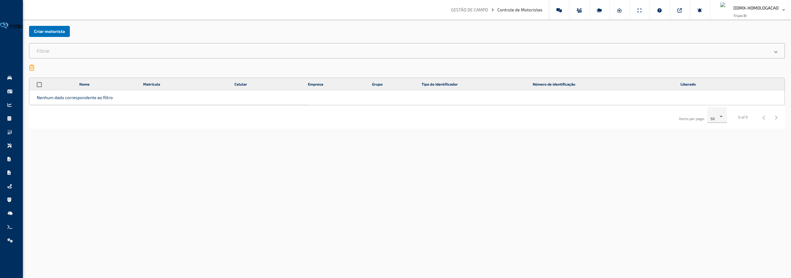

---

#### O que você encontra nesta tela

**Barra de Ações**

Localizada no topo da tela. Contém o botão **Criar Motorista** para iniciar um novo cadastro.

**Painel de Filtros**

Expansível, localizado abaixo da barra de ações. Ao clicar no cabeçalho **Filtro**, o painel se abre e exibe os campos de pesquisa. Permite filtrar a tabela por nome, matrícula, grupo, número de identificação, tipos de identificadores e status do motorista.

**Barra de Ações da Tabela**

Localizada entre o painel de filtros e a tabela. Contém o ícone de lixeira para **Apagar Motoristas Selecionados** em lote.

**Tabela de Motoristas**

Lista todos os motoristas cadastrados conforme os filtros aplicados. Exibe as colunas: Nome, Matrícula, Celular, Empresa, Grupo, Tipo de Identificador, Número de Identificação e Status (ícone de liberado ou bloqueado). Ao final de cada linha, há botões de ação individuais. A tabela é paginada e ordenável por coluna.

---

#### Funcionalidades

**Cadastrar novo motorista**

Abre a janela de criação com formulário completo para registrar um motorista e vinculá-lo a veículos.

Como usar:

1. Clique no botão **Criar Motorista** no topo da tela.
2. A janela de cadastro será aberta com quatro abas: **Configurações**, **Controles**, **Veículos** e **Arquivos**.
3. Preencha os dados nas abas conforme necessário (detalhadas abaixo).
4. Clique em **Salvar** para concluir o cadastro.

> **Dica:** Ao criar um motorista, a aba **Veículos** é exibida e permite vincular veículos imediatamente. Após salvar, o vínculo com veículos é gerenciado pelo botão de carro na linha do motorista na tabela.

**Preencher dados de configuração do motorista (aba Configurações)**

Define os dados de identificação, contato, jornada de trabalho e e-mail de alerta do motorista.

Como usar:

1. No campo **Tipo de Identificador**, selecione o tipo de dispositivo utilizado pelo motorista para identificação. Este campo só pode ser alterado na criação — após salvar, não é possível trocar o tipo.
2. Se o tipo selecionado for RFID ou outro dispositivo físico, informe o código no campo **Identificador**.
3. Preencha os campos de **Nome**, **Matrícula**, **Celular**, **Empresa** e **Grupo**.
4. O campo **Login** é preenchido automaticamente pelo sistema e não pode ser editado manualmente.
5. Nos campos **Início da Jornada** e **Fim da Jornada**, informe os horários no formato HH:mm.
6. No campo **Tempo Mínimo de Intrajornada (minutos)**, informe o intervalo mínimo de pausa que deve ser respeitado entre jornadas.
7. No campo **E-mail de Alerta de Intrajornada**, informe o endereço que receberá notificações quando a intrajornada for descumprida.

> **Dica:** Os horários de jornada são utilizados pelo sistema para monitorar o cumprimento da carga horária do motorista. Preencha corretamente para que os alertas funcionem.

**Registrar documentos e controles de vencimento (aba Controles)**

Armazena os documentos do motorista e permite cadastrar registros de controle com data de vencimento e alertas automáticos por e-mail.

Como usar:

1. Na aba **Controles**, preencha os campos **RG**, **CPF** e **CNH** do motorista.
2. Para adicionar um controle de vencimento (como habilitação, exame médico ou treinamento), clique no botão **Novo Controle**.
3. Na janela de controle, preencha:
   - **Descrição**: nome do controle (ex.: Habilitação, ASO, NR-20).
   - **Data de Vencimento**: data em que o documento vence.
   - **Data de Alerta de Vencimento**: data a partir da qual o sistema começará a alertar sobre o vencimento iminente.
   - **E-mail para Alerta**: endereço que receberá a notificação de vencimento.
   - **Ações**: selecione quais ações automáticas devem ser tomadas ao vencer.
4. Confirme para adicionar o controle à lista.
5. Os controles cadastrados aparecem na tabela com nome e data de vencimento, com opções de editar ou apagar cada item.

> **Dica:** Cadastre uma data de alerta com antecedência suficiente (ex.: 30 dias antes do vencimento) para garantir tempo hábil de renovação dos documentos.

**Vincular veículos ao motorista (aba Veículos — disponível apenas na criação)**

Associa os veículos que o motorista poderá operar, permitindo que o sistema identifique e registre a condução em tempo real.

Como usar:

1. Na aba **Veículos**, a árvore de grupos e veículos da conta será exibida.
2. Marque as caixas de seleção dos veículos ou grupos que devem ser vinculados ao motorista.
3. Clique em **Salvar** ao concluir para registrar o vínculo junto com o cadastro.

> **Dica:** Após a criação do motorista, o vínculo com veículos é gerenciado pelo botão de carro (ícone de frota) na linha do motorista na tabela principal, não pelo formulário de edição.

**Importar arquivos do motorista (aba Arquivos — disponível apenas na criação)**

Permite anexar arquivos ao cadastro do motorista durante a criação, como documentos digitalizados.

Como usar:

1. Na aba **Arquivos**, selecione ou arraste os arquivos que deseja anexar.
2. Os arquivos serão enviados automaticamente ao salvar o cadastro.

> **Dica:** Após o cadastro, o envio e a visualização de arquivos do motorista é feito pelo ícone de arquivo (importar arquivos) na linha do motorista na tabela principal.

**Editar dados de um motorista**

Abre o formulário preenchido com os dados atuais do motorista para alteração.

Como usar:

1. Na tabela, localize o motorista que deseja alterar.
2. Clique no ícone de lápis (**Editar**) na coluna de ações da linha correspondente.
3. A janela de edição será aberta com as abas **Configurações** e **Controles**.
4. Faça as alterações desejadas e clique em **Salvar**.

> **Dica:** Na edição, as abas **Veículos** e **Arquivos** não estão disponíveis. Para gerenciar veículos vinculados, use o botão de carro na tabela. Para gerenciar arquivos, use o botão de importar arquivos.

**Gerenciar veículos vinculados ao motorista**

Adiciona ou remove os veículos associados a um motorista já cadastrado.

Como usar:

1. Na tabela, localize o motorista desejado.
2. Clique no ícone de carro (**Veículos**) na coluna de ações da linha correspondente.
3. A janela de seleção de veículos será aberta com os vínculos atuais.
4. Marque ou desmarque os veículos conforme necessário.
5. Salve para aplicar as alterações.

> **Dica:** Um motorista pode ser vinculado a múltiplos veículos. O sistema identificará o motorista em qualquer veículo da lista ao qual ele se conectar.

**Gerenciar arquivos do motorista**

Visualiza, adiciona ou remove arquivos associados ao cadastro do motorista.

Como usar:

1. Na tabela, localize o motorista desejado.
2. Clique no ícone de arquivo (**Importar Arquivos**) na coluna de ações da linha correspondente.
3. A janela de gerenciamento de arquivos será aberta com a lista de documentos já anexados.
4. Faça o upload de novos arquivos ou remova os existentes.

> **Dica:** Use este recurso para manter os documentos do motorista centralizados no sistema, facilitando auditorias e consultas futuras.

**Filtrar motoristas**

Reduz a lista exibida na tabela para facilitar a localização de motoristas específicos.

Como usar:

1. Clique no cabeçalho **Filtro** para expandir o painel de filtros.
2. Preencha os campos desejados: Nome, Matrícula, Grupo, Número de Identificação, Tipos de Identificadores e/ou Status.
3. A tabela será atualizada automaticamente após uma breve pausa ao digitar.
4. Para localizar apenas motoristas com determinados tipos de dispositivo, clique no campo **Tipos de Identificadores**, use a busca dentro do seletor e marque as opções desejadas. Use a opção **Selecionar/Desselecionar Todos** para marcar ou desmarcar tudo de uma vez.

> **Dica:** Todos os filtros funcionam em conjunto. Combine nome e status para localizar rapidamente, por exemplo, motoristas bloqueados de um determinado grupo.

**Apagar motoristas selecionados**

Remove permanentemente um ou mais motoristas da lista.

Como usar:

1. Marque a caixa de seleção à esquerda dos motoristas que deseja remover. Para selecionar todos os visíveis, clique na caixa de seleção no cabeçalho da tabela.
2. Clique no ícone de lixeira (**Apagar Motoristas Selecionados**) na barra de ações acima da tabela.
3. Confirme a exclusão na janela de confirmação exibida.

> **Dica:** A exclusão é permanente e remove todos os dados e vínculos do motorista. Certifique-se de que o motorista não está ativo na operação antes de apagar.

---

#### Campos e Filtros

| Campo / Filtro                              | O que faz                                                                                                       |
| ------------------------------------------- | --------------------------------------------------------------------------------------------------------------- |
| **Nome**                                    | Filtra motoristas pelo nome cadastrado                                                                          |
| **Matrícula**                               | Filtra pelo número de matrícula do motorista                                                                    |
| **Grupo**                                   | Filtra motoristas pelo grupo ao qual pertencem                                                                  |
| **Número de Identificação**                 | Filtra pelo código do dispositivo de identificação (iButton, RFID etc.)                                         |
| **Tipos de Identificadores**                | Filtra por tipo de dispositivo utilizado: WT110, iButton, TD50, RFID, Smartphone, Sem Dispositivo, entre outros |
| **Status**                                  | Filtra por situação do motorista: Todos, Liberado ou Bloqueado                                                  |
| **Tipo de Identificador (cadastro)**        | Define o dispositivo usado pelo motorista para se identificar ao veículo; fixo após a criação                   |
| **Identificador (cadastro)**                | Código do dispositivo físico; obrigatório para tipos RFID e similares                                           |
| **Matrícula (cadastro)**                    | Número de registro do motorista na empresa                                                                      |
| **Celular**                                 | Número de telefone celular do motorista                                                                         |
| **Empresa**                                 | Nome da empresa à qual o motorista pertence                                                                     |
| **Grupo (cadastro)**                        | Grupo ou setor ao qual o motorista está associado                                                               |
| **Início da Jornada**                       | Horário de início do turno de trabalho no formato HH:mm                                                         |
| **Fim da Jornada**                          | Horário de encerramento do turno de trabalho no formato HH:mm                                                   |
| **Tempo Mínimo de Intrajornada (minutos)**  | Duração mínima de pausa obrigatória entre jornadas; usado para alertas de descumprimento                        |
| **E-mail de Alerta de Intrajornada**        | Endereço que recebe notificações quando a pausa mínima não é cumprida                                           |
| **RG**                                      | Número do documento de identidade do motorista                                                                  |
| **CPF**                                     | Número do Cadastro de Pessoa Física do motorista                                                                |
| **CNH**                                     | Número da Carteira Nacional de Habilitação do motorista                                                         |
| **Descrição (controle)**                    | Nome do documento ou obrigação com prazo de vencimento                                                          |
| **Data de Vencimento (controle)**           | Data em que o documento ou a obrigação vence                                                                    |
| **Data de Alerta de Vencimento (controle)** | Data a partir da qual o sistema começa a notificar sobre o vencimento próximo                                   |
| **E-mail para Alerta (controle)**           | Endereço que recebe a notificação de vencimento iminente                                                        |
| **Ações (controle)**                        | Ações automáticas associadas ao vencimento do controle                                                          |

[↑ Voltar ao Índice](index.md#índice)

---

