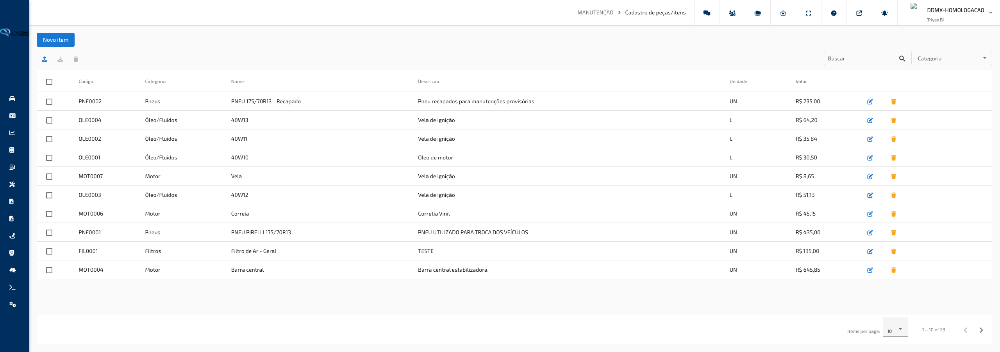
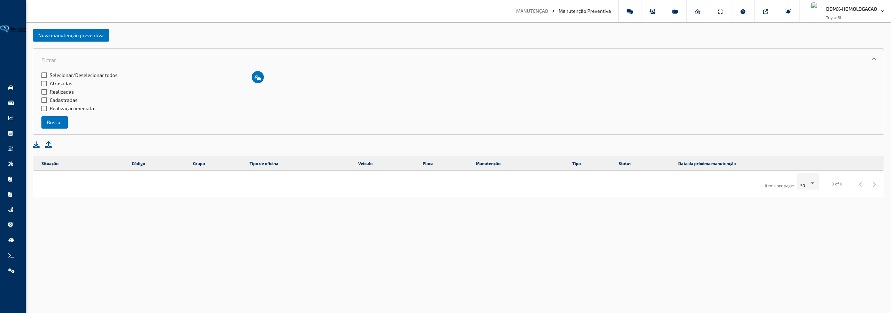
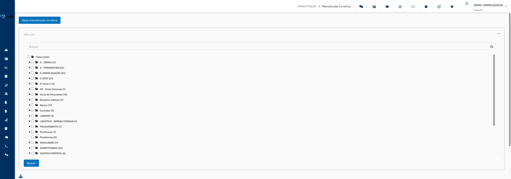

## Manutenção

### Cadastro de Peças/Itens

**Caminho:** Manutenção > Cadastro de Peças/Itens

Esta tela permite gerenciar o catálogo de peças e insumos utilizados nas manutenções da frota. Aqui você cadastra, edita, remove e importa itens que poderão ser vinculados a ordens de manutenção preventiva e corretiva.

---

#### O que você encontra nesta tela

**Barra de ações**

Localizada no topo da tela, contém o botão **Novo Item** para cadastrar uma peça manualmente, além dos botões de **Importar**, **Exportar** e **Apagar** (estes últimos são ícones ao lado do campo de busca).

**Filtros**

Dois controles de filtragem ficam ao lado dos botões de ação: um campo de busca por texto livre e um seletor de **Categoria**, que restringe a lista à categoria escolhida.

**Tabela de peças**

Exibe todos os itens cadastrados com as colunas: **Código**, **Categoria**, **Nome**, **Descrição**, **Unidade** e **Valor**. Cada linha possui caixas de seleção para marcar itens individualmente ou em lote. As colunas são ordenáveis clicando no cabeçalho.

**Paginação**

Abaixo da tabela, controla quantos itens são exibidos por página (opções: 5, 10, 25 ou 100).

---

#### Funcionalidades

**Cadastrar nova peça**

Abre um formulário para registrar um novo item no catálogo.

Como usar:

1. Clique no botão **Novo Item** no canto superior esquerdo.
2. Preencha os campos obrigatórios: **Código**, **Categoria**, **Nome**, **Unidade** e **Valor**. O campo **Descrição** é opcional.
3. Clique em **Salvar** para confirmar o cadastro.

> **Dica:** O campo **Código** é o identificador interno da peça na sua organização — use um padrão já adotado pelo almoxarifado ou sistema de estoque para facilitar o reconhecimento.

---

**Editar peça cadastrada**

Permite alterar os dados de um item já existente.

Como usar:

1. Localize a peça na tabela usando os filtros de busca ou rolando a lista.
2. Clique no ícone de **lápis** na coluna de ações da linha desejada.
3. Altere os campos necessários no formulário que será aberto.
4. Clique em **Salvar** para confirmar as alterações.

> **Dica:** Caso precise corrigir o valor de várias peças, edite uma por vez para garantir que cada alteração seja salva individualmente.

---

**Excluir peça**

Remove um ou mais itens do catálogo de forma permanente.

Como usar:

1. Para excluir uma peça individualmente, clique no ícone de **lixeira** na coluna de ações da linha correspondente.
2. Para excluir múltiplas peças de uma vez, marque as caixas de seleção ao lado de cada item desejado (ou marque todas usando a caixa no cabeçalho da tabela).
3. Clique no ícone de **lixeira** na barra de ações superior.
4. Confirme a operação na janela de confirmação que aparecer.

> **Dica:** A exclusão é permanente. Verifique se a peça não está vinculada a nenhuma ordem de manutenção ativa antes de removê-la.

---

**Importar peças por planilha**

Permite cadastrar múltiplas peças de uma vez enviando uma planilha preenchida no formato `.xlsx`.

Como usar:

1. Clique no botão de seleção de arquivo na barra de importação e escolha a planilha preenchida. Se ainda não tiver o arquivo, clique em **Download do Modelo (.xlsx)** para baixar a referência antes de preencher.
2. Linhas da planilha com o campo **Código** vazio são consideradas em branco e ignoradas automaticamente — não aparecem na tabela de prévia.
3. A tabela de prévia exibe cada item com um ícone de status ao lado (indicando se o registro está válido ou possui erro) e destaca em vermelho apenas o campo especificamente inválido daquela linha, facilitando localizar o que precisa de correção.
4. Corrija os campos diretamente nas células da tabela — texto, categoria e unidade são editáveis por linha.
5. Um aviso fixo na barra superior lembra que itens com o mesmo **Código** são tratados como duplicados e marcados como inválidos.
6. Para remover um item indesejado da lista antes de salvar, clique no ícone de **lixeira** na coluna de ações da linha.
7. Quando todos os registros estiverem válidos, clique em **Salvar** para confirmar a importação.

> **Dica:** O cabeçalho da tabela permanece fixo ao rolar a lista, facilitando a conferência de planilhas grandes.

---

**Exportar peças para planilha**

Gera um arquivo `.xlsx` com os dados das peças selecionadas.

Como usar:

1. Marque as caixas de seleção dos itens que deseja exportar.
2. Clique no ícone de **download** (seta para baixo) na barra de ações.
3. O arquivo será baixado automaticamente com o nome do relatório e a data de geração.

> **Dica:** É necessário selecionar ao menos um item antes de clicar em exportar. O botão ficará desabilitado enquanto nenhum item estiver marcado.

---

**Filtrar peças**

Localiza itens específicos na lista sem precisar rolar toda a tabela.

Como usar:

1. Digite um termo no campo **Buscar** para filtrar pelo código, nome, descrição ou qualquer outro texto visível.
2. Use o seletor **Categoria** para restringir a exibição a um tipo específico de peça.
3. Os dois filtros podem ser usados ao mesmo tempo para um resultado mais preciso.

> **Dica:** Para limpar o filtro de categoria e ver todos os itens novamente, selecione a opção **Todos** no seletor de Categoria.

---

#### Campos e Filtros

| Campo / Filtro | O que faz |
|---|---|
| Código | Identificador interno da peça na organização (obrigatório) |
| Categoria | Classifica a peça por área do veículo: Motor, Transmissão, Freios, Elétrica, Suspensão/Direção, Implemento, Insumos, Acessórios, Interior ou Exterior (obrigatório) |
| Nome | Nome da peça ou item (obrigatório) |
| Descrição | Informações adicionais sobre a peça (opcional) |
| Unidade | Unidade de medida: UN (unidade), KG (quilograma), L (litro), M (metro), MM (milímetro) ou CM (centímetro) (obrigatório) |
| Valor | Custo unitário da peça em reais (obrigatório) |
| Buscar | Filtra a tabela por qualquer texto contido nos campos visíveis |
| Categoria (filtro) | Restringe a tabela a peças de uma categoria específica |

[↑ Voltar ao Índice](index.md#índice)

---

### Manutenção Preventiva

**Caminho:** Manutenção > Manutenção Preventiva

Esta tela centraliza o controle das manutenções preventivas da frota. Nela você cadastra planos de manutenção por data, quilometragem ou horímetro, acompanha o status de cada item, registra a execução das manutenções e mantém um histórico completo por veículo.

---

#### O que você encontra nesta tela

**Botão Nova Manutenção Preventiva**

Localizado no topo da tela, abre o formulário para cadastrar um novo plano de manutenção.

**Painel de Filtros**

Painel expansível logo abaixo do botão principal. Contém checkboxes para filtrar por situação das manutenções e um botão para selecionar veículos específicos. Após configurar os filtros, clique em **Buscar** para aplicar.

**Barra de ações da tabela**

Dois ícones acima da tabela: **download** (exportar para planilha) e **upload** (importar manutenções em lote).

**Tabela de manutenções**

Exibe todas as manutenções conforme os filtros aplicados, com as colunas: **Situação**, **Código**, **Grupo**, **Tipo de Oficina**, **Veículo**, **Placa**, **Manutenção**, **Tipo**, **Status** e **Data da Próxima Manutenção**. A coluna **Situação** indica se a manutenção está cadastrada, pendente, atrasada ou realizada. A coluna **Status** exibe o tempo, a quilometragem ou as horas restantes/decorridas. Um ícone de repetição aparece na coluna **Situação** quando a manutenção está configurada para se repetir automaticamente após cada execução. As colunas são ordenáveis clicando no cabeçalho.

**Ações por linha**

Cada linha da tabela possui até quatro ícones de ação: **Detalhar**, **Reportar** (disponível apenas para manutenções não realizadas), **Arquivos** e **Apagar**.

**Paginação**

Abaixo da tabela, permite navegar entre páginas e ajustar quantos itens são exibidos (5, 10, 25 ou 100 por página).

---

#### Funcionalidades

**Cadastrar nova manutenção preventiva**

Registra um plano de manutenção vinculado a um veículo, com gatilho por data, quilometragem ou horímetro (ou qualquer combinação dos três).

Como usar:

1. Clique no botão **Nova Manutenção Preventiva** no topo da tela.
2. Preencha o **Nome da Manutenção** e selecione o **Veículo** no campo de busca.
3. Escolha o **Tipo** de estratégia de manutenção preventiva: Baseada em Uso, Baseada em Tempo, Baseada em Condição, Preditiva ou Prescritiva.
4. Ative um ou mais gatilhos:
   - **Por Data:** marque a opção, informe a data da última manutenção e a data da próxima. O sistema calcula o período automaticamente, ou você pode preencher o campo **Realizar a cada X dias** diretamente. Defina também com quantos dias de antecedência deseja ser avisado.
   - **Por Hodômetro:** marque a opção. O hodômetro atual do veículo é exibido automaticamente. Informe o hodômetro na última manutenção, o intervalo em quilômetros e com quantos quilômetros antes deseja receber o aviso.
   - **Por Horímetro:** marque a opção. Escolha o tipo de horímetro (Motor, RPM, Tensão de bateria ou Tempo de uso). O valor atual é exibido. Informe o horímetro na última manutenção, o intervalo em horas e a antecedência para aviso.
5. Preencha o **E-mail de aviso** se desejar receber notificações por e-mail.
6. Marque **Repetir manutenção** se quiser que o plano se renove automaticamente após cada execução.
7. Adicione observações no campo **Observação** se necessário.
8. Clique em **Salvar**.

> **Dica:** Você pode combinar os três gatilhos (data + hodômetro + horímetro) em um único plano. O sistema alertará quando qualquer um dos limites for atingido. Ative apenas os que fazem sentido para o tipo de manutenção.

---

**Filtrar manutenções**

Restringe a lista às manutenções de interesse, por situação e/ou por veículo.

Como usar:

1. No painel **Filtros**, selecione uma ou mais situações:
   - **Atrasadas** — manutenções que já passaram do limite configurado.
   - **Realizadas** — manutenções já executadas.
   - **Cadastradas** — planos cadastrados ainda dentro do prazo.
   - **Realização imediata** — manutenções pendentes, próximas do vencimento.
2. Para filtrar por veículo, clique no ícone de seleção de veículos e escolha os desejados na janela que abrir.
3. Clique em **Buscar** para atualizar a tabela.

> **Dica:** Use o checkbox **Selecionar/Desselecionar todos** para marcar ou desmarcar todas as situações de uma vez. As situações podem ser combinadas livremente — por exemplo, marcar **Atrasadas** e **Realização imediata** ao mesmo tempo exibe corretamente os dois grupos de manutenções pendentes de atenção.

---

**Reportar execução de manutenção**

Registra que uma manutenção foi realizada, com data, responsável, peças substituídas e custos.

Como usar:

1. Na linha da manutenção, clique no ícone de **dupla marcação** (reportar). Esse ícone só aparece para manutenções ainda não realizadas.
2. Na etapa **Data da Manutenção**, informe a data e hora de início e a data e hora de término. Uma caixa exibe a última observação registrada para referência.
3. Avance para a etapa **Informações da Manutenção** e preencha:
   - **Hodômetro no momento da manutenção** — quilometragem registrada no veículo.
   - **Horímetro no momento da manutenção** — leitura do horímetro no momento.
   - **Responsável** — nome do responsável pela execução.
   - **Centro de custo** — centro de custo para fins de controle financeiro.
   - **Tipo de oficina** — escolha entre **Própria** ou **Terceirizada**.
   - **Número da OS** — número da ordem de serviço.
   - **Peças/itens substituídos** — adicione as peças do catálogo que foram utilizadas. O custo total das peças é calculado automaticamente.
   - **Custo do serviço** — valor da mão de obra ou serviço (R$).
   - **Oficina** — nome da oficina onde foi realizada (com busca e opção de cadastrar nova). A busca considera tanto áreas cadastradas como oficina quanto como concessionária.
   - **Descrição do serviço** e **Observação** — campos de texto livre.
4. Clique em **Salvar** para registrar a execução.

> **Dica:** O **Custo total** é calculado automaticamente somando o custo do serviço e o custo das peças. Não é necessário preencher esse campo manualmente.

---

**Ver detalhes de uma manutenção**

Exibe todas as informações do plano de manutenção e o histórico de execução de forma resumida.

Como usar:

1. Clique no ícone de **informações** (quadrado com "i") na linha da manutenção desejada.
2. A janela de detalhes exibe: código, nome, veículo, categoria, datas, configurações de hodômetro e horímetro, e-mail de aviso, repetição, responsável, centro de custo, número da OS, tipo, custo total, oficina e observações.
3. Feche a janela clicando no ícone de fechar no canto superior.

> **Dica:** A seção de detalhes mostra tanto as configurações originais do plano (intervalos, limites) quanto os dados registrados na última execução, facilitando a conferência.

---

**Gerenciar arquivos de uma manutenção**

Permite anexar documentos, notas fiscais, fotos e outros arquivos a uma manutenção específica.

Como usar:

1. Clique no ícone de **arquivo com seta** na linha da manutenção.
2. Na janela que abrir, use o botão de upload para selecionar e enviar os arquivos desejados.
3. Os arquivos já enviados ficam listados e podem ser visualizados ou removidos.

> **Dica:** Use este recurso para guardar comprovantes de serviço, notas fiscais de peças e laudos técnicos vinculados diretamente à manutenção.

---

**Excluir manutenção preventiva**

Remove o plano de manutenção e seu histórico de forma permanente.

Como usar:

1. Clique no ícone de **lixeira** na linha da manutenção que deseja remover.
2. Confirme a operação na janela de confirmação que aparecer.
3. A manutenção será removida da lista imediatamente.

> **Dica:** A exclusão é permanente e remove também o histórico de execuções. Se precisar apenas interromper o acompanhamento, considere deixar o plano cadastrado sem reportar novas execuções.

---

**Exportar manutenções para planilha**

Gera um arquivo `.xlsx` com todas as manutenções atualmente exibidas na tabela.

Como usar:

1. Aplique os filtros desejados e clique em **Buscar** para carregar os dados.
2. Clique no ícone de **download** acima da tabela.
3. O arquivo é baixado automaticamente com as colunas: Situação, Código, Veículo, Manutenção, Status, Realizada, Data/Hora do reporte, hodômetros, horímetros, responsável, centro de custo, OS, tipo, custo, oficina e descrição do serviço.

> **Dica:** Filtre antes de exportar para gerar relatórios específicos — por exemplo, apenas as manutenções atrasadas ou apenas as de um grupo de veículos.

---

**Importar manutenções por planilha**

Cadastra múltiplos planos de manutenção de uma só vez via planilha.

Como usar:

1. Clique no ícone de **upload** acima da tabela.
2. Na janela, clique no link **Download do Modelo (.xlsx)** para baixar o arquivo de referência.
3. Preencha o modelo com os dados: Placa, Nome da manutenção, Hodômetro da última troca, Realizar a cada (km), Avisar faltando (km), Horímetro da última troca, Realizar a cada (horas), Avisar faltando (horas) e E-mail.
4. Selecione o arquivo preenchido para fazer o envio.
5. Revise os registros exibidos na tabela de prévia e clique em **Salvar**.

> **Dica:** Certifique-se de que as placas informadas na planilha correspondem exatamente às placas dos veículos cadastrados no sistema.

---

#### Campos e Filtros

| Campo / Filtro | O que faz |
|---|---|
| Nome da Manutenção | Identifica o plano (ex: "Troca de óleo", "Revisão de freios") |
| Veículo | Veículo ao qual o plano de manutenção está vinculado |
| Tipo | Estratégia de manutenção preventiva: Baseada em Uso, Baseada em Tempo, Baseada em Condição, Preditiva ou Prescritiva |
| Por Data | Habilita controle por calendário; define data da última manutenção, próxima data e aviso de antecedência em dias |
| Por Hodômetro | Habilita controle por quilometragem; define hodômetro da última troca, intervalo em km e aviso em km |
| Por Horímetro | Habilita controle por horas de uso; define tipo de horímetro, horímetro da última troca, intervalo em horas e aviso em horas |
| E-mail de aviso | Endereço de e-mail que receberá notificações quando a manutenção estiver próxima |
| Repetir manutenção | Quando marcado, o plano é renovado automaticamente após cada execução registrada |
| Observação | Campo de texto livre para anotações gerais sobre o plano |
| Filtro: Atrasadas | Exibe apenas manutenções que ultrapassaram o limite configurado |
| Filtro: Realizadas | Exibe apenas manutenções já executadas |
| Filtro: Cadastradas | Exibe apenas planos dentro do prazo (ainda não vencidos) |
| Filtro: Realização imediata | Exibe manutenções próximas do vencimento |
| Seleção de veículos | Restringe a lista a um ou mais veículos específicos |

[↑ Voltar ao Índice](index.md#índice)

---

### Manutenção Corretiva

**Caminho:** Manutenção > Manutenção Corretiva

Esta tela registra manutenções não planejadas realizadas nos veículos da frota — ocorrências imprevistas como quebras, falhas e reparos emergenciais. Diferente da manutenção preventiva, não há agendamento: o registro é feito após o evento ocorrer.

---

#### O que você encontra nesta tela

**Botão Nova Manutenção**

No topo da tela, abre o formulário para registrar uma nova manutenção corretiva.

**Painel de seleção de veículos**

Painel expansível com uma árvore de veículos organizada por grupos. Marque os veículos desejados e clique em **Buscar** para carregar apenas as manutenções desses veículos.

**Barra de ações da tabela**

Um ícone de **download** acima da tabela permite exportar os registros exibidos para uma planilha.

**Tabela de manutenções corretivas**

Exibe os registros conforme a seleção de veículos, com as colunas: **Código**, **Data de Início**, **Data de Fim**, **Tipo de Oficina**, **Grupo**, **Veículo**, **Placa**, **Manutenção** e **Tipo**. As colunas são ordenáveis clicando no cabeçalho.

**Ações por linha**

Cada linha possui três ícones: **Detalhar** (visualizar informações completas), **Arquivos** (gerenciar documentos anexos) e **Apagar**.

**Paginação**

Abaixo da tabela, permite navegar entre páginas e ajustar a quantidade de registros exibidos (5, 10, 25 ou 100 por página).

---

#### Funcionalidades

**Registrar nova manutenção corretiva**

Cria o registro de uma manutenção não planejada, documentando o que foi feito, quando, em qual veículo e com quais custos.

Como usar:

1. Clique no botão **Nova Manutenção** no topo da tela.
2. Informe a **Data de início** e o **Horário de início** da manutenção.
3. Informe a **Data de fim** e o **Horário de fim**.
4. Preencha o **Nome** da manutenção (descrição resumida do problema ou serviço).
5. Selecione o **Veículo** no campo de busca. Ao selecionar, o **Hodômetro** e o **Horímetro** são preenchidos automaticamente com os valores atuais do veículo.
6. Escolha o **Tipo**: Planejada ou Não Planejada.
7. Confirme ou ajuste o **Hodômetro no momento da manutenção** e o **Horímetro no momento da manutenção**.
8. Preencha o **Responsável** e o **Centro de custo**.
9. Selecione o **Tipo de oficina**: **Própria** ou **Terceirizada**.
10. Informe o **Número da OS** (ordem de serviço), se houver.
11. Adicione as **Peças/itens substituídos** do catálogo. O custo total das peças é calculado automaticamente.
12. Informe o **Custo do serviço** (mão de obra). O **Custo total** é atualizado automaticamente.
13. Selecione ou digite a **Oficina** onde a manutenção foi realizada. A busca considera tanto áreas cadastradas como oficina quanto como concessionária. Para cadastrar uma nova oficina, clique no botão **+** ao lado do campo.
14. Preencha a **Descrição do serviço** e a **Observação** conforme necessário.
15. Clique em **Reportar realização da manutenção** para salvar o registro.

> **Dica:** Ao selecionar o veículo, o hodômetro e o horímetro são preenchidos com os valores atuais registrados no sistema. Confirme se esses valores correspondem às leituras no momento da manutenção e corrija se necessário.

---

**Filtrar manutenções por veículo**

Restringe a tabela às manutenções de veículos específicos.

Como usar:

1. No painel **Veículos**, navegue pela árvore de grupos e marque os veículos desejados.
2. Clique em **Buscar** para carregar apenas os registros dos veículos selecionados.
3. Para ver todos os veículos novamente, desmarque as seleções e clique em **Buscar**.

> **Dica:** A árvore organiza os veículos por grupos, facilitando a seleção por frota ou área operacional.

---

**Ver detalhes de uma manutenção corretiva**

Exibe todas as informações registradas de forma organizada, sem permitir edições.

Como usar:

1. Clique no ícone de **informações** (quadrado com "i") na linha da manutenção desejada.
2. A janela de detalhes exibe: código, datas de início e fim, nome, veículo, tipo, hodômetro, horímetro, responsável, centro de custo, tipo de oficina, número da OS, custo total, oficina, descrição do serviço, observação e o detalhamento de custos (peças e mão de obra).
3. Feche a janela clicando no ícone de fechar no canto superior.

> **Dica:** A seção de custos na parte inferior dos detalhes lista cada peça utilizada com quantidade e valor, além do custo de mão de obra separado.

---

**Gerenciar arquivos de uma manutenção**

Permite anexar e visualizar documentos, fotos e comprovantes vinculados a um registro específico.

Como usar:

1. Clique no ícone de **arquivo com seta** na linha da manutenção.
2. Na janela que abrir, use o botão de upload para selecionar e enviar arquivos.
3. Os arquivos já enviados ficam listados e podem ser visualizados ou removidos.

> **Dica:** Guarde notas fiscais de peças, laudos técnicos e fotos do problema diretamente no registro para facilitar consultas futuras e auditorias.

---

**Excluir manutenção corretiva**

Remove o registro de forma permanente.

Como usar:

1. Clique no ícone de **lixeira** na linha da manutenção que deseja remover.
2. Confirme a operação na janela de confirmação.
3. O registro é removido imediatamente da lista.

> **Dica:** A exclusão é permanente e não pode ser desfeita. Verifique se o registro não é necessário para relatórios ou auditorias antes de removê-lo.

---

**Exportar manutenções para planilha**

Gera um arquivo `.xlsx` com todos os registros atualmente exibidos na tabela.

Como usar:

1. Filtre os veículos desejados usando o painel de seleção e clique em **Buscar**.
2. Clique no ícone de **download** acima da tabela.
3. O arquivo é baixado automaticamente com as colunas: Código, Data início, Data fim, Grupo, Veículo, Placa, Manutenção, Categoria, Hodômetro, Horímetro, Responsável, Centro de custo, OS, Custo, Oficina, Descrição do serviço e Observações.

> **Dica:** Selecione apenas os veículos relevantes antes de exportar para gerar relatórios mais focados por frota, período ou tipo de manutenção.

---

#### Campos e Filtros

| Campo / Filtro | O que faz |
|---|---|
| Nome | Descrição resumida do problema ou serviço realizado |
| Veículo | Veículo em que a manutenção foi executada (ao selecionar, hodômetro e horímetro são preenchidos automaticamente) |
| Tipo | Classificação da manutenção corretiva: Planejada ou Não Planejada |
| Data de início | Data e hora em que a manutenção foi iniciada |
| Data de fim | Data e hora em que a manutenção foi concluída |
| Hodômetro no momento | Quilometragem do veículo no momento da manutenção |
| Horímetro no momento | Leitura do horímetro do veículo no momento da manutenção |
| Responsável | Nome do responsável pela execução da manutenção |
| Centro de custo | Centro de custo para controle financeiro |
| Tipo de oficina | Indica se a manutenção foi feita em oficina própria ou terceirizada |
| Número da OS | Número da ordem de serviço, para rastreabilidade |
| Peças/itens substituídos | Itens do catálogo utilizados na manutenção; o custo total das peças é calculado automaticamente |
| Custo do serviço | Valor da mão de obra ou serviço (R$) |
| Custo de peças/itens | Calculado automaticamente com base nas peças selecionadas (somente leitura) |
| Custo total | Soma do custo do serviço e das peças (somente leitura) |
| Oficina | Nome da oficina onde a manutenção foi realizada (com busca e opção de cadastrar nova); a busca inclui áreas cadastradas como oficina ou como concessionária |
| Descrição do serviço | Detalhamento técnico do que foi executado |
| Observação | Campo livre para anotações complementares |
| Seleção de veículos (filtro) | Árvore para escolher quais veículos terão suas manutenções exibidas na tabela |

[↑ Voltar ao Índice](index.md#índice)

---
