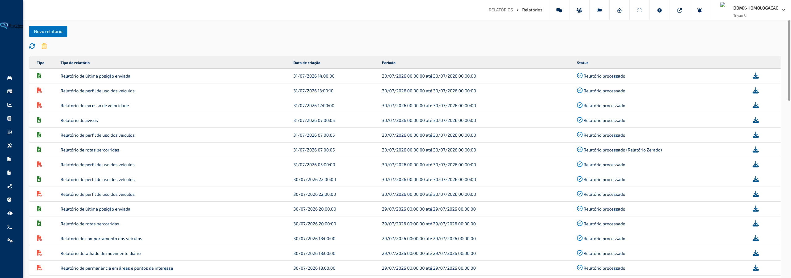
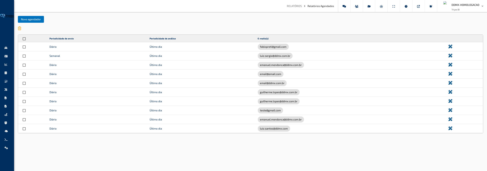

## Relatórios

### Relatórios

**Caminho:** Relatórios > Relatórios

A tela de **Relatórios** é a central de geração e consulta de relatórios da frota. Nela você solicita novos relatórios sobre os veículos — como rotas percorridas, excesso de velocidade, quilometragem e avisos — e acompanha a lista de relatórios já gerados, podendo baixá-los em PDF ou Excel assim que ficarem prontos.

---

#### O que você encontra nesta tela

**Barra de ações**

No topo da tela ficam as ações principais:

- Botão **Novo Relatório** — abre a janela de criação de um novo relatório.
- Ícone de **atualizar** (setas circulares) — recarrega a lista de relatórios, útil para verificar se um relatório em processamento já ficou pronto.
- Ícone de **lixeira** — apaga todos os relatórios já gerados da lista, após uma confirmação.

**Tabela de relatórios**

A área principal exibe todos os relatórios solicitados, com as colunas:

- **Tipo** — ícone indicando o formato do arquivo: PDF ou Excel.
- **Tipo de Relatório** — qual relatório foi solicitado (ex.: Rotas Percorridas, Excesso de Velocidade).
- **Data de Criação** — quando o relatório foi solicitado.
- **Período** — o intervalo de datas que o relatório abrange.
- **Status** — situação atual do relatório:
  - **Relatório em processamento** — ainda está sendo gerado; o download fica indisponível e aparece a indicação para aguardar a atualização.
  - **Relatório processado** — pronto para download.
  - **Relatório processado (zerado)** — foi gerado, mas não havia dados no período selecionado.
  - **Relatório processado (parcial)** — foi gerado com apenas parte dos dados do período.
- **Ações** — ícone de **download** para baixar o arquivo. Enquanto o relatório está em processamento, um ícone giratório é exibido no lugar.

No rodapé da tabela há um controle de **paginação**, que exibe 50 relatórios por página (ajustável para 5, 10, 25 ou 100). As colunas **Veículos**, **Data de Criação** e **Período** podem ser ordenadas clicando no cabeçalho.

---

#### Funcionalidades

**Gerar um novo relatório**

Cria um ou mais relatórios sobre os veículos escolhidos, em um período definido. A criação é feita em uma janela com três etapas: **Veículos**, **Configurações** e **Concluir**.

Como usar:

1. Clique no botão **Novo Relatório**.
2. Na etapa **Veículos**, marque na árvore os veículos ou grupos que devem entrar no relatório e clique em **Próximo**.
3. Na etapa **Configurações**, informe a **Data Inicial** e a **Data Final** com seus horários, escolha o formato de saída (**PDF** ou **Excel**) e marque um ou mais tipos de relatório na lista. Use o campo **Buscar** para localizar um tipo de relatório pelo nome. Clique em **Próximo**.
4. Na etapa final, preencha os parâmetros específicos de cada relatório selecionado (quando houver) e, se desejar, informe endereços de e-mail para receber os arquivos.
5. Clique em **Gerar Relatórios**. Uma mensagem confirma o envio e o relatório aparece na lista com o status **Relatório em processamento**.

> **Dica:** você pode marcar vários tipos de relatório de uma só vez na etapa de configurações — todos serão gerados juntos para o mesmo período e os mesmos veículos, e cada um aparecerá como uma linha separada na lista.

**Considerar apenas a faixa de horário**

Na etapa de configurações há a opção **Considerar apenas faixa de horário**. Quando marcada, o horário informado nas datas inicial e final é aplicado a cada dia do período, em vez de valer apenas para o primeiro e o último dia. É útil, por exemplo, para analisar somente o horário comercial ao longo de vários dias.

Como usar:

1. Na etapa **Configurações**, informe o período desejado nas datas inicial e final.
2. Ajuste a **Hora Inicial** e a **Hora Final** para a faixa que deseja analisar (ex.: 08:00:00 às 18:00:00).
3. Marque a caixa **Considerar apenas faixa de horário** e prossiga normalmente.

> **Dica:** sem essa opção marcada, o relatório considera o intervalo contínuo do início ao fim; com ela marcada, apenas a faixa de horário de cada dia entra na análise.

**Configurar parâmetros específicos do relatório**

Alguns tipos de relatório pedem informações extras na etapa final, exibidas logo abaixo do nome de cada relatório selecionado. Entre elas:

- **Tempo entre posições** — para o relatório de atividade.
- **Tempo mínimo de ociosidade** — para o relatório de veículo parado com ignição ligada.
- **Considerar eventos limite acima de**, **Porcentagem acima do limite** e **Velocidade acima do limite por tempo** — para o relatório de excesso de velocidade.
- **Tempo mínimo de permanência em área** e **Tempo mínimo de permanência em ponto** — para o relatório de permanência em áreas e pontos de interesse.
- Seleção de **áreas de interesse** — botão que abre a escolha das áreas a analisar, com opção de **utilizar todas as áreas de interesse**.
- **Considerar pontos de interesse** — inclui os pontos de interesse na análise de permanência.

Como usar:

1. Selecione os tipos de relatório desejados na etapa **Configurações** e avance.
2. Na etapa final, revise cada relatório listado e preencha os campos exibidos abaixo de cada um.
3. Para relatórios de permanência, clique no botão de **seleção de áreas** e escolha as áreas de interesse, ou marque a opção de usar todas.
4. Clique em **Gerar Relatórios**.

> **Dica:** o contador ao lado do botão de seleção de áreas mostra quantas áreas já foram escolhidas — confira antes de gerar o relatório.

**Receber o relatório por e-mail**

Além de baixar o arquivo pela tela, você pode informar endereços de e-mail para receber os relatórios assim que forem processados.

Como usar:

1. Na etapa final da criação do relatório, localize o campo de envio por e-mail no topo.
2. Digite um endereço de e-mail e pressione **Enter** (ou ponto e vírgula) para adicioná-lo — ele vira uma etiqueta no campo.
3. Repita para adicionar mais destinatários; para remover, clique no **x** da etiqueta.
4. Clique em **Gerar Relatórios**.

> **Dica:** o envio por e-mail é opcional. Mesmo enviando por e-mail, o relatório continua disponível para download na lista da tela.

**Baixar um relatório**

Quando o status muda para **Relatório processado**, o arquivo fica disponível para download.

Como usar:

1. Localize o relatório desejado na tabela.
2. Confira se o status é **Relatório processado** — se ainda estiver em processamento, clique no ícone de **atualizar** de tempos em tempos.
3. Clique no ícone de **download** na coluna de ações. O arquivo é salvo no seu computador no formato escolhido (PDF ou Excel).

> **Dica:** um relatório com status **processado (zerado)** foi concluído, mas não encontrou dados no período — verifique se o período e os veículos selecionados estão corretos antes de gerar novamente.

**Atualizar a lista de relatórios**

Recarrega a lista para refletir o andamento dos relatórios em processamento.

Como usar:

1. Clique no ícone de **atualizar** (setas circulares) no topo da tela.
2. Aguarde a mensagem de confirmação de que os relatórios foram atualizados.
3. Verifique na coluna **Status** se os relatórios pendentes já foram concluídos.

> **Dica:** relatórios de períodos longos ou com muitos veículos podem demorar mais para processar — não é necessário gerar novamente, basta atualizar a lista.

**Limpar todos os relatórios**

Remove de uma só vez todos os relatórios já gerados que aparecem na lista.

Como usar:

1. Clique no ícone de **lixeira** no topo da tela.
2. Confirme a exclusão na mensagem exibida.
3. A lista é atualizada e fica vazia.

> **Dica:** a exclusão vale para todos os relatórios da lista e não pode ser desfeita — baixe antes os arquivos que ainda precisa guardar.

---

#### Campos e Filtros

| Campo / Filtro | O que faz |
|---|---|
| **Data Inicial** / **Hora Inicial** | Define o início do período analisado pelo relatório. |
| **Data Final** / **Hora Final** | Define o fim do período analisado pelo relatório. |
| **Considerar apenas faixa de horário** | Aplica a faixa de horário informada a cada dia do período, em vez do intervalo contínuo. |
| **Tipo de Relatório** (formato) | Escolhe o formato do arquivo gerado: PDF ou Excel. |
| **Buscar** | Filtra a lista de tipos de relatório pelo nome, na etapa de configurações. |
| **Tipos de relatório** (lista de caixas de seleção) | Marca quais relatórios serão gerados; a lista exibida depende dos serviços habilitados para a sua conta. |
| **Envio por e-mail** | Endereços que receberão os relatórios processados; adicione com Enter ou ponto e vírgula. |
| **Tempo entre posições** | Intervalo considerado entre registros no relatório de atividade. |
| **Tempo mínimo de ociosidade** | Tempo mínimo parado com ignição ligada para constar no relatório. |
| **Considerar eventos limite acima de** | Velocidade mínima para considerar um evento de excesso. |
| **Porcentagem acima do limite** | Percentual acima do limite da via para considerar excesso de velocidade. |
| **Velocidade acima do limite por tempo** | Tempo mínimo acima do limite para registrar o evento. |
| **Tempo mínimo de permanência em área/ponto** | Tempo mínimo de parada para contar como permanência. |
| **Seleção de áreas de interesse** | Escolhe as áreas analisadas no relatório de permanência, com opção de usar todas. |
| **Considerar pontos de interesse** | Inclui os pontos de interesse na análise de permanência. |
| **Paginação** | Ajusta quantos relatórios aparecem por página (5, 10, 25, 50 ou 100). |

[↑ Voltar ao Índice](index.md#índice)

---

### Relatórios Agendados

**Caminho:** Relatórios > Relatórios Agendados

A tela de **Relatórios Agendados** permite programar o envio automático de relatórios da frota por e-mail, sem precisar gerá-los manualmente a cada vez. Você cria um agendador escolhendo os veículos, a periodicidade e os relatórios desejados, e o sistema envia os arquivos em PDF ou Excel diretamente para os e-mails cadastrados.

---

#### O que você encontra nesta tela

**Barra de ações**

No topo da tela ficam as ações principais:

- Botão **Novo Agendador** — abre a janela de criação de um novo agendamento de relatórios.
- Ícone de **lixeira** — apaga os agendadores marcados na tabela, após uma confirmação.

**Tabela de agendadores**

A área principal lista todos os agendamentos já criados, com as colunas:

- **Caixa de seleção** — marca o agendador para exclusão. A caixa no cabeçalho marca ou desmarca todos de uma vez.
- **Periodicidade de Envio** — com que frequência os relatórios são enviados (Diário, Semanal ou Mensal).
- **Periodicidade de Análise** — qual período de dados cada envio abrange (Último dia, Última semana ou Último mês).
- **E-mails** — os endereços que recebem os relatórios, exibidos em etiquetas individuais.
- **Ações** — ícone de **lápis** para editar o agendador.

Quando não há agendadores cadastrados, a tabela exibe uma mensagem informando que não há dados.

**Janela de criação/edição**

Ao clicar em **Novo Agendador** (ou no lápis de edição), abre-se uma janela com um assistente em três etapas: **Veículos**, **Configurações** e **Concluir**. Os botões **Anterior** e **Próximo** navegam entre as etapas, e o botão de avançar só é liberado quando a etapa atual está completa.

---

#### Funcionalidades

**Criar um novo agendador**

Programa o envio automático e recorrente de um ou mais relatórios para os e-mails que você definir.

Como usar:

1. Clique no botão **Novo Agendador**.
2. Na etapa **Veículos**, marque na árvore os veículos ou grupos que farão parte dos relatórios e clique em **Próximo**.
3. Na etapa **Configurações**, informe a **Hora Inicial** e a **Hora Final**, escolha a **Periodicidade de Envio**, a **Periodicidade de Análise** e adicione ao menos um e-mail de destino. Clique em **Próximo**.
4. Na etapa final, abra cada tipo de relatório desejado, marque **Habilitar agendador** e escolha o formato de saída (**PDF**, **Excel** ou ambos).
5. Clique em **Registrar Agendador** para concluir. Uma mensagem confirma o cadastro e o novo agendador aparece na tabela.

> **Dica:** você pode habilitar vários tipos de relatório em um mesmo agendador — todos serão enviados juntos, na mesma periodicidade, para os mesmos e-mails. Se precisar de periodicidades diferentes, crie agendadores separados.

**Configurar a periodicidade e o horário de envio**

Define quando os relatórios são enviados e qual período de dados eles analisam.

Como usar:

1. Na etapa **Configurações**, escolha a **Periodicidade de Envio**: Diário, Semanal ou Mensal.
2. Se escolher **Semanal**, selecione o **Dia de Envio** (dia da semana); se escolher **Mensal**, selecione o dia do mês (1 a 31).
3. Escolha a **Periodicidade de Análise** — o período de dados que cada relatório abrange: Último dia, Última semana ou Último mês.
4. Se desejar, ajuste o **Horário mínimo de disparo** para que o envio ocorra somente a partir de determinada hora do dia; caso contrário, mantenha o horário padrão da conta.

> **Dica:** combine as periodicidades de forma coerente — por exemplo, envio **Semanal** com análise da **Última semana** — para que cada relatório cubra exatamente o intervalo desde o envio anterior.

**Configurar cada tipo de relatório**

Na etapa final, cada tipo de relatório aparece em um painel expansível com suas próprias opções. Os tipos disponíveis dependem dos serviços habilitados para a sua conta e podem incluir, por exemplo: Perfil de Uso dos Veículos, Avisos, Rotas Percorridas, Última Posição Enviada, Jornada de Trabalho, Atividade, Veículo Parado com Ignição Ligada, Excesso de Velocidade, Odômetro, Permanência em Áreas e Pontos de Interesse, Horímetro, Checklist, entre outros.

Como usar:

1. Clique no painel do relatório desejado para expandi-lo.
2. Marque **Habilitar agendador** — os relatórios habilitados exibem um ícone de confirmação no título do painel.
3. Escolha o formato de saída: **PDF**, **Excel** ou ambos.
4. Ajuste os parâmetros específicos do relatório, quando existirem — por exemplo, tempo mínimo de ociosidade, velocidade mínima para eventos de excesso ou tempo mínimo de permanência.
5. Para relatórios de permanência, use o botão de **seleção de áreas de interesse** para escolher as áreas analisadas — a quantidade de áreas selecionadas aparece ao lado do botão — ou marque a opção de utilizar todas as áreas.

> **Dica:** os ícones de PDF e Excel aparecem no título de cada painel, permitindo conferir rapidamente o formato configurado em cada relatório sem precisar expandi-los.

**Editar um agendador**

Altera qualquer configuração de um agendamento existente: veículos, horários, periodicidade, e-mails ou relatórios habilitados.

Como usar:

1. Na tabela, localize o agendador desejado e clique no ícone de **lápis** na coluna de ações.
2. A mesma janela em três etapas se abre, já preenchida com as configurações atuais — inclusive os veículos marcados na árvore.
3. Ajuste o que for necessário em cada etapa e clique em **Registrar Agendador** para salvar.

> **Dica:** ao editar, percorra as três etapas para revisar tudo antes de salvar — as alterações só são aplicadas depois de clicar em **Registrar Agendador**.

**Excluir agendadores**

Remove agendamentos que não são mais necessários, interrompendo os envios automáticos correspondentes.

Como usar:

1. Marque a caixa de seleção dos agendadores que deseja remover — ou use a caixa do cabeçalho para marcar todos.
2. Clique no ícone de **lixeira** no topo da tela.
3. Confirme a operação na janela de confirmação. Uma mensagem informa que a remoção foi solicitada e a lista é atualizada.

> **Dica:** a exclusão interrompe definitivamente o envio dos relatórios daquele agendador. Se quiser apenas suspender um relatório específico, edite o agendador e desmarque **Habilitar agendador** no painel correspondente.

---

#### Campos e Filtros

| Campo / Filtro | O que faz |
|---|---|
| **Hora Inicial** / **Hora Final** | Define a faixa de horário do dia considerada na análise dos relatórios. |
| **Considerar apenas faixa de horário** | Restringe a análise à faixa de horário informada em cada dia do período. |
| **Periodicidade de Envio** | Frequência de envio dos relatórios: Diário, Semanal ou Mensal. |
| **Periodicidade de Análise** | Período de dados abrangido por cada envio: Último dia, Última semana ou Último mês. |
| **Horário mínimo de disparo** | Hora do dia a partir da qual o envio pode ocorrer (04:00 às 22:00), ou o horário padrão da conta. |
| **Dia de Envio** | Dia da semana (envio semanal) ou dia do mês, de 1 a 31 (envio mensal), em que os relatórios são enviados. |
| **E-mail** | Endereços que recebem os relatórios; adicione vários usando Enter, vírgula ou ponto e vírgula. |
| **Habilitar agendador** | Ativa o envio automático do tipo de relatório correspondente. |
| **Tipo de saída** | Formato do arquivo enviado: PDF, Excel ou ambos. |
| **Tempo entre posições** | Intervalo considerado entre registros no relatório de atividade (2 a 30 minutos). |
| **Tempo mínimo de ociosidade** | Tempo mínimo parado com ignição ligada para constar no relatório. |
| **Considerar eventos limite acima de** | Velocidade mínima para considerar um evento de excesso de velocidade. |
| **Porcentagem acima do limite** | Percentual acima do limite da via para considerar excesso de velocidade. |
| **Velocidade acima do limite por tempo** | Tempo mínimo acima do limite para registrar o evento. |
| **Tempo mínimo de permanência em área/ponto** | Tempo mínimo de parada para contar como permanência. |
| **Seleção de áreas de interesse** | Escolhe as áreas analisadas no relatório de permanência, com opção de usar todas. |
| **Considerar pontos de interesse** | Inclui os pontos de interesse na análise de permanência. |

[↑ Voltar ao Índice](index.md#índice)

---
