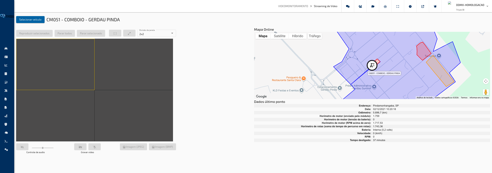
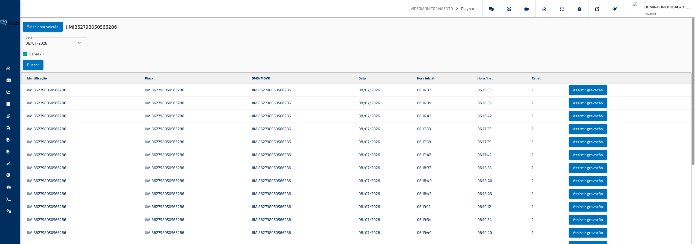
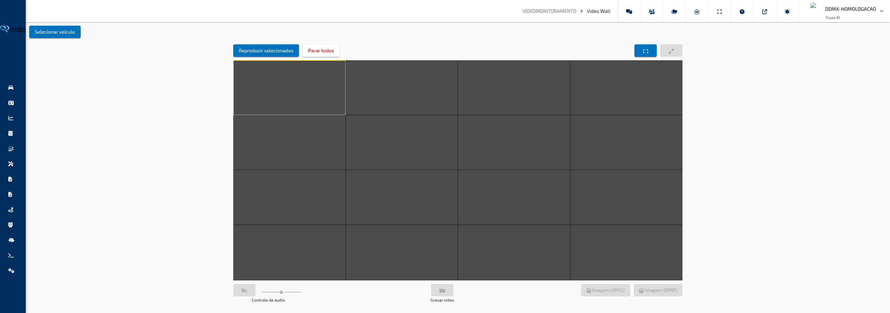

## Videomonitoramento

### Stream de Vídeo

**Caminho:** Videomonitoramento > Stream de Vídeo

A tela de **Stream de Vídeo** permite assistir, em tempo real, às imagens das câmeras instaladas nos veículos da sua frota. Além do vídeo ao vivo, a tela mostra a localização atual do veículo em um mapa e um painel com as informações mais recentes dele, tudo em um único lugar.

---

#### O que você encontra nesta tela

**Barra superior**

Na parte de cima da tela fica o botão **Selecionar Veículo** e, ao lado, o nome do veículo escolhido. Enquanto nenhum veículo for selecionado, o título exibe a indicação de que não há veículo selecionado.

**Área de vídeo**

É a região principal da tela, onde as imagens das câmeras são exibidas. Dependendo do equipamento instalado no veículo, o vídeo pode ser mostrado em uma grade com vários canais ao mesmo tempo — cada canal corresponde a uma câmera do veículo (por exemplo: câmera frontal, câmera voltada para o motorista). Enquanto as imagens são carregadas, um indicador de carregamento aparece no centro da área. Se o equipamento do veículo estiver desligado ou sem comunicação, uma mensagem informa que o dispositivo está indisponível no momento.

**Mapa de localização**

À direita da área de vídeo, um mapa mostra a posição atual do veículo selecionado. A posição é atualizada automaticamente conforme o veículo envia novas informações.

**Painel de informações do veículo**

Abaixo do mapa, um painel lista os dados mais recentes do veículo selecionado, como identificação e demais informações de acompanhamento. Esses dados também são atualizados automaticamente em tempo real.

---

#### Funcionalidades

**Selecionar um veículo para assistir**

Escolhe qual veículo da frota terá suas câmeras exibidas na tela. A lista mostra os veículos organizados em grupos, e apenas os veículos que possuem câmera compatível podem ser selecionados — os demais aparecem desabilitados.

Como usar:

1. Clique no botão **Selecionar Veículo** na barra superior.
2. Na janela que se abre, navegue pelos grupos ou use a busca para encontrar o veículo desejado.
3. Clique sobre o veículo com câmera disponível para selecioná-lo.
4. A janela se fecha e as imagens das câmeras do veículo começam a carregar automaticamente.

> **Dica:** Veículos sem câmera instalada aparecem desabilitados na lista e não podem ser selecionados. Se um grupo inteiro aparecer desabilitado, significa que nenhum veículo daquele grupo possui câmera compatível.

**Assistir ao vídeo ao vivo**

Exibe as imagens das câmeras do veículo em tempo real. Quando o veículo possui mais de uma câmera, as imagens são organizadas em uma grade, permitindo acompanhar vários ângulos ao mesmo tempo.

Como usar:

1. Selecione um veículo com câmera disponível.
2. Aguarde o carregamento das imagens — um indicador de carregamento é exibido durante esse processo.
3. Use os controles do player de vídeo (reproduzir, pausar, volume) para ajustar a exibição de cada canal.

> **Dica:** O vídeo inicia automaticamente sem som. Se quiser ouvir o áudio, ative o volume diretamente nos controles do player. Caso apareça a mensagem de dispositivo indisponível, o equipamento do veículo pode estar desligado ou fora de área de cobertura — tente novamente mais tarde.

**Acompanhar a localização e os dados do veículo**

Enquanto assiste ao vídeo, você acompanha ao mesmo tempo onde o veículo está e quais são suas informações mais recentes, sem precisar trocar de tela.

Como usar:

1. Selecione um veículo com câmera disponível.
2. Observe o mapa à direita para ver a posição atual do veículo.
3. Consulte o painel abaixo do mapa para ver os dados mais recentes do veículo.

> **Dica:** O mapa e o painel de informações são atualizados automaticamente conforme o veículo envia novos dados — não é necessário recarregar a tela.

---

#### Campos e Filtros

| Campo / Filtro | O que faz |
|---|---|
| **Selecionar Veículo** | Abre a janela de escolha do veículo cujas câmeras serão exibidas |
| **Busca de veículos** (na janela de seleção) | Filtra a lista de veículos pelo nome para encontrar rapidamente o desejado |
| **Grupos de veículos** (na janela de seleção) | Organiza os veículos por grupo; grupos sem veículos com câmera aparecem desabilitados |

[↑ Voltar ao Índice](index.md#índice)

---

### Playback

**Caminho:** Videomonitoramento > Playback

A tela de **Playback** permite localizar e assistir às gravações feitas pelas câmeras instaladas nos veículos da sua frota. Você escolhe o veículo, a data e os canais de câmera desejados, e a tela lista todas as gravações disponíveis daquele dia para reprodução.

---

#### O que você encontra nesta tela

**Barra de filtros**

Na parte superior da tela ficam o botão **Selecionar Veículo**, o nome do veículo escolhido, o campo de **Data** e o botão **Buscar**. Enquanto nenhum veículo for selecionado, o título indica que não há veículo selecionado.

**Canais de câmera**

Logo abaixo da barra de filtros, aparecem caixas de seleção com os canais de câmera disponíveis no veículo escolhido — cada canal corresponde a uma câmera (por exemplo: câmera frontal, câmera voltada para o motorista). Canais sem comunicação aparecem desabilitados, com a indicação de dispositivo indisponível. Se o veículo não possuir canais disponíveis, uma mensagem informa que não há canais.

**Lista de gravações**

A área principal da tela exibe as gravações encontradas em uma tabela, com identificação do veículo, placa, identificação do equipamento, data, hora inicial, hora final e canal de cada gravação. Cada linha possui o botão **Assistir Gravação**. Enquanto a busca é realizada, um indicador de carregamento aparece na tela.

---

#### Funcionalidades

**Selecionar um veículo**

Escolhe qual veículo terá suas gravações pesquisadas. Apenas veículos com câmera compatível e que estejam ativamente enviando dados para o sistema podem ser selecionados.

Como usar:

1. Clique no botão **Selecionar Veículo** na barra de filtros.
2. Na janela que se abre, navegue pelos grupos ou use a busca para encontrar o veículo desejado.
3. Clique sobre o veículo para selecioná-lo.
4. A janela se fecha e os canais de câmera do veículo são carregados automaticamente.

> **Dica:** Ao trocar de veículo, a seleção de canais é reiniciada — marque novamente os canais desejados antes de buscar. Veículos sem dados recentes de comunicação aparecem desabilitados na lista (e um grupo inteiro fica desabilitado quando nenhum veículo dele está comunicando), evitando buscas em dispositivos que não vão retornar gravações. Se aparecer um aviso de dispositivo inválido, o veículo escolhido não possui câmera compatível com esta tela.

**Buscar gravações**

Localiza todas as gravações disponíveis do veículo na data escolhida, nos canais marcados.

Como usar:

1. Selecione um veículo com câmera disponível.
2. Escolha a data desejada no campo **Data** (por padrão, a data de hoje já vem preenchida).
3. Marque um ou mais canais de câmera.
4. Clique no botão **Buscar**.
5. As gravações encontradas aparecem na tabela, organizadas por canal e horário.

> **Dica:** O botão **Buscar** só fica habilitado quando há um veículo selecionado, uma data escolhida e pelo menos um canal marcado. Se nenhuma gravação aparecer, o veículo pode não ter registrado imagens na data escolhida.

**Assistir a uma gravação**

Reproduz o trecho de vídeo gravado pela câmera do veículo no período indicado na linha da tabela.

Como usar:

1. Faça uma busca de gravações.
2. Localize na tabela a gravação desejada — use a ordenação das colunas ou a paginação para navegar pela lista.
3. Clique no botão **Assistir Gravação** da linha correspondente.
4. Uma janela se abre com o player de vídeo, onde você pode reproduzir, pausar e navegar pela gravação.
5. Para fechar, clique no ícone de fechar no canto superior da janela.

> **Dica:** Dependendo do equipamento instalado no veículo, o player pode exibir uma linha do tempo com os trechos gravados do dia, permitindo navegar entre eles sem fechar a janela. Se a gravação não estiver mais disponível no equipamento, uma mensagem informa que nenhuma gravação foi encontrada.

---

#### Campos e Filtros

| Campo / Filtro | O que faz |
|---|---|
| **Selecionar Veículo** | Abre a janela de escolha do veículo cujas gravações serão pesquisadas |
| **Data** | Define o dia em que as gravações serão pesquisadas (padrão: data de hoje) |
| **Canais** | Caixas de seleção que definem quais câmeras do veículo entram na busca; canais sem comunicação ficam desabilitados |
| **Buscar** | Executa a pesquisa de gravações com os filtros escolhidos |
| **Ordenação das colunas** | Clique no título de uma coluna da tabela para ordenar as gravações |
| **Paginação** | Controla quantas gravações são exibidas por página (10, 20, 50 ou 100) |

[↑ Voltar ao Índice](index.md#índice)

---

### Video Wall

**Caminho:** Videomonitoramento > Video Wall

A tela de **Video Wall** permite assistir, ao mesmo tempo, às imagens das câmeras de vários veículos da sua frota. Diferente da tela de Stream de Vídeo, que mostra apenas um veículo por vez, aqui você monta um painel com várias câmeras lado a lado, ideal para acompanhar a frota em tempo real.

---

#### O que você encontra nesta tela

**Barra superior**

Na parte de cima da tela fica o botão **Selecionar Veículo**, usado para escolher quais veículos e câmeras farão parte do painel de imagens.

**Painel de imagens**

É a área principal da tela, onde as imagens das câmeras dos veículos escolhidos são exibidas lado a lado, organizadas automaticamente em uma grade conforme a quantidade de câmeras selecionadas. Acima das imagens ficam os botões de controle da exibição, e abaixo ficam os controles de som, gravação e captura de imagem.

---

#### Funcionalidades

**Selecionar veículos e câmeras**

Define quais veículos e quais câmeras de cada um vão aparecer no painel de imagens. A escolha é feita em três etapas: veículos, câmeras e revisão.

Como usar:

1. Clique no botão **Selecionar Veículo** na barra superior.
2. Na etapa **Veículos**, marque na lista todos os veículos que deseja acompanhar — é possível escolher mais de um.
3. Clique em **Próximo** para avançar para a etapa **Canais**.
4. Marque as câmeras desejadas de cada veículo. O total de câmeras marcadas em todos os veículos não pode passar de 16.
5. Clique em **Próximo** para conferir a etapa **Revisão**, que mostra um resumo de tudo o que foi escolhido.
6. Clique em **Iniciar Video Wall** para exibir as imagens no painel.

> **Dica:** O botão **Próximo** só fica disponível depois que pelo menos um veículo (etapa Veículos) ou uma câmera (etapa Canais) for marcado. Na etapa de Revisão, use o botão **Reiniciar** para limpar toda a seleção e começar de novo, ou o botão **Anterior** para voltar e ajustar a escolha. Câmeras sem comunicação aparecem desabilitadas na lista, com a indicação de que o canal está offline.

**Acompanhar as imagens no painel**

Depois de iniciado, o Video Wall organiza automaticamente as imagens das câmeras escolhidas em uma grade e começa a exibir todas ao mesmo tempo.

Como usar:

1. Conclua a seleção de veículos e câmeras e clique em **Iniciar Video Wall**.
2. Aguarde o carregamento das imagens — a exibição é organizada automaticamente conforme o número de câmeras escolhidas.
3. Clique sobre uma das imagens da grade para selecioná-la; a imagem selecionada passa a responder aos controles de som, gravação e tela cheia individual.

> **Dica:** Para trocar os veículos ou câmeras exibidos, clique novamente em **Selecionar Veículo** e refaça a escolha.

**Controlar a exibição**

Os botões na parte superior do painel controlam a reprodução geral das imagens.

Como usar:

1. Use **Reproduzir Tudo** para iniciar (ou reiniciar) a exibição de todas as câmeras selecionadas.
2. Use **Parar Tudo** para interromper a exibição de todas as câmeras de uma vez.
3. Use **Tela Cheia** para exibir o painel inteiro em tela cheia, ou **Tela Cheia Selecionado** para ampliar apenas a imagem que está selecionada no momento.

> **Dica:** Se nenhuma imagem estiver selecionada, o botão **Tela Cheia Selecionado** fica desabilitado — clique antes sobre uma das imagens da grade.

**Controlar som, gravação e captura**

Na parte de baixo do painel ficam os controles individuais da imagem selecionada.

Como usar:

1. Clique sobre a imagem desejada na grade para selecioná-la.
2. Use o botão de som para ativar ou desativar o áudio dessa câmera, e o controle deslizante ao lado para ajustar o volume.
3. Use o botão de gravação para começar ou parar a gravação local da imagem selecionada.
4. Use os botões de captura para salvar uma imagem parada do momento atual, nos formatos **JPEG** ou **BMP**.

> **Dica:** Esses controles só ficam disponíveis depois que uma imagem da grade é selecionada e está em exibição.

---

#### Campos e Filtros

| Campo / Filtro | O que faz |
|---|---|
| **Selecionar Veículo** | Abre a janela de seleção de veículos e câmeras para o painel |
| **Veículos** (etapa 1) | Lista com marcação para escolher um ou mais veículos |
| **Canais** (etapa 2) | Lista com marcação das câmeras de cada veículo escolhido; limite de 16 câmeras no total |
| **Revisão** (etapa 3) | Resumo somente leitura de tudo o que foi selecionado |
| **Reiniciar** | Limpa toda a seleção de veículos e câmeras |
| **Anterior / Próximo** | Navegam entre as etapas de seleção |
| **Iniciar Video Wall** | Confirma a seleção e começa a exibir as imagens no painel |
| **Reproduzir Tudo / Parar Tudo** | Inicia ou interrompe a exibição de todas as câmeras do painel |
| **Tela Cheia / Tela Cheia Selecionado** | Amplia todo o painel ou apenas a imagem selecionada |
| **Som, Gravar, Capturar (JPEG/BMP)** | Controlam áudio, gravação e captura de imagem da câmera selecionada |

[↑ Voltar ao Índice](index.md#índice)

---
